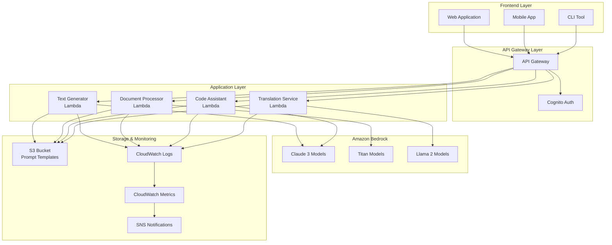

# 5.1.2 テキスト生成実装

このモジュールでは、Amazon Bedrockを使用した高度なテキスト生成機能の実装について学習します。基本的なAPI呼び出しから、実用的なアプリケーションの構築まで、包括的にカバーします。

## 📋 前提条件

### 必須の完了モジュール
- 1.1.1 AWSアカウント設定とIAM
- 5.1.1 Bedrockセットアップ

### 技術要件
- Python 3.8以上またはNode.js 16以上
- AWS CLI v2.0以上
- AWS SDKの基本的な使用経験
- REST APIの理解

### 権限要件
- Bedrock基盤モデルへのアクセス権限
- Lambda関数の作成・実行権限
- CloudWatch Logsへの書き込み権限

## 🎯 学習目標

このモジュールを完了すると、以下のことができるようになります：

1. **高度なプロンプトエンジニアリング技術の習得**
   - 効果的なプロンプト設計パターン
   - Few-shot learningの実装
   - Chain-of-Thoughtプロンプティング

2. **多様なテキスト生成機能の実装**
   - 創作支援システム
   - 文書要約・翻訳機能
   - コード生成アシスタント

3. **ストリーミング応答の実装**
   - リアルタイム応答機能
   - 長文生成の最適化
   - ユーザーエクスペリエンスの向上

4. **エラーハンドリングと最適化**
   - レート制限対応
   - コスト効率的な実装
   - 品質管理とフィルタリング

5. **Lambda関数を用いたサーバーレス実装**
   - API Gateway連携
   - イベント駆動アーキテクチャ
   - スケーラブルなデプロイ

## 📐 アーキテクチャ概要

### システム全体図



### 主要コンポーネント

1. **API Gateway**: RESTful APIエンドポイント
2. **Lambda Functions**: テキスト生成ロジック
3. **Bedrock Models**: 多様な生成AIモデル
4. **S3**: プロンプトテンプレート保存
5. **CloudWatch**: 監視とログ管理

## 🛠 ハンズオン実装

### ステップ1: CloudFormationインフラストラクチャ

#### 1.1 基本インフラストラクチャの作成

```yaml
# cloudformation/text-generation-infrastructure.yaml
AWSTemplateFormatVersion: '2010-09-09'
Description: 'Text Generation Infrastructure with Bedrock'

Parameters:
  ProjectName:
    Type: String
    Default: 'AI-TextGen'
    Description: 'Project name for resource naming'
  
  Environment:
    Type: String
    Default: 'dev'
    AllowedValues: ['dev', 'staging', 'prod']
    Description: 'Environment name'

Resources:
  # S3 Bucket for prompt templates and outputs
  PromptTemplatesBucket:
    Type: AWS::S3::Bucket
    Properties:
      BucketName: !Sub '${ProjectName}-${Environment}-prompt-templates'
      VersioningConfiguration:
        Status: Enabled
      PublicAccessBlockConfiguration:
        BlockPublicAcls: true
        BlockPublicPolicy: true
        IgnorePublicAcls: true
        RestrictPublicBuckets: true
      LifecycleConfiguration:
        Rules:
          - Id: DeleteOldVersions
            Status: Enabled
            NoncurrentVersionExpirationInDays: 30

  # Lambda Execution Role
  TextGenerationExecutionRole:
    Type: AWS::IAM::Role
    Properties:
      RoleName: !Sub '${ProjectName}-${Environment}-TextGen-Role'
      AssumeRolePolicyDocument:
        Version: '2012-10-17'
        Statement:
          - Effect: Allow
            Principal:
              Service: lambda.amazonaws.com
            Action: sts:AssumeRole
      ManagedPolicyArns:
        - arn:aws:iam::aws:policy/service-role/AWSLambdaBasicExecutionRole
      Policies:
        - PolicyName: BedrockAccess
          PolicyDocument:
            Version: '2012-10-17'
            Statement:
              - Effect: Allow
                Action:
                  - bedrock:InvokeModel
                  - bedrock:InvokeModelWithResponseStream
                Resource:
                  - !Sub 'arn:aws:bedrock:${AWS::Region}::foundation-model/anthropic.claude-3-haiku-20240307-v1:0'
                  - !Sub 'arn:aws:bedrock:${AWS::Region}::foundation-model/anthropic.claude-3-sonnet-20240229-v1:0'
                  - !Sub 'arn:aws:bedrock:${AWS::Region}::foundation-model/amazon.titan-text-express-v1'
        - PolicyName: S3Access
          PolicyDocument:
            Version: '2012-10-17'
            Statement:
              - Effect: Allow
                Action:
                  - s3:GetObject
                  - s3:PutObject
                  - s3:DeleteObject
                Resource: !Sub '${PromptTemplatesBucket}/*'
              - Effect: Allow
                Action:
                  - s3:ListBucket
                Resource: !Ref PromptTemplatesBucket

  # CloudWatch Log Groups
  TextGeneratorLogGroup:
    Type: AWS::Logs::LogGroup
    Properties:
      LogGroupName: !Sub '/aws/lambda/${ProjectName}-${Environment}-text-generator'
      RetentionInDays: 14

  DocumentProcessorLogGroup:
    Type: AWS::Logs::LogGroup
    Properties:
      LogGroupName: !Sub '/aws/lambda/${ProjectName}-${Environment}-document-processor'
      RetentionInDays: 14

  CodeAssistantLogGroup:
    Type: AWS::Logs::LogGroup
    Properties:
      LogGroupName: !Sub '/aws/lambda/${ProjectName}-${Environment}-code-assistant'
      RetentionInDays: 14

  # API Gateway
  TextGenerationAPI:
    Type: AWS::ApiGateway::RestApi
    Properties:
      Name: !Sub '${ProjectName}-${Environment}-TextGenAPI'
      Description: 'Text Generation API using Bedrock'
      EndpointConfiguration:
        Types:
          - REGIONAL
      Policy:
        Version: '2012-10-17'
        Statement:
          - Effect: Allow
            Principal: '*'
            Action: execute-api:Invoke
            Resource: '*'

  # API Gateway Deployment
  APIDeployment:
    Type: AWS::ApiGateway::Deployment
    DependsOn:
      - TextGeneratorMethod
      - DocumentProcessorMethod
      - CodeAssistantMethod
    Properties:
      RestApiId: !Ref TextGenerationAPI
      StageName: !Ref Environment

Outputs:
  PromptTemplatesBucket:
    Description: 'S3 Bucket for prompt templates'
    Value: !Ref PromptTemplatesBucket
    Export:
      Name: !Sub '${ProjectName}-${Environment}-PromptTemplatesBucket'

  TextGenerationExecutionRole:
    Description: 'Lambda execution role ARN'
    Value: !GetAtt TextGenerationExecutionRole.Arn
    Export:
      Name: !Sub '${ProjectName}-${Environment}-ExecutionRole'

  APIGatewayURL:
    Description: 'API Gateway URL'
    Value: !Sub 'https://${TextGenerationAPI}.execute-api.${AWS::Region}.amazonaws.com/${Environment}'
    Export:
      Name: !Sub '${ProjectName}-${Environment}-APIURL'
```

#### 1.2 Lambda関数の実装

##### テキストジェネレーター Lambda関数

```python
# lambda/text-generator/lambda_function.py
import json
import boto3
import logging
from typing import Dict, Any, Optional
from botocore.exceptions import ClientError
import time

# ログ設定
logger = logging.getLogger()
logger.setLevel(logging.INFO)

# Bedrockクライアントの初期化
bedrock_runtime = boto3.client('bedrock-runtime')
s3_client = boto3.client('s3')

# 環境変数
PROMPT_TEMPLATES_BUCKET = os.environ.get('PROMPT_TEMPLATES_BUCKET')

class TextGenerationError(Exception):
    """テキスト生成エラーのカスタム例外"""
    pass

def lambda_handler(event: Dict[str, Any], context) -> Dict[str, Any]:
    """
    メインのLambda ハンドラー関数
    """
    try:
        # リクエストボディの解析
        if 'body' in event:
            body = json.loads(event['body']) if isinstance(event['body'], str) else event['body']
        else:
            body = event
        
        # リクエストパラメータの取得
        text_type = body.get('type', 'general')
        prompt = body.get('prompt', '')
        model_id = body.get('model_id', 'anthropic.claude-3-haiku-20240307-v1:0')
        parameters = body.get('parameters', {})
        
        # 入力検証
        if not prompt.strip():
            raise ValueError("Prompt cannot be empty")
        
        logger.info(f"Generating text of type: {text_type}, model: {model_id}")
        
        # テキスト生成実行
        result = generate_text(
            text_type=text_type,
            prompt=prompt,
            model_id=model_id,
            parameters=parameters
        )
        
        return {
            'statusCode': 200,
            'headers': {
                'Content-Type': 'application/json',
                'Access-Control-Allow-Origin': '*',
                'Access-Control-Allow-Methods': 'POST, OPTIONS',
                'Access-Control-Allow-Headers': 'Content-Type, Authorization'
            },
            'body': json.dumps({
                'success': True,
                'result': result,
                'metadata': {
                    'model_id': model_id,
                    'text_type': text_type,
                    'timestamp': int(time.time())
                }
            }, ensure_ascii=False)
        }
        
    except ValueError as e:
        logger.error(f"Validation error: {str(e)}")
        return error_response(400, str(e))
    
    except TextGenerationError as e:
        logger.error(f"Text generation error: {str(e)}")
        return error_response(500, str(e))
    
    except Exception as e:
        logger.error(f"Unexpected error: {str(e)}")
        return error_response(500, "Internal server error")

def generate_text(text_type: str, prompt: str, model_id: str, parameters: Dict[str, Any]) -> Dict[str, Any]:
    """
    指定されたタイプとパラメータでテキストを生成
    """
    try:
        # プロンプトテンプレートの取得
        enhanced_prompt = enhance_prompt_with_template(text_type, prompt)
        
        # モデル別のリクエスト構築
        if model_id.startswith('anthropic.claude'):
            result = generate_with_claude(enhanced_prompt, model_id, parameters)
        elif model_id.startswith('amazon.titan'):
            result = generate_with_titan(enhanced_prompt, model_id, parameters)
        else:
            raise TextGenerationError(f"Unsupported model: {model_id}")
        
        return result
        
    except ClientError as e:
        error_code = e.response['Error']['Code']
        error_message = e.response['Error']['Message']
        
        if error_code == 'ValidationException':
            raise TextGenerationError(f"Invalid request: {error_message}")
        elif error_code == 'ThrottlingException':
            raise TextGenerationError("Rate limit exceeded. Please try again later.")
        elif error_code == 'AccessDeniedException':
            raise TextGenerationError("Access denied to the model")
        else:
            raise TextGenerationError(f"Bedrock error: {error_message}")

def enhance_prompt_with_template(text_type: str, user_prompt: str) -> str:
    """
    テンプレートを使用してプロンプトを強化
    """
    try:
        template_key = f"templates/{text_type}.txt"
        
        # S3からテンプレートを取得
        response = s3_client.get_object(
            Bucket=PROMPT_TEMPLATES_BUCKET,
            Key=template_key
        )
        template = response['Body'].read().decode('utf-8')
        
        # テンプレートにユーザープロンプトを挿入
        enhanced_prompt = template.replace('{user_prompt}', user_prompt)
        
        logger.info(f"Enhanced prompt using template: {text_type}")
        return enhanced_prompt
        
    except ClientError as e:
        if e.response['Error']['Code'] == 'NoSuchKey':
            logger.warning(f"Template not found for type: {text_type}, using default")
            return get_default_template(text_type, user_prompt)
        else:
            logger.error(f"Error fetching template: {e}")
            return user_prompt

def get_default_template(text_type: str, user_prompt: str) -> str:
    """
    デフォルトのプロンプトテンプレートを返す
    """
    templates = {
        'creative_writing': f"""あなたは創作のプロフェッショナルです。以下のリクエストに基づいて、魅力的で創造的な文章を書いてください。

リクエスト: {user_prompt}

以下の点を意識して執筆してください：
- 読者を引きつける魅力的な導入
- 具体的で鮮明な描写
- 適切な文体とトーン
- 読みやすい構成

執筆:""",

        'business_writing': f"""あなたはビジネス文書作成の専門家です。以下のリクエストに基づいて、プロフェッショナルな文書を作成してください。

リクエスト: {user_prompt}

以下の点を考慮してください：
- 明確で簡潔な表現
- 論理的な構成
- ビジネスに適した敬語と表現
- 目的に合った形式

文書:""",

        'academic_writing': f"""あなたは学術論文作成の専門家です。以下のリクエストに基づいて、学術的な文章を作成してください。

リクエスト: {user_prompt}

学術文書の要件：
- 客観的で論理的な記述
- 適切な引用形式
- 専門用語の適切な使用
- 構造化された論述

論述:""",

        'translation': f"""あなたは翻訳の専門家です。以下のテキストを指定された言語に正確に翻訳してください。

翻訳リクエスト: {user_prompt}

翻訳時の注意事項：
- 原文の意味を正確に伝える
- 自然で読みやすい表現を使用
- 文化的なニュアンスを考慮
- 専門用語は適切に翻訳

翻訳:""",

        'code_explanation': f"""あなたはプログラミングの専門家です。以下のコードまたは技術的な質問について、詳しく説明してください。

質問/コード: {user_prompt}

説明に含めるべき要素：
- コードの動作原理
- 使用されている技術やアルゴリズム
- 改善点や注意事項
- 実用的な使用例

説明:""",

        'summarization': f"""あなたは文書要約の専門家です。以下のテキストを簡潔で要点を押さえた要約にしてください。

要約対象: {user_prompt}

要約の要件：
- 主要なポイントを漏らさない
- 簡潔で読みやすい表現
- 論理的な構成
- 原文の重要度に基づく情報の取捨選択

要約:"""
    }
    
    return templates.get(text_type, f"以下のリクエストに対して適切な回答をしてください：\n\n{user_prompt}")

def generate_with_claude(prompt: str, model_id: str, parameters: Dict[str, Any]) -> Dict[str, Any]:
    """
    Claude モデルでテキスト生成
    """
    # デフォルトパラメータ
    default_params = {
        'max_tokens': 1000,
        'temperature': 0.7,
        'top_p': 0.9
    }
    
    # パラメータのマージ
    params = {**default_params, **parameters}
    
    # リクエストボディの構築
    body = {
        "anthropic_version": "bedrock-2023-05-31",
        "max_tokens": params['max_tokens'],
        "temperature": params['temperature'],
        "top_p": params['top_p'],
        "messages": [
            {
                "role": "user",
                "content": prompt
            }
        ]
    }
    
    # Bedrock API呼び出し
    response = bedrock_runtime.invoke_model(
        modelId=model_id,
        body=json.dumps(body)
    )
    
    # レスポンス解析
    response_body = json.loads(response['body'].read())
    generated_text = response_body['content'][0]['text']
    
    return {
        'generated_text': generated_text,
        'input_tokens': response_body.get('usage', {}).get('input_tokens', 0),
        'output_tokens': response_body.get('usage', {}).get('output_tokens', 0),
        'model_id': model_id
    }

def generate_with_titan(prompt: str, model_id: str, parameters: Dict[str, Any]) -> Dict[str, Any]:
    """
    Titan モデルでテキスト生成
    """
    # デフォルトパラメータ
    default_params = {
        'maxTokenCount': 1000,
        'temperature': 0.7,
        'topP': 0.9
    }
    
    # パラメータのマージ
    params = {**default_params, **parameters}
    
    # リクエストボディの構築
    body = {
        "inputText": prompt,
        "textGenerationConfig": {
            "maxTokenCount": params['maxTokenCount'],
            "temperature": params['temperature'],
            "topP": params['topP'],
            "stopSequences": []
        }
    }
    
    # Bedrock API呼び出し
    response = bedrock_runtime.invoke_model(
        modelId=model_id,
        body=json.dumps(body)
    )
    
    # レスポンス解析
    response_body = json.loads(response['body'].read())
    generated_text = response_body['results'][0]['outputText']
    
    return {
        'generated_text': generated_text,
        'input_tokens': response_body.get('inputTextTokenCount', 0),
        'output_tokens': response_body.get('results', [{}])[0].get('tokenCount', 0),
        'model_id': model_id
    }

def error_response(status_code: int, message: str) -> Dict[str, Any]:
    """
    エラーレスポンスを生成
    """
    return {
        'statusCode': status_code,
        'headers': {
            'Content-Type': 'application/json',
            'Access-Control-Allow-Origin': '*'
        },
        'body': json.dumps({
            'success': False,
            'error': message,
            'timestamp': int(time.time())
        }, ensure_ascii=False)
    }
```

##### ストリーミング対応テキストジェネレーター

```python
# lambda/streaming-text-generator/lambda_function.py
import json
import boto3
import logging
from typing import Dict, Any, Iterator
from botocore.exceptions import ClientError
import base64

logger = logging.getLogger()
logger.setLevel(logging.INFO)

bedrock_runtime = boto3.client('bedrock-runtime')

def lambda_handler(event: Dict[str, Any], context) -> Dict[str, Any]:
    """
    ストリーミング対応のテキスト生成Lambda関数
    """
    try:
        # リクエストボディの解析
        if 'body' in event:
            body = json.loads(event['body']) if isinstance(event['body'], str) else event['body']
        else:
            body = event
        
        prompt = body.get('prompt', '')
        model_id = body.get('model_id', 'anthropic.claude-3-haiku-20240307-v1:0')
        stream = body.get('stream', False)
        
        if not prompt.strip():
            raise ValueError("Prompt cannot be empty")
        
        if stream:
            # ストリーミングレスポンス
            return handle_streaming_request(prompt, model_id, body.get('parameters', {}))
        else:
            # 通常のレスポンス
            return handle_normal_request(prompt, model_id, body.get('parameters', {}))
            
    except Exception as e:
        logger.error(f"Error in streaming handler: {str(e)}")
        return {
            'statusCode': 500,
            'body': json.dumps({'error': str(e)})
        }

def handle_streaming_request(prompt: str, model_id: str, parameters: Dict[str, Any]) -> Dict[str, Any]:
    """
    ストリーミングリクエストの処理
    """
    # Claude用のリクエストボディ
    body = {
        "anthropic_version": "bedrock-2023-05-31",
        "max_tokens": parameters.get('max_tokens', 1000),
        "temperature": parameters.get('temperature', 0.7),
        "top_p": parameters.get('top_p', 0.9),
        "messages": [
            {
                "role": "user",
                "content": prompt
            }
        ]
    }
    
    try:
        # ストリーミングAPIの呼び出し
        response = bedrock_runtime.invoke_model_with_response_stream(
            modelId=model_id,
            body=json.dumps(body)
        )
        
        # ストリームからのデータ収集
        full_response = ""
        event_stream = response['body']
        
        for event in event_stream:
            if 'chunk' in event:
                chunk = json.loads(event['chunk']['bytes'].decode())
                if chunk['type'] == 'content_block_delta':
                    if 'delta' in chunk and 'text' in chunk['delta']:
                        text_chunk = chunk['delta']['text']
                        full_response += text_chunk
        
        return {
            'statusCode': 200,
            'headers': {
                'Content-Type': 'application/json',
                'Access-Control-Allow-Origin': '*'
            },
            'body': json.dumps({
                'generated_text': full_response,
                'stream': True,
                'model_id': model_id
            }, ensure_ascii=False)
        }
        
    except ClientError as e:
        logger.error(f"Bedrock streaming error: {e}")
        raise

def handle_normal_request(prompt: str, model_id: str, parameters: Dict[str, Any]) -> Dict[str, Any]:
    """
    通常のリクエスト処理
    """
    body = {
        "anthropic_version": "bedrock-2023-05-31",
        "max_tokens": parameters.get('max_tokens', 1000),
        "temperature": parameters.get('temperature', 0.7),
        "top_p": parameters.get('top_p', 0.9),
        "messages": [
            {
                "role": "user",
                "content": prompt
            }
        ]
    }
    
    response = bedrock_runtime.invoke_model(
        modelId=model_id,
        body=json.dumps(body)
    )
    
    response_body = json.loads(response['body'].read())
    generated_text = response_body['content'][0]['text']
    
    return {
        'statusCode': 200,
        'headers': {
            'Content-Type': 'application/json',
            'Access-Control-Allow-Origin': '*'
        },
        'body': json.dumps({
            'generated_text': generated_text,
            'stream': False,
            'model_id': model_id,
            'usage': response_body.get('usage', {})
        }, ensure_ascii=False)
    }
```

#### 1.3 プロンプトテンプレートの作成

```bash
# プロンプトテンプレートの作成とS3アップロード
mkdir -p templates

# 創作支援テンプレート
cat > templates/creative_writing.txt << 'EOF'
あなたは創作のプロフェッショナルです。読者を引きつける魅力的な文章を書いてください。

リクエスト: {user_prompt}

創作の指針：
1. 鮮明で具体的な描写を心がける
2. 感情に訴えかける表現を使用
3. 適切なペースで物語を展開
4. 読者の想像力を刺激する
5. 文体とトーンを統一する

創作:
EOF

# ビジネス文書テンプレート
cat > templates/business_writing.txt << 'EOF'
あなたはビジネス文書作成の専門家です。プロフェッショナルで効果的な文書を作成してください。

リクエスト: {user_prompt}

ビジネス文書の要件：
1. 明確で簡潔な表現
2. 論理的で構造化された内容
3. 適切な敬語と表現
4. 目的に合った形式とトーン
5. 実行可能な具体性

文書:
EOF

# 学術論文テンプレート
cat > templates/academic_writing.txt << 'EOF'
あなたは学術論文作成の専門家です。学術的な基準に従って文章を作成してください。

リクエスト: {user_prompt}

学術文書の要件：
1. 客観的で論理的な記述
2. 根拠に基づいた主張
3. 適切な専門用語の使用
4. 構造化された論述
5. 批判的思考の反映

論述:
EOF

# コード説明テンプレート
cat > templates/code_explanation.txt << 'EOF'
あなたはプログラミングの専門家です。技術的な内容を分かりやすく説明してください。

リクエスト: {user_prompt}

説明の要件：
1. コードの動作原理を明確に説明
2. 使用されている技術やパターンの解説
3. 改善点や注意事項の指摘
4. 実用的な使用例の提示
5. 初心者にも理解できる表現

説明:
EOF

# 要約テンプレート
cat > templates/summarization.txt << 'EOF'
あなたは文書要約の専門家です。効果的で正確な要約を作成してください。

要約対象: {user_prompt}

要約の要件：
1. 主要なポイントを漏らさない
2. 簡潔で読みやすい表現
3. 論理的な構成の維持
4. 重要度に基づく情報の取捨選択
5. 原文の意図を正確に反映

要約:
EOF
```

### ステップ2: Lambda関数のデプロイ

#### 2.1 デプロイメント用CloudFormationテンプレート

```yaml
# cloudformation/lambda-functions.yaml
AWSTemplateFormatVersion: '2010-09-09'
Description: 'Lambda functions for text generation'

Parameters:
  ProjectName:
    Type: String
    Default: 'AI-TextGen'
  
  Environment:
    Type: String
    Default: 'dev'
  
  ExecutionRoleArn:
    Type: String
    Description: 'Lambda execution role ARN'
  
  PromptTemplatesBucket:
    Type: String
    Description: 'S3 bucket for prompt templates'

Resources:
  # Text Generator Lambda Function
  TextGeneratorFunction:
    Type: AWS::Lambda::Function
    Properties:
      FunctionName: !Sub '${ProjectName}-${Environment}-text-generator'
      Runtime: python3.11
      Handler: lambda_function.lambda_handler
      Role: !Ref ExecutionRoleArn
      Timeout: 300
      MemorySize: 512
      Environment:
        Variables:
          PROMPT_TEMPLATES_BUCKET: !Ref PromptTemplatesBucket
          LOG_LEVEL: INFO
      Code:
        ZipFile: |
          # Placeholder code - will be updated with deployment
          def lambda_handler(event, context):
              return {'statusCode': 200, 'body': 'Function not yet deployed'}

  # Streaming Text Generator Lambda Function
  StreamingTextGeneratorFunction:
    Type: AWS::Lambda::Function
    Properties:
      FunctionName: !Sub '${ProjectName}-${Environment}-streaming-text-generator'
      Runtime: python3.11
      Handler: lambda_function.lambda_handler
      Role: !Ref ExecutionRoleArn
      Timeout: 300
      MemorySize: 512
      Code:
        ZipFile: |
          # Placeholder code - will be updated with deployment
          def lambda_handler(event, context):
              return {'statusCode': 200, 'body': 'Function not yet deployed'}

  # Document Processor Lambda Function
  DocumentProcessorFunction:
    Type: AWS::Lambda::Function
    Properties:
      FunctionName: !Sub '${ProjectName}-${Environment}-document-processor'
      Runtime: python3.11
      Handler: lambda_function.lambda_handler
      Role: !Ref ExecutionRoleArn
      Timeout: 600
      MemorySize: 1024
      Environment:
        Variables:
          PROMPT_TEMPLATES_BUCKET: !Ref PromptTemplatesBucket
          MAX_DOCUMENT_SIZE: '1048576'  # 1MB
      Code:
        ZipFile: |
          # Placeholder code - will be updated with deployment
          def lambda_handler(event, context):
              return {'statusCode': 200, 'body': 'Function not yet deployed'}

  # API Gateway Lambda Permissions
  TextGeneratorAPIPermission:
    Type: AWS::Lambda::Permission
    Properties:
      FunctionName: !Ref TextGeneratorFunction
      Action: lambda:InvokeFunction
      Principal: apigateway.amazonaws.com
      SourceArn: !Sub 'arn:aws:execute-api:${AWS::Region}:${AWS::AccountId}:*/*/*/*'

  StreamingTextGeneratorAPIPermission:
    Type: AWS::Lambda::Permission
    Properties:
      FunctionName: !Ref StreamingTextGeneratorFunction
      Action: lambda:InvokeFunction
      Principal: apigateway.amazonaws.com
      SourceArn: !Sub 'arn:aws:execute-api:${AWS::Region}:${AWS::AccountId}:*/*/*/*'

  DocumentProcessorAPIPermission:
    Type: AWS::Lambda::Permission
    Properties:
      FunctionName: !Ref DocumentProcessorFunction
      Action: lambda:InvokeFunction
      Principal: apigateway.amazonaws.com
      SourceArn: !Sub 'arn:aws:execute-api:${AWS::Region}:${AWS::AccountId}:*/*/*/*'

Outputs:
  TextGeneratorFunctionArn:
    Description: 'Text Generator Lambda Function ARN'
    Value: !GetAtt TextGeneratorFunction.Arn
    Export:
      Name: !Sub '${ProjectName}-${Environment}-TextGeneratorArn'

  StreamingTextGeneratorFunctionArn:
    Description: 'Streaming Text Generator Lambda Function ARN'
    Value: !GetAtt StreamingTextGeneratorFunction.Arn
    Export:
      Name: !Sub '${ProjectName}-${Environment}-StreamingTextGeneratorArn'

  DocumentProcessorFunctionArn:
    Description: 'Document Processor Lambda Function ARN'
    Value: !GetAtt DocumentProcessorFunction.Arn
    Export:
      Name: !Sub '${ProjectName}-${Environment}-DocumentProcessorArn'
```

#### 2.2 デプロイスクリプト

```bash
#!/bin/bash
# scripts/deploy-lambda-functions.sh

set -e

PROJECT_NAME="AI-TextGen"
ENVIRONMENT="dev"
REGION="us-east-1"

echo "Deploying Lambda functions for ${PROJECT_NAME}-${ENVIRONMENT}..."

# Lambda関数のパッケージング
package_lambda_function() {
    local function_name=$1
    local source_dir=$2
    
    echo "Packaging ${function_name}..."
    
    cd ${source_dir}
    
    # 依存関係のインストール
    if [ -f requirements.txt ]; then
        pip install -r requirements.txt -t .
    fi
    
    # ZIPファイルの作成
    zip -r "../${function_name}.zip" . -x "*.pyc" "*.pyo" "*__pycache__*" "*.git*"
    
    cd ..
}

# Lambda関数コードのアップデート
update_lambda_function() {
    local function_name=$1
    local zip_file=$2
    
    echo "Updating ${function_name}..."
    
    aws lambda update-function-code \
        --function-name "${PROJECT_NAME}-${ENVIRONMENT}-${function_name}" \
        --zip-file "fileb://${zip_file}" \
        --region ${REGION}
}

# 各Lambda関数のパッケージングとデプロイ
package_lambda_function "text-generator" "lambda/text-generator"
package_lambda_function "streaming-text-generator" "lambda/streaming-text-generator"
package_lambda_function "document-processor" "lambda/document-processor"

# Lambda関数コードのアップデート
update_lambda_function "text-generator" "text-generator.zip"
update_lambda_function "streaming-text-generator" "streaming-text-generator.zip"
update_lambda_function "document-processor" "document-processor.zip"

# プロンプトテンプレートのS3アップロード
echo "Uploading prompt templates to S3..."
BUCKET_NAME="${PROJECT_NAME}-${ENVIRONMENT}-prompt-templates"

aws s3 sync templates/ s3://${BUCKET_NAME}/templates/ \
    --region ${REGION} \
    --delete

echo "Deployment completed successfully!"
```

### ステップ3: API Gateway設定

#### 3.1 API Gateway設定用CloudFormation

```yaml
# cloudformation/api-gateway.yaml
AWSTemplateFormatVersion: '2010-09-09'
Description: 'API Gateway configuration for text generation service'

Parameters:
  ProjectName:
    Type: String
    Default: 'AI-TextGen'
  
  Environment:
    Type: String
    Default: 'dev'
  
  TextGeneratorFunctionArn:
    Type: String
    Description: 'Text Generator Lambda Function ARN'
  
  StreamingTextGeneratorFunctionArn:
    Type: String
    Description: 'Streaming Text Generator Lambda Function ARN'
  
  DocumentProcessorFunctionArn:
    Type: String
    Description: 'Document Processor Lambda Function ARN'

Resources:
  # API Gateway Rest API
  TextGenerationAPI:
    Type: AWS::ApiGateway::RestApi
    Properties:
      Name: !Sub '${ProjectName}-${Environment}-API'
      Description: 'Text Generation API using Amazon Bedrock'
      EndpointConfiguration:
        Types:
          - REGIONAL
      BinaryMediaTypes:
        - 'application/pdf'
        - 'application/msword'
        - 'application/vnd.openxmlformats-officedocument.wordprocessingml.document'

  # Resources
  GenerateResource:
    Type: AWS::ApiGateway::Resource
    Properties:
      RestApiId: !Ref TextGenerationAPI
      ParentId: !GetAtt TextGenerationAPI.RootResourceId
      PathPart: 'generate'

  StreamResource:
    Type: AWS::ApiGateway::Resource
    Properties:
      RestApiId: !Ref TextGenerationAPI
      ParentId: !GetAtt TextGenerationAPI.RootResourceId
      PathPart: 'stream'

  ProcessResource:
    Type: AWS::ApiGateway::Resource
    Properties:
      RestApiId: !Ref TextGenerationAPI
      ParentId: !GetAtt TextGenerationAPI.RootResourceId
      PathPart: 'process'

  # Methods for Generate endpoint
  GenerateMethod:
    Type: AWS::ApiGateway::Method
    Properties:
      RestApiId: !Ref TextGenerationAPI
      ResourceId: !Ref GenerateResource
      HttpMethod: POST
      AuthorizationType: NONE
      Integration:
        Type: AWS_PROXY
        IntegrationHttpMethod: POST
        Uri: !Sub 'arn:aws:apigateway:${AWS::Region}:lambda:path/2015-03-31/functions/${TextGeneratorFunctionArn}/invocations'
      MethodResponses:
        - StatusCode: 200
          ResponseHeaders:
            Access-Control-Allow-Origin: true
            Access-Control-Allow-Methods: true
            Access-Control-Allow-Headers: true
        - StatusCode: 400
        - StatusCode: 500

  GenerateOptionsMethod:
    Type: AWS::ApiGateway::Method
    Properties:
      RestApiId: !Ref TextGenerationAPI
      ResourceId: !Ref GenerateResource
      HttpMethod: OPTIONS
      AuthorizationType: NONE
      Integration:
        Type: MOCK
        IntegrationResponses:
          - StatusCode: 200
            ResponseParameters:
              method.response.header.Access-Control-Allow-Headers: "'Content-Type,X-Amz-Date,Authorization,X-Api-Key,X-Amz-Security-Token'"
              method.response.header.Access-Control-Allow-Methods: "'POST,OPTIONS'"
              method.response.header.Access-Control-Allow-Origin: "'*'"
        RequestTemplates:
          application/json: '{"statusCode": 200}'
      MethodResponses:
        - StatusCode: 200
          ResponseParameters:
            method.response.header.Access-Control-Allow-Headers: true
            method.response.header.Access-Control-Allow-Methods: true
            method.response.header.Access-Control-Allow-Origin: true

  # Methods for Stream endpoint
  StreamMethod:
    Type: AWS::ApiGateway::Method
    Properties:
      RestApiId: !Ref TextGenerationAPI
      ResourceId: !Ref StreamResource
      HttpMethod: POST
      AuthorizationType: NONE
      Integration:
        Type: AWS_PROXY
        IntegrationHttpMethod: POST
        Uri: !Sub 'arn:aws:apigateway:${AWS::Region}:lambda:path/2015-03-31/functions/${StreamingTextGeneratorFunctionArn}/invocations'
      MethodResponses:
        - StatusCode: 200
          ResponseHeaders:
            Access-Control-Allow-Origin: true
        - StatusCode: 400
        - StatusCode: 500

  StreamOptionsMethod:
    Type: AWS::ApiGateway::Method
    Properties:
      RestApiId: !Ref TextGenerationAPI
      ResourceId: !Ref StreamResource
      HttpMethod: OPTIONS
      AuthorizationType: NONE
      Integration:
        Type: MOCK
        IntegrationResponses:
          - StatusCode: 200
            ResponseParameters:
              method.response.header.Access-Control-Allow-Headers: "'Content-Type,X-Amz-Date,Authorization,X-Api-Key,X-Amz-Security-Token'"
              method.response.header.Access-Control-Allow-Methods: "'POST,OPTIONS'"
              method.response.header.Access-Control-Allow-Origin: "'*'"
        RequestTemplates:
          application/json: '{"statusCode": 200}'
      MethodResponses:
        - StatusCode: 200
          ResponseParameters:
            method.response.header.Access-Control-Allow-Headers: true
            method.response.header.Access-Control-Allow-Methods: true
            method.response.header.Access-Control-Allow-Origin: true

  # API Deployment
  APIDeployment:
    Type: AWS::ApiGateway::Deployment
    DependsOn:
      - GenerateMethod
      - GenerateOptionsMethod
      - StreamMethod
      - StreamOptionsMethod
    Properties:
      RestApiId: !Ref TextGenerationAPI
      StageName: !Ref Environment
      StageDescription:
        Variables:
          version: "1.0"
        Description: !Sub 'Deployed on ${Environment} environment'

  # Usage Plan
  APIUsagePlan:
    Type: AWS::ApiGateway::UsagePlan
    Properties:
      UsagePlanName: !Sub '${ProjectName}-${Environment}-usage-plan'
      Description: 'Usage plan for text generation API'
      ApiStages:
        - ApiId: !Ref TextGenerationAPI
          Stage: !Ref Environment
      Throttle:
        RateLimit: 100
        BurstLimit: 200
      Quota:
        Limit: 10000
        Period: DAY

Outputs:
  APIGatewayURL:
    Description: 'API Gateway URL'
    Value: !Sub 'https://${TextGenerationAPI}.execute-api.${AWS::Region}.amazonaws.com/${Environment}'
    Export:
      Name: !Sub '${ProjectName}-${Environment}-APIURL'

  APIGatewayId:
    Description: 'API Gateway ID'
    Value: !Ref TextGenerationAPI
    Export:
      Name: !Sub '${ProjectName}-${Environment}-APIId'
```

### ステップ4: クライアントアプリケーションの実装

#### 4.1 Python クライアント

```python
# client/python_client.py
import requests
import json
import time
from typing import Dict, Any, Optional
import argparse

class BedrockTextGenerator:
    """
    Bedrock テキスト生成 API クライアント
    """
    
    def __init__(self, api_url: str):
        self.api_url = api_url.rstrip('/')
        self.session = requests.Session()
        self.session.headers.update({
            'Content-Type': 'application/json',
            'User-Agent': 'BedrockTextGenerator/1.0'
        })
    
    def generate_text(
        self,
        prompt: str,
        text_type: str = 'general',
        model_id: str = 'anthropic.claude-3-haiku-20240307-v1:0',
        parameters: Optional[Dict[str, Any]] = None
    ) -> Dict[str, Any]:
        """
        テキスト生成リクエストを送信
        """
        if parameters is None:
            parameters = {}
        
        payload = {
            'prompt': prompt,
            'type': text_type,
            'model_id': model_id,
            'parameters': parameters
        }
        
        try:
            response = self.session.post(
                f'{self.api_url}/generate',
                json=payload,
                timeout=300
            )
            response.raise_for_status()
            return response.json()
            
        except requests.exceptions.RequestException as e:
            return {
                'success': False,
                'error': f'Request failed: {str(e)}'
            }
    
    def generate_streaming_text(
        self,
        prompt: str,
        model_id: str = 'anthropic.claude-3-haiku-20240307-v1:0',
        parameters: Optional[Dict[str, Any]] = None
    ) -> Dict[str, Any]:
        """
        ストリーミング テキスト生成リクエストを送信
        """
        if parameters is None:
            parameters = {}
        
        payload = {
            'prompt': prompt,
            'model_id': model_id,
            'parameters': parameters,
            'stream': True
        }
        
        try:
            response = self.session.post(
                f'{self.api_url}/stream',
                json=payload,
                timeout=300
            )
            response.raise_for_status()
            return response.json()
            
        except requests.exceptions.RequestException as e:
            return {
                'success': False,
                'error': f'Streaming request failed: {str(e)}'
            }

def main():
    parser = argparse.ArgumentParser(description='Bedrock Text Generation Client')
    parser.add_argument('--api-url', required=True, help='API Gateway URL')
    parser.add_argument('--prompt', required=True, help='Text generation prompt')
    parser.add_argument('--type', default='general', help='Text type (creative_writing, business_writing, etc.)')
    parser.add_argument('--model', default='anthropic.claude-3-haiku-20240307-v1:0', help='Model ID')
    parser.add_argument('--stream', action='store_true', help='Use streaming API')
    parser.add_argument('--max-tokens', type=int, default=1000, help='Maximum tokens')
    parser.add_argument('--temperature', type=float, default=0.7, help='Temperature (0.0-1.0)')
    
    args = parser.parse_args()
    
    # クライアントの初期化
    client = BedrockTextGenerator(args.api_url)
    
    # パラメータの設定
    parameters = {
        'max_tokens': args.max_tokens,
        'temperature': args.temperature
    }
    
    print(f"Generating text with prompt: '{args.prompt[:50]}...'")
    print(f"Model: {args.model}")
    print(f"Type: {args.type}")
    print(f"Streaming: {args.stream}")
    print("-" * 50)
    
    start_time = time.time()
    
    # テキスト生成の実行
    if args.stream:
        result = client.generate_streaming_text(
            prompt=args.prompt,
            model_id=args.model,
            parameters=parameters
        )
    else:
        result = client.generate_text(
            prompt=args.prompt,
            text_type=args.type,
            model_id=args.model,
            parameters=parameters
        )
    
    end_time = time.time()
    
    # 結果の表示
    if result.get('success', True):
        print("Generated Text:")
        print("=" * 50)
        if 'result' in result:
            print(result['result']['generated_text'])
            print("\nMetadata:")
            if 'input_tokens' in result['result']:
                print(f"Input tokens: {result['result']['input_tokens']}")
            if 'output_tokens' in result['result']:
                print(f"Output tokens: {result['result']['output_tokens']}")
        else:
            print(result.get('generated_text', 'No text generated'))
        
        print(f"\nGeneration time: {end_time - start_time:.2f} seconds")
    else:
        print(f"Error: {result.get('error', 'Unknown error')}")

if __name__ == '__main__':
    main()
```

#### 4.2 Web クライアント (HTML + JavaScript)

```html
<!-- client/web_client.html -->
<!DOCTYPE html>
<html lang="ja">
<head>
    <meta charset="UTF-8">
    <meta name="viewport" content="width=device-width, initial-scale=1.0">
    <title>Bedrock Text Generator</title>
    <style>
        body {
            font-family: -apple-system, BlinkMacSystemFont, 'Segoe UI', Roboto, sans-serif;
            max-width: 1200px;
            margin: 0 auto;
            padding: 20px;
            background-color: #f5f5f5;
        }
        
        .container {
            background: white;
            border-radius: 10px;
            padding: 30px;
            box-shadow: 0 2px 10px rgba(0,0,0,0.1);
        }
        
        .header {
            text-align: center;
            margin-bottom: 30px;
            color: #333;
        }
        
        .form-group {
            margin-bottom: 20px;
        }
        
        label {
            display: block;
            margin-bottom: 5px;
            font-weight: 600;
            color: #555;
        }
        
        textarea, select, input {
            width: 100%;
            padding: 12px;
            border: 2px solid #ddd;
            border-radius: 6px;
            font-size: 14px;
            transition: border-color 0.3s;
        }
        
        textarea:focus, select:focus, input:focus {
            outline: none;
            border-color: #4CAF50;
        }
        
        .prompt-textarea {
            min-height: 120px;
            resize: vertical;
        }
        
        .result-textarea {
            min-height: 300px;
            background-color: #f9f9f9;
            font-family: 'Courier New', monospace;
        }
        
        .button-group {
            display: flex;
            gap: 10px;
            margin: 20px 0;
        }
        
        button {
            flex: 1;
            padding: 12px 24px;
            border: none;
            border-radius: 6px;
            font-size: 16px;
            font-weight: 600;
            cursor: pointer;
            transition: all 0.3s;
        }
        
        .btn-primary {
            background-color: #4CAF50;
            color: white;
        }
        
        .btn-primary:hover {
            background-color: #45a049;
        }
        
        .btn-secondary {
            background-color: #2196F3;
            color: white;
        }
        
        .btn-secondary:hover {
            background-color: #1976D2;
        }
        
        .btn-danger {
            background-color: #f44336;
            color: white;
        }
        
        .btn-danger:hover {
            background-color: #d32f2f;
        }
        
        button:disabled {
            background-color: #cccccc;
            cursor: not-allowed;
        }
        
        .parameters-grid {
            display: grid;
            grid-template-columns: 1fr 1fr 1fr;
            gap: 15px;
        }
        
        .status {
            padding: 10px;
            margin: 10px 0;
            border-radius: 4px;
            font-weight: 500;
        }
        
        .status.success {
            background-color: #d4edda;
            color: #155724;
            border: 1px solid #c3e6cb;
        }
        
        .status.error {
            background-color: #f8d7da;
            color: #721c24;
            border: 1px solid #f5c6cb;
        }
        
        .status.info {
            background-color: #d1ecf1;
            color: #0c5460;
            border: 1px solid #bee5eb;
        }
        
        .metadata {
            background-color: #f8f9fa;
            padding: 15px;
            border-radius: 6px;
            margin-top: 15px;
            font-size: 14px;
            color: #666;
        }
        
        .loading {
            display: none;
            text-align: center;
            padding: 20px;
        }
        
        .spinner {
            border: 4px solid #f3f3f3;
            border-top: 4px solid #4CAF50;
            border-radius: 50%;
            width: 40px;
            height: 40px;
            animation: spin 1s linear infinite;
            margin: 0 auto;
        }
        
        @keyframes spin {
            0% { transform: rotate(0deg); }
            100% { transform: rotate(360deg); }
        }
    </style>
</head>
<body>
    <div class="container">
        <div class="header">
            <h1>🤖 Bedrock Text Generator</h1>
            <p>Amazon Bedrockを使用した高度なテキスト生成</p>
        </div>
        
        <form id="textGenerationForm">
            <div class="form-group">
                <label for="apiUrl">API URL:</label>
                <input type="url" id="apiUrl" placeholder="https://your-api-gateway-url.amazonaws.com/dev" required>
            </div>
            
            <div class="form-group">
                <label for="textType">テキストタイプ:</label>
                <select id="textType">
                    <option value="general">一般</option>
                    <option value="creative_writing">創作支援</option>
                    <option value="business_writing">ビジネス文書</option>
                    <option value="academic_writing">学術論文</option>
                    <option value="code_explanation">コード説明</option>
                    <option value="summarization">要約</option>
                    <option value="translation">翻訳</option>
                </select>
            </div>
            
            <div class="form-group">
                <label for="modelId">モデル:</label>
                <select id="modelId">
                    <option value="anthropic.claude-3-haiku-20240307-v1:0">Claude 3 Haiku (高速・低コスト)</option>
                    <option value="anthropic.claude-3-sonnet-20240229-v1:0">Claude 3 Sonnet (バランス型)</option>
                    <option value="amazon.titan-text-express-v1">Amazon Titan Express</option>
                </select>
            </div>
            
            <div class="form-group">
                <label for="prompt">プロンプト:</label>
                <textarea id="prompt" class="prompt-textarea" placeholder="ここにプロンプトを入力してください..." required></textarea>
            </div>
            
            <div class="parameters-grid">
                <div class="form-group">
                    <label for="maxTokens">最大トークン数:</label>
                    <input type="number" id="maxTokens" value="1000" min="1" max="4000">
                </div>
                
                <div class="form-group">
                    <label for="temperature">Temperature:</label>
                    <input type="number" id="temperature" value="0.7" min="0" max="1" step="0.1">
                </div>
                
                <div class="form-group">
                    <label for="topP">Top P:</label>
                    <input type="number" id="topP" value="0.9" min="0" max="1" step="0.1">
                </div>
            </div>
            
            <div class="button-group">
                <button type="submit" class="btn-primary" id="generateBtn">
                    テキスト生成
                </button>
                <button type="button" class="btn-secondary" id="streamBtn">
                    ストリーミング生成
                </button>
                <button type="button" class="btn-danger" id="clearBtn">
                    クリア
                </button>
            </div>
        </form>
        
        <div class="loading" id="loading">
            <div class="spinner"></div>
            <p>テキスト生成中...</p>
        </div>
        
        <div id="status"></div>
        
        <div class="form-group">
            <label for="result">生成結果:</label>
            <textarea id="result" class="result-textarea" readonly></textarea>
        </div>
        
        <div id="metadata" class="metadata" style="display: none;"></div>
    </div>

    <script>
        class TextGeneratorClient {
            constructor() {
                this.initEventListeners();
            }
            
            initEventListeners() {
                document.getElementById('textGenerationForm').addEventListener('submit', (e) => {
                    e.preventDefault();
                    this.generateText(false);
                });
                
                document.getElementById('streamBtn').addEventListener('click', () => {
                    this.generateText(true);
                });
                
                document.getElementById('clearBtn').addEventListener('click', () => {
                    this.clearResults();
                });
            }
            
            async generateText(streaming = false) {
                const apiUrl = document.getElementById('apiUrl').value.trim();
                const textType = document.getElementById('textType').value;
                const modelId = document.getElementById('modelId').value;
                const prompt = document.getElementById('prompt').value.trim();
                const maxTokens = parseInt(document.getElementById('maxTokens').value);
                const temperature = parseFloat(document.getElementById('temperature').value);
                const topP = parseFloat(document.getElementById('topP').value);
                
                if (!apiUrl || !prompt) {
                    this.showStatus('API URLとプロンプトを入力してください。', 'error');
                    return;
                }
                
                this.setLoading(true);
                this.clearResults();
                
                const endpoint = streaming ? '/stream' : '/generate';
                const payload = {
                    prompt: prompt,
                    type: textType,
                    model_id: modelId,
                    parameters: {
                        max_tokens: maxTokens,
                        temperature: temperature,
                        top_p: topP
                    }
                };
                
                if (streaming) {
                    payload.stream = true;
                }
                
                try {
                    const startTime = Date.now();
                    
                    const response = await fetch(apiUrl + endpoint, {
                        method: 'POST',
                        headers: {
                            'Content-Type': 'application/json',
                        },
                        body: JSON.stringify(payload)
                    });
                    
                    if (!response.ok) {
                        throw new Error(`HTTP error! status: ${response.status}`);
                    }
                    
                    const result = await response.json();
                    const endTime = Date.now();
                    const duration = (endTime - startTime) / 1000;
                    
                    this.displayResult(result, duration, streaming);
                    
                } catch (error) {
                    console.error('Generation error:', error);
                    this.showStatus(`エラーが発生しました: ${error.message}`, 'error');
                } finally {
                    this.setLoading(false);
                }
            }
            
            displayResult(result, duration, streaming) {
                if (result.success === false) {
                    this.showStatus(`生成エラー: ${result.error}`, 'error');
                    return;
                }
                
                let generatedText = '';
                let metadata = {};
                
                if (result.result) {
                    // 通常のレスポンス
                    generatedText = result.result.generated_text;
                    metadata = {
                        model_id: result.result.model_id,
                        input_tokens: result.result.input_tokens,
                        output_tokens: result.result.output_tokens,
                        duration: duration
                    };
                } else if (result.generated_text) {
                    // ストリーミングレスポンス
                    generatedText = result.generated_text;
                    metadata = {
                        model_id: result.model_id,
                        streaming: streaming,
                        duration: duration
                    };
                }
                
                document.getElementById('result').value = generatedText;
                this.showStatus('テキスト生成が完了しました。', 'success');
                this.displayMetadata(metadata);
            }
            
            displayMetadata(metadata) {
                const metadataDiv = document.getElementById('metadata');
                let html = '<h3>生成情報</h3>';
                
                for (const [key, value] of Object.entries(metadata)) {
                    const label = this.getMetadataLabel(key);
                    html += `<p><strong>${label}:</strong> ${value}</p>`;
                }
                
                metadataDiv.innerHTML = html;
                metadataDiv.style.display = 'block';
            }
            
            getMetadataLabel(key) {
                const labels = {
                    model_id: 'モデルID',
                    input_tokens: '入力トークン数',
                    output_tokens: '出力トークン数',
                    duration: '生成時間 (秒)',
                    streaming: 'ストリーミング'
                };
                return labels[key] || key;
            }
            
            showStatus(message, type) {
                const statusDiv = document.getElementById('status');
                statusDiv.innerHTML = `<div class="status ${type}">${message}</div>`;
                
                // 成功メッセージは3秒後に自動で消す
                if (type === 'success') {
                    setTimeout(() => {
                        statusDiv.innerHTML = '';
                    }, 3000);
                }
            }
            
            setLoading(loading) {
                const loadingDiv = document.getElementById('loading');
                const generateBtn = document.getElementById('generateBtn');
                const streamBtn = document.getElementById('streamBtn');
                
                if (loading) {
                    loadingDiv.style.display = 'block';
                    generateBtn.disabled = true;
                    streamBtn.disabled = true;
                } else {
                    loadingDiv.style.display = 'none';
                    generateBtn.disabled = false;
                    streamBtn.disabled = false;
                }
            }
            
            clearResults() {
                document.getElementById('result').value = '';
                document.getElementById('metadata').style.display = 'none';
                document.getElementById('status').innerHTML = '';
            }
        }
        
        // アプリケーションの初期化
        document.addEventListener('DOMContentLoaded', () => {
            new TextGeneratorClient();
        });
    </script>
</body>
</html>
```

## ✅ 検証方法

### 1. インフラストラクチャの検証

```bash
# CloudFormationスタックの確認
aws cloudformation describe-stacks \
    --stack-name ai-textgen-dev-infrastructure \
    --query 'Stacks[0].StackStatus'

# Lambda関数の確認
aws lambda list-functions \
    --query 'Functions[?starts_with(FunctionName, `AI-TextGen-dev`)].FunctionName'

# API Gatewayの確認
aws apigateway get-rest-apis \
    --query 'items[?name==`AI-TextGen-dev-API`].[id,name]'
```

### 2. API テスト

```bash
# 基本的なテキスト生成テスト
curl -X POST https://your-api-url/dev/generate \
  -H "Content-Type: application/json" \
  -d '{
    "prompt": "AWSのサーバーレスアーキテクチャについて説明してください",
    "type": "general",
    "model_id": "anthropic.claude-3-haiku-20240307-v1:0",
    "parameters": {
      "max_tokens": 500,
      "temperature": 0.7
    }
  }'

# ストリーミングテスト
curl -X POST https://your-api-url/dev/stream \
  -H "Content-Type: application/json" \
  -d '{
    "prompt": "短い物語を書いてください",
    "model_id": "anthropic.claude-3-haiku-20240307-v1:0",
    "stream": true,
    "parameters": {
      "max_tokens": 800,
      "temperature": 0.8
    }
  }'
```

### 3. パフォーマンステスト

```python
# performance_test.py
import asyncio
import aiohttp
import time
import statistics

async def test_concurrent_requests(api_url: str, num_requests: int = 10):
    """
    同時リクエストのパフォーマンステスト
    """
    async def make_request(session, request_id):
        payload = {
            "prompt": f"Test request {request_id}",
            "type": "general",
            "model_id": "anthropic.claude-3-haiku-20240307-v1:0",
            "parameters": {"max_tokens": 100}
        }
        
        start_time = time.time()
        async with session.post(f"{api_url}/generate", json=payload) as response:
            result = await response.json()
            end_time = time.time()
            return end_time - start_time
    
    async with aiohttp.ClientSession() as session:
        tasks = [make_request(session, i) for i in range(num_requests)]
        response_times = await asyncio.gather(*tasks)
    
    print(f"Concurrent requests: {num_requests}")
    print(f"Average response time: {statistics.mean(response_times):.2f}s")
    print(f"Min response time: {min(response_times):.2f}s")
    print(f"Max response time: {max(response_times):.2f}s")
    print(f"Median response time: {statistics.median(response_times):.2f}s")

if __name__ == "__main__":
    api_url = "https://your-api-url/dev"
    asyncio.run(test_concurrent_requests(api_url, 5))
```

## 🔧 トラブルシューティング

### よくある問題と解決策

#### 1. Bedrockモデルアクセスエラー
**症状**: `ValidationException: The provided model identifier is invalid`

**解決策**:
```bash
# モデルアクセス状況の確認
aws bedrock list-foundation-models \
    --region us-east-1 \
    --query 'modelSummaries[?modelLifecycle.status==`ACTIVE`].[modelId,modelName]'

# Bedrockコンソールでモデルアクセスを申請
# https://console.aws.amazon.com/bedrock/home#/model-access
```

#### 2. Lambda タイムアウトエラー
**症状**: `Task timed out after 30.00 seconds`

**解決策**:
```yaml
# CloudFormationでタイムアウトを延長
Properties:
  Timeout: 300  # 5分に延長
  MemorySize: 1024  # メモリも増量
```

#### 3. APIゲートウェイのCORSエラー
**症状**: ブラウザで `CORS policy` エラー

**解決策**:
```yaml
# OPTIONSメソッドの追加とCORSヘッダーの設定
MethodResponses:
  - StatusCode: 200
    ResponseHeaders:
      Access-Control-Allow-Origin: true
      Access-Control-Allow-Methods: true
      Access-Control-Allow-Headers: true
```

#### 4. 料金が予想以上に発生
**症状**: 予期しない高額な請求

**解決策**:
```python
# コスト監視とアラートの設定
def estimate_cost(input_tokens, output_tokens, model_id):
    """料金の概算計算"""
    pricing = {
        'anthropic.claude-3-haiku-20240307-v1:0': {
            'input': 0.00025,   # per 1K tokens
            'output': 0.00125
        },
        'anthropic.claude-3-sonnet-20240229-v1:0': {
            'input': 0.003,
            'output': 0.015
        }
    }
    
    if model_id in pricing:
        cost = (input_tokens/1000 * pricing[model_id]['input'] + 
                output_tokens/1000 * pricing[model_id]['output'])
        return cost
    return 0
```

### デバッグ手法

#### 1. CloudWatch Logs の活用
```python
# Lambda関数でのログ出力
import logging
logger = logging.getLogger()
logger.setLevel(logging.INFO)

def lambda_handler(event, context):
    logger.info(f"Received event: {json.dumps(event)}")
    # 処理...
    logger.info(f"Response: {json.dumps(response)}")
```

#### 2. X-Ray トレーシング
```yaml
# CloudFormationでX-Rayを有効化
Properties:
  TracingConfig:
    Mode: Active
```

## 📊 コスト見積もり

### 月間コスト（開発環境での想定使用量）

| サービス | 使用量 | 単価 | 月間コスト |
|---------|--------|------|-----------|
| Bedrock Claude 3 Haiku | 1M入力トークン | $0.25/1M | $0.25 |
| Bedrock Claude 3 Haiku | 1M出力トークン | $1.25/1M | $1.25 |
| Lambda (128MB) | 100,000実行 | $0.20/1M | $0.02 |
| API Gateway | 100,000リクエスト | $3.50/1M | $0.35 |
| S3 Standard | 1GB | $0.023/GB | $0.02 |
| CloudWatch Logs | 1GB | $0.50/GB | $0.50 |

**開発環境月額総計: 約 $2.39**

### 本番環境（中規模アプリケーション想定）

| サービス | 使用量 | 単価 | 月間コスト |
|---------|--------|------|-----------|
| Bedrock Claude 3 Sonnet | 10M入力トークン | $3.00/1M | $30.00 |
| Bedrock Claude 3 Sonnet | 5M出力トークン | $15.00/1M | $75.00 |
| Lambda (512MB) | 1,000,000実行 | $8.33/1M | $8.33 |
| API Gateway | 1,000,000リクエスト | $3.50/1M | $3.50 |
| S3 Standard | 10GB | $0.023/GB | $0.23 |
| CloudWatch | 10GB | $0.50/GB | $5.00 |

**本番環境月額総計: 約 $122.06**

## 🧹 クリーンアップ

### リソースの削除手順

```bash
#!/bin/bash
# scripts/cleanup.sh

PROJECT_NAME="AI-TextGen"
ENVIRONMENT="dev"
REGION="us-east-1"

echo "Cleaning up ${PROJECT_NAME}-${ENVIRONMENT} resources..."

# CloudFormationスタックの削除（逆順）
aws cloudformation delete-stack \
    --stack-name "${PROJECT_NAME}-${ENVIRONMENT}-api-gateway" \
    --region ${REGION}

aws cloudformation delete-stack \
    --stack-name "${PROJECT_NAME}-${ENVIRONMENT}-lambda-functions" \
    --region ${REGION}

aws cloudformation delete-stack \
    --stack-name "${PROJECT_NAME}-${ENVIRONMENT}-infrastructure" \
    --region ${REGION}

# S3バケットの中身を削除
BUCKET_NAME="${PROJECT_NAME}-${ENVIRONMENT}-prompt-templates"
aws s3 rm "s3://${BUCKET_NAME}" --recursive --region ${REGION}

# CloudWatch Log Groupsの削除
aws logs delete-log-group \
    --log-group-name "/aws/lambda/${PROJECT_NAME}-${ENVIRONMENT}-text-generator" \
    --region ${REGION}

aws logs delete-log-group \
    --log-group-name "/aws/lambda/${PROJECT_NAME}-${ENVIRONMENT}-streaming-text-generator" \
    --region ${REGION}

aws logs delete-log-group \
    --log-group-name "/aws/lambda/${PROJECT_NAME}-${ENVIRONMENT}-document-processor" \
    --region ${REGION}

echo "Cleanup completed!"
```

## 📝 次のステップ

このモジュールを完了したら、以下の高度な機能に進むことをお勧めします：

### 推奨される学習パス
1. **5.2.1 チャットボット作成**: 対話型AIアプリケーションの構築
2. **5.2.2 RAGシステム構築**: 知識ベースを活用した質問応答システム
3. **5.2.3 画像生成機能**: マルチモーダルAI機能の実装

### 発展的な機能実装
1. **ファインチューニング**: カスタムモデルの作成
2. **エージェント機能**: Function Callingを活用した自動化
3. **マルチモーダル対応**: テキスト・画像・音声の統合処理
4. **リアルタイム協調編集**: 複数ユーザーでの同時編集機能

## 🔗 学習リソース

### AWS公式ドキュメント
- [Amazon Bedrock User Guide](https://docs.aws.amazon.com/bedrock/latest/userguide/)
- [Bedrock Runtime API Reference](https://docs.aws.amazon.com/bedrock-runtime/latest/APIReference/)
- [Lambda Best Practices](https://docs.aws.amazon.com/lambda/latest/dg/best-practices.html)
- [API Gateway Developer Guide](https://docs.aws.amazon.com/apigateway/latest/developerguide/)

### プロンプトエンジニアリング
- [Anthropic Prompt Engineering Guide](https://docs.anthropic.com/claude/docs/prompt-engineering)
- [OpenAI Best Practices for Prompt Engineering](https://help.openai.com/en/articles/6654000-best-practices-for-prompt-engineering-with-openai-api)
- [Prompt Engineering Guide](https://www.promptingguide.ai/)

### サンプルコードとワークショップ
- [Amazon Bedrock Samples](https://github.com/aws-samples/amazon-bedrock-samples)
- [Generative AI Use Cases](https://github.com/aws-samples/generative-ai-use-cases-jp)
- [AWS Bedrock Workshop](https://github.com/aws-samples/amazon-bedrock-workshop)