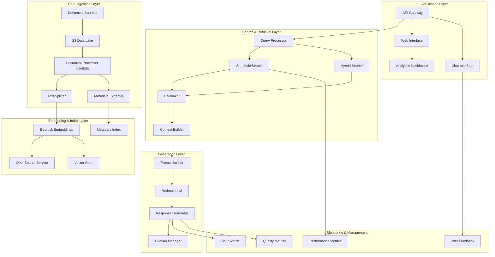
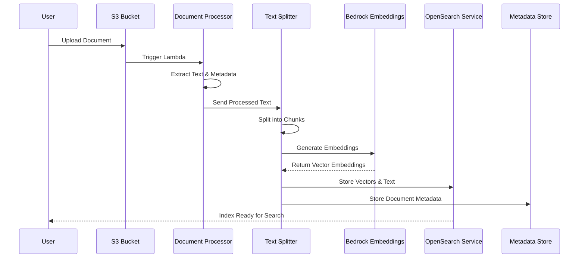
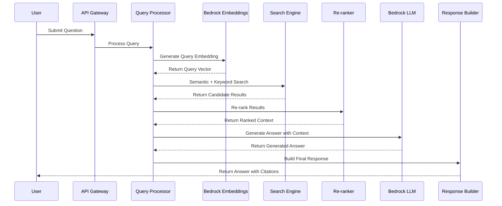

# 5.2.2 RAGシステム構築

このモジュールでは、RAG（Retrieval-Augmented Generation）アーキテクチャを用いた高度な知識ベース質問応答システムを構築します。大規模言語モデルの知識を外部データで拡張し、正確で最新の情報に基づく回答を生成するシステムを実装します。

## 📋 前提条件

### 必須の完了モジュール
- 1.1.1 AWSアカウント設定とIAM
- 5.1.1 Bedrockセットアップ
- 5.1.2 テキスト生成実装

### 技術要件
- Python 3.9以上またはNode.js 18以上
- AWS CLI v2.0以上
- Docker（ローカル開発用）
- ベクトル検索の基本理解

### 権限要件
- Bedrock基盤モデルへのアクセス権限
- OpenSearch Service の管理権限
- Lambda関数の作成・実行権限
- S3バケットの読み書き権限

## 🎯 学習目標

このモジュールを完了すると、以下のことができるようになります：

1. **RAGアーキテクチャの深い理解**
   - 検索拡張生成の原理と実装方法
   - ベクトル埋め込みとセマンティック検索
   - 情報検索と生成の統合手法

2. **高性能な文書処理パイプライン構築**
   - 多様な形式の文書処理（PDF、Word、HTML等）
   - テキストの分割・正規化・クリーニング
   - メタデータ抽出と構造化

3. **ベクトル検索システムの実装**
   - Amazon OpenSearch Serviceの活用
   - 埋め込みベクトルの生成・保存・検索
   - セマンティック検索とキーワード検索の組み合わせ

4. **エンタープライズレベルの質問応答システム**
   - 複雑なクエリに対する段階的推論
   - 回答の信頼性とソース追跡
   - 文脈を考慮した対話機能

5. **スケーラブルなデータ管理**
   - 大規模文書コレクションの効率的な管理
   - インクリメンタル更新とバージョン管理
   - 分散処理による高速化

6. **高度な検索精度の最適化**
   - ハイブリッド検索戦略の実装
   - リランキングと結果フィルタリング
   - ユーザーフィードバックによる継続的改善

7. **運用監視と品質管理**
   - 検索・生成品質のメトリクス計測
   - ユーザー満足度の追跡
   - システムパフォーマンス監視

8. **セキュリティとプライバシー対応**
   - アクセス制御と認証認可
   - データの暗号化と匿名化
   - 法的コンプライアンス対応

## 📐 アーキテクチャ概要

### RAGシステム全体構成



### 文書処理フロー



### 検索・回答生成フロー



## 🛠 ハンズオン実装

### ステップ1: 文書処理パイプラインの構築

#### 1.1 文書取り込み・処理Lambda関数の実装

```python
# lambda/document-processor/lambda_function.py
import json
import boto3
import os
import re
from typing import List, Dict, Any, Optional
from urllib.parse import unquote_plus
import fitz  # PyMuPDF for PDF processing
import docx  # python-docx for Word documents
from bs4 import BeautifulSoup  # For HTML processing
import nltk
from nltk.tokenize import sent_tokenize
from sentence_transformers import SentenceTransformer

# AWS Services
s3_client = boto3.client('s3')
bedrock_runtime = boto3.client('bedrock-runtime')
opensearch_client = boto3.client('opensearchserverless')

# Environment Variables
OPENSEARCH_ENDPOINT = os.environ.get('OPENSEARCH_ENDPOINT')
EMBEDDINGS_MODEL_ID = os.environ.get('EMBEDDINGS_MODEL_ID', 'amazon.titan-embed-text-v1')
CHUNK_SIZE = int(os.environ.get('CHUNK_SIZE', '1000'))
CHUNK_OVERLAP = int(os.environ.get('CHUNK_OVERLAP', '200'))

def lambda_handler(event, context):
    """
    メインのLambda ハンドラー関数
    S3イベントから文書を処理し、ベクトル化してOpenSearchに保存
    """
    try:
        # S3イベントから情報を抽出
        for record in event['Records']:
            bucket = record['s3']['bucket']['name']
            key = unquote_plus(record['s3']['object']['key'])
            
            print(f"Processing document: s3://{bucket}/{key}")
            
            # 文書を処理
            result = process_document(bucket, key)
            
            if result['success']:
                print(f"Successfully processed document: {key}")
                print(f"Created {result['chunks_count']} chunks")
            else:
                print(f"Failed to process document: {key}, Error: {result['error']}")
        
        return {
            'statusCode': 200,
            'body': json.dumps('Document processing completed successfully')
        }
        
    except Exception as e:
        print(f"Error in lambda_handler: {str(e)}")
        return {
            'statusCode': 500,
            'body': json.dumps(f'Error processing document: {str(e)}')
        }

def process_document(bucket: str, key: str) -> Dict[str, Any]:
    """
    単一文書の処理メイン関数
    """
    try:
        # S3から文書をダウンロード
        response = s3_client.get_object(Bucket=bucket, Key=key)
        document_content = response['Body'].read()
        
        # 文書の種類を判定
        file_extension = key.lower().split('.')[-1]
        
        # メタデータを抽出
        metadata = extract_metadata(bucket, key, response)
        
        # 文書からテキストを抽出
        text_content = extract_text_content(document_content, file_extension)
        
        if not text_content.strip():
            return {
                'success': False,
                'error': 'No extractable text found in document'
            }
        
        # テキストを前処理
        processed_text = preprocess_text(text_content)
        
        # テキストをチャンクに分割
        chunks = split_text_into_chunks(processed_text, metadata)
        
        # 各チャンクの埋め込みベクトルを生成
        embedded_chunks = []
        for i, chunk in enumerate(chunks):
            try:
                embedding = generate_embedding(chunk['text'])
                chunk['embedding'] = embedding
                chunk['chunk_id'] = f"{metadata['document_id']}_chunk_{i}"
                embedded_chunks.append(chunk)
            except Exception as e:
                print(f"Error generating embedding for chunk {i}: {str(e)}")
                continue
        
        # OpenSearchに保存
        indexing_result = store_in_opensearch(embedded_chunks, metadata)
        
        return {
            'success': True,
            'chunks_count': len(embedded_chunks),
            'indexing_result': indexing_result
        }
        
    except Exception as e:
        return {
            'success': False,
            'error': str(e)
        }

def extract_metadata(bucket: str, key: str, s3_response: Dict) -> Dict[str, Any]:
    """
    文書メタデータの抽出
    """
    import hashlib
    from datetime import datetime
    
    # S3オブジェクトメタデータ
    last_modified = s3_response.get('LastModified', datetime.now())
    content_length = s3_response.get('ContentLength', 0)
    content_type = s3_response.get('ContentType', 'application/octet-stream')
    
    # 文書IDの生成（ハッシュベース）
    document_id = hashlib.md5(f"{bucket}/{key}".encode()).hexdigest()
    
    metadata = {
        'document_id': document_id,
        'source_bucket': bucket,
        'source_key': key,
        'file_name': key.split('/')[-1],
        'file_extension': key.lower().split('.')[-1] if '.' in key else '',
        'content_type': content_type,
        'file_size': content_length,
        'upload_timestamp': last_modified.isoformat(),
        'processing_timestamp': datetime.now().isoformat(),
        'tags': extract_tags_from_path(key)
    }
    
    return metadata

def extract_tags_from_path(key: str) -> List[str]:
    """
    ファイルパスからタグを抽出
    """
    tags = []
    path_parts = key.split('/')
    
    # パスの各部分をタグとして使用
    for part in path_parts[:-1]:  # ファイル名を除く
        if part and part != '.':
            tags.append(part.lower())
    
    return tags

def extract_text_content(content: bytes, file_extension: str) -> str:
    """
    ファイルタイプに応じたテキスト抽出
    """
    try:
        if file_extension == 'pdf':
            return extract_text_from_pdf(content)
        elif file_extension in ['doc', 'docx']:
            return extract_text_from_docx(content)
        elif file_extension in ['html', 'htm']:
            return extract_text_from_html(content)
        elif file_extension in ['txt', 'md']:
            return content.decode('utf-8', errors='ignore')
        else:
            # テキストファイルとして試行
            return content.decode('utf-8', errors='ignore')
    except Exception as e:
        print(f"Error extracting text from {file_extension}: {str(e)}")
        return ""

def extract_text_from_pdf(content: bytes) -> str:
    """
    PDFからテキストを抽出
    """
    import io
    
    text_content = []
    
    try:
        # PyMuPDFを使用してPDFを処理
        pdf_document = fitz.open(stream=content, filetype="pdf")
        
        for page_num in range(pdf_document.page_count):
            page = pdf_document[page_num]
            text = page.get_text()
            
            if text.strip():
                text_content.append(text)
        
        pdf_document.close()
        
    except Exception as e:
        print(f"Error processing PDF: {str(e)}")
        return ""
    
    return '\n\n'.join(text_content)

def extract_text_from_docx(content: bytes) -> str:
    """
    Word文書からテキストを抽出
    """
    import io
    
    try:
        doc = docx.Document(io.BytesIO(content))
        text_content = []
        
        for paragraph in doc.paragraphs:
            if paragraph.text.strip():
                text_content.append(paragraph.text)
        
        return '\n\n'.join(text_content)
        
    except Exception as e:
        print(f"Error processing DOCX: {str(e)}")
        return ""

def extract_text_from_html(content: bytes) -> str:
    """
    HTMLからテキストを抽出
    """
    try:
        soup = BeautifulSoup(content, 'html.parser')
        
        # スクリプトとスタイルを削除
        for script in soup(["script", "style"]):
            script.decompose()
        
        # テキストを抽出
        text = soup.get_text()
        
        # 行間を整理
        lines = (line.strip() for line in text.splitlines())
        chunks = (phrase.strip() for line in lines for phrase in line.split("  "))
        text = ' '.join(chunk for chunk in chunks if chunk)
        
        return text
        
    except Exception as e:
        print(f"Error processing HTML: {str(e)}")
        return ""

def preprocess_text(text: str) -> str:
    """
    テキストの前処理・正規化
    """
    # 不要な空白文字を除去
    text = re.sub(r'\s+', ' ', text)
    
    # 特殊文字の正規化
    text = re.sub(r'[^\w\s\.\,\!\?\;\:\-\(\)\"\']', ' ', text)
    
    # 連続する句読点を単一に
    text = re.sub(r'([\.!?]){2,}', r'\1', text)
    
    return text.strip()

def split_text_into_chunks(text: str, metadata: Dict[str, Any]) -> List[Dict[str, Any]]:
    """
    テキストを意味的なチャンクに分割
    """
    chunks = []
    
    try:
        # 文単位で分割
        sentences = sent_tokenize(text)
        
        current_chunk = ""
        current_chunk_sentences = []
        
        for sentence in sentences:
            # チャンクサイズを超える場合は新しいチャンクを開始
            if len(current_chunk) + len(sentence) > CHUNK_SIZE and current_chunk:
                # オーバーラップ分を考慮
                overlap_sentences = current_chunk_sentences[-2:] if len(current_chunk_sentences) >= 2 else current_chunk_sentences
                
                chunks.append({
                    'text': current_chunk.strip(),
                    'sentence_count': len(current_chunk_sentences),
                    'char_count': len(current_chunk),
                    'metadata': metadata.copy()
                })
                
                # 新しいチャンクをオーバーラップ文で開始
                current_chunk = ' '.join(overlap_sentences) + ' ' if overlap_sentences else ''
                current_chunk_sentences = overlap_sentences.copy() if overlap_sentences else []
            
            current_chunk += sentence + ' '
            current_chunk_sentences.append(sentence)
        
        # 最後のチャンクを追加
        if current_chunk.strip():
            chunks.append({
                'text': current_chunk.strip(),
                'sentence_count': len(current_chunk_sentences),
                'char_count': len(current_chunk),
                'metadata': metadata.copy()
            })
    
    except Exception as e:
        print(f"Error in text splitting: {str(e)}")
        # フォールバック: 固定サイズでの分割
        chunks = split_text_fixed_size(text, metadata)
    
    return chunks

def split_text_fixed_size(text: str, metadata: Dict[str, Any]) -> List[Dict[str, Any]]:
    """
    固定サイズでのテキスト分割（フォールバック用）
    """
    chunks = []
    start = 0
    
    while start < len(text):
        end = start + CHUNK_SIZE
        
        # オーバーラップを考慮
        if start > 0:
            start -= CHUNK_OVERLAP
        
        chunk_text = text[start:end]
        
        chunks.append({
            'text': chunk_text,
            'char_count': len(chunk_text),
            'metadata': metadata.copy()
        })
        
        start = end
    
    return chunks

def generate_embedding(text: str) -> List[float]:
    """
    Bedrockを使用してテキストの埋め込みベクトルを生成
    """
    try:
        # Titan Embeddings モデル用のリクエストボディ
        body = {
            "inputText": text
        }
        
        response = bedrock_runtime.invoke_model(
            modelId=EMBEDDINGS_MODEL_ID,
            body=json.dumps(body)
        )
        
        response_body = json.loads(response['body'].read())
        embedding = response_body.get('embedding', [])
        
        return embedding
        
    except Exception as e:
        print(f"Error generating embedding: {str(e)}")
        raise

def store_in_opensearch(chunks: List[Dict[str, Any]], document_metadata: Dict[str, Any]) -> Dict[str, Any]:
    """
    チャンクをOpenSearchに保存
    """
    try:
        from opensearchpy import OpenSearch, RequestsHttpConnection
        from aws_requests_auth.aws_auth import AWSRequestsAuth
        
        # OpenSearchクライアント設定
        host = OPENSEARCH_ENDPOINT.replace('https://', '')
        auth = AWSRequestsAuth(aws_access_key=os.environ['AWS_ACCESS_KEY_ID'],
                              aws_secret_access_key=os.environ['AWS_SECRET_ACCESS_KEY'],
                              aws_token=os.environ.get('AWS_SESSION_TOKEN'),
                              aws_host=host,
                              aws_region=os.environ['AWS_REGION'],
                              aws_service='es')
        
        client = OpenSearch(
            hosts=[{'host': host, 'port': 443}],
            http_auth=auth,
            use_ssl=True,
            verify_certs=True,
            connection_class=RequestsHttpConnection
        )
        
        # インデックス名
        index_name = f"documents-{document_metadata['file_extension']}"
        
        # インデックスが存在しない場合は作成
        if not client.indices.exists(index=index_name):
            create_index(client, index_name)
        
        # バルクインサート用のデータ準備
        bulk_data = []
        successful_inserts = 0
        
        for chunk in chunks:
            doc = {
                'chunk_id': chunk['chunk_id'],
                'document_id': document_metadata['document_id'],
                'text': chunk['text'],
                'embedding': chunk['embedding'],
                'metadata': {
                    **document_metadata,
                    'chunk_info': {
                        'char_count': chunk['char_count'],
                        'sentence_count': chunk.get('sentence_count', 0)
                    }
                },
                'timestamp': document_metadata['processing_timestamp']
            }
            
            bulk_data.append({
                "index": {
                    "_index": index_name,
                    "_id": chunk['chunk_id']
                }
            })
            bulk_data.append(doc)
        
        # バルクインサート実行
        if bulk_data:
            response = client.bulk(body=bulk_data)
            
            # エラーチェック
            if response['errors']:
                for item in response['items']:
                    if 'index' in item and 'error' in item['index']:
                        print(f"Indexing error: {item['index']['error']}")
                    else:
                        successful_inserts += 1
            else:
                successful_inserts = len(chunks)
        
        return {
            'index_name': index_name,
            'total_chunks': len(chunks),
            'successful_inserts': successful_inserts,
            'errors': successful_inserts < len(chunks)
        }
        
    except Exception as e:
        print(f"Error storing in OpenSearch: {str(e)}")
        raise

def create_index(client, index_name: str):
    """
    OpenSearchインデックスを作成
    """
    mapping = {
        "mappings": {
            "properties": {
                "chunk_id": {"type": "keyword"},
                "document_id": {"type": "keyword"},
                "text": {
                    "type": "text",
                    "analyzer": "standard"
                },
                "embedding": {
                    "type": "knn_vector",
                    "dimension": 1536,  # Titan Embeddings のベクトル次元
                    "method": {
                        "name": "hnsw",
                        "space_type": "cosinesimil",
                        "engine": "nmslib",
                        "parameters": {
                            "ef_construction": 128,
                            "m": 24
                        }
                    }
                },
                "metadata": {
                    "type": "object",
                    "properties": {
                        "file_name": {"type": "keyword"},
                        "file_extension": {"type": "keyword"},
                        "content_type": {"type": "keyword"},
                        "tags": {"type": "keyword"},
                        "file_size": {"type": "long"},
                        "upload_timestamp": {"type": "date"},
                        "processing_timestamp": {"type": "date"}
                    }
                },
                "timestamp": {"type": "date"}
            }
        },
        "settings": {
            "index": {
                "knn": True,
                "knn.algo_param.ef_search": 100
            }
        }
    }
    
    client.indices.create(index=index_name, body=mapping)
    print(f"Created index: {index_name}")
```

#### 1.2 検索・質問応答Lambda関数の実装

```python
# lambda/rag-query-processor/lambda_function.py
import json
import boto3
import os
from typing import Dict, List, Any, Optional
from datetime import datetime
import re

# AWS Services
bedrock_runtime = boto3.client('bedrock-runtime')

# Environment Variables
OPENSEARCH_ENDPOINT = os.environ.get('OPENSEARCH_ENDPOINT')
EMBEDDINGS_MODEL_ID = os.environ.get('EMBEDDINGS_MODEL_ID', 'amazon.titan-embed-text-v1')
LLM_MODEL_ID = os.environ.get('LLM_MODEL_ID', 'anthropic.claude-3-haiku-20240307-v1:0')
MAX_CONTEXT_LENGTH = int(os.environ.get('MAX_CONTEXT_LENGTH', '4000'))
TOP_K_RESULTS = int(os.environ.get('TOP_K_RESULTS', '5'))

def lambda_handler(event, context):
    """
    RAG質問応答のメインハンドラー
    """
    try:
        # リクエストボディの解析
        if 'body' in event:
            body = json.loads(event['body']) if isinstance(event['body'], str) else event['body']
        else:
            body = event
        
        # パラメータ抽出
        query = body.get('query', '').strip()
        search_type = body.get('search_type', 'hybrid')  # semantic, keyword, hybrid
        max_results = min(body.get('max_results', TOP_K_RESULTS), 20)
        include_sources = body.get('include_sources', True)
        filters = body.get('filters', {})
        
        # 入力検証
        if not query:
            return create_response(400, {
                'error': 'Query is required',
                'message': 'Please provide a valid query string'
            })
        
        if len(query) > 1000:
            return create_response(400, {
                'error': 'Query too long',
                'message': 'Query must be less than 1000 characters'
            })
        
        print(f"Processing query: {query[:100]}...")
        
        # RAG処理の実行
        result = process_rag_query(
            query=query,
            search_type=search_type,
            max_results=max_results,
            include_sources=include_sources,
            filters=filters
        )
        
        return create_response(200, result)
        
    except Exception as e:
        print(f"Error in lambda_handler: {str(e)}")
        return create_response(500, {
            'error': 'Internal server error',
            'message': 'An unexpected error occurred while processing your query'
        })

def process_rag_query(query: str, search_type: str, max_results: int, 
                     include_sources: bool, filters: Dict[str, Any]) -> Dict[str, Any]:
    """
    RAGクエリの処理メイン関数
    """
    start_time = datetime.now()
    
    try:
        # 1. クエリの前処理
        processed_query = preprocess_query(query)
        
        # 2. 関連文書の検索
        search_results = search_relevant_documents(
            query=processed_query,
            search_type=search_type,
            max_results=max_results,
            filters=filters
        )
        
        if not search_results:
            return {
                'answer': "申し訳ございませんが、ご質問に関連する情報を見つけることができませんでした。別の表現で質問していただくか、より具体的な内容でお尋ねください。",
                'sources': [],
                'confidence': 0.0,
                'search_results_count': 0,
                'processing_time_ms': int((datetime.now() - start_time).total_seconds() * 1000)
            }
        
        # 3. コンテキストの構築
        context = build_context_from_results(search_results, MAX_CONTEXT_LENGTH)
        
        # 4. LLMによる回答生成
        answer_result = generate_answer_with_llm(processed_query, context, search_results)
        
        # 5. レスポンスの構築
        response = {
            'answer': answer_result['answer'],
            'confidence': calculate_confidence_score(search_results, answer_result),
            'search_results_count': len(search_results),
            'processing_time_ms': int((datetime.now() - start_time).total_seconds() * 1000)
        }
        
        if include_sources:
            response['sources'] = format_sources(search_results)
        
        # 6. 使用統計の記録
        log_query_statistics(query, search_results, answer_result, response)
        
        return response
        
    except Exception as e:
        print(f"Error in process_rag_query: {str(e)}")
        raise

def preprocess_query(query: str) -> str:
    """
    クエリの前処理・正規化
    """
    # 基本的なクリーニング
    processed = re.sub(r'\s+', ' ', query.strip())
    
    # 特殊文字の処理
    processed = re.sub(r'[^\w\s\?\.\,\!\-\(\)]', ' ', processed)
    
    return processed

def search_relevant_documents(query: str, search_type: str, max_results: int, 
                            filters: Dict[str, Any]) -> List[Dict[str, Any]]:
    """
    関連文書の検索実行
    """
    try:
        from opensearchpy import OpenSearch, RequestsHttpConnection
        from aws_requests_auth.aws_auth import AWSRequestsAuth
        
        # OpenSearchクライアント設定
        host = OPENSEARCH_ENDPOINT.replace('https://', '')
        auth = AWSRequestsAuth(aws_access_key=os.environ['AWS_ACCESS_KEY_ID'],
                              aws_secret_access_key=os.environ['AWS_SECRET_ACCESS_KEY'],
                              aws_token=os.environ.get('AWS_SESSION_TOKEN'),
                              aws_host=host,
                              aws_region=os.environ['AWS_REGION'],
                              aws_service='es')
        
        client = OpenSearch(
            hosts=[{'host': host, 'port': 443}],
            http_auth=auth,
            use_ssl=True,
            verify_certs=True,
            connection_class=RequestsHttpConnection
        )
        
        if search_type == 'semantic':
            return semantic_search(client, query, max_results, filters)
        elif search_type == 'keyword':
            return keyword_search(client, query, max_results, filters)
        else:  # hybrid
            return hybrid_search(client, query, max_results, filters)
            
    except Exception as e:
        print(f"Error in search_relevant_documents: {str(e)}")
        return []

def semantic_search(client, query: str, max_results: int, filters: Dict[str, Any]) -> List[Dict[str, Any]]:
    """
    セマンティック検索（ベクトル検索）
    """
    try:
        # クエリの埋め込みベクトルを生成
        query_embedding = generate_embedding(query)
        
        # ベクトル検索クエリ
        search_query = {
            "size": max_results,
            "query": {
                "bool": {
                    "must": [
                        {
                            "knn": {
                                "embedding": {
                                    "vector": query_embedding,
                                    "k": max_results
                                }
                            }
                        }
                    ]
                }
            },
            "_source": ["text", "metadata", "chunk_id", "document_id"]
        }
        
        # フィルタの追加
        if filters:
            search_query["query"]["bool"]["filter"] = build_filters(filters)
        
        # 検索実行
        response = client.search(
            index="documents-*",
            body=search_query
        )
        
        return format_search_results(response['hits']['hits'])
        
    except Exception as e:
        print(f"Error in semantic_search: {str(e)}")
        return []

def keyword_search(client, query: str, max_results: int, filters: Dict[str, Any]) -> List[Dict[str, Any]]:
    """
    キーワード検索（全文検索）
    """
    try:
        search_query = {
            "size": max_results,
            "query": {
                "bool": {
                    "must": [
                        {
                            "multi_match": {
                                "query": query,
                                "fields": ["text^2", "metadata.file_name"],
                                "type": "best_fields",
                                "fuzziness": "AUTO"
                            }
                        }
                    ]
                }
            },
            "_source": ["text", "metadata", "chunk_id", "document_id"]
        }
        
        # フィルタの追加
        if filters:
            search_query["query"]["bool"]["filter"] = build_filters(filters)
        
        # 検索実行
        response = client.search(
            index="documents-*",
            body=search_query
        )
        
        return format_search_results(response['hits']['hits'])
        
    except Exception as e:
        print(f"Error in keyword_search: {str(e)}")
        return []

def hybrid_search(client, query: str, max_results: int, filters: Dict[str, Any]) -> List[Dict[str, Any]]:
    """
    ハイブリッド検索（セマンティック + キーワード）
    """
    try:
        # セマンティック検索結果
        semantic_results = semantic_search(client, query, max_results, filters)
        
        # キーワード検索結果
        keyword_results = keyword_search(client, query, max_results, filters)
        
        # 結果の統合とリランキング
        combined_results = combine_and_rerank_results(
            semantic_results, keyword_results, query, max_results
        )
        
        return combined_results
        
    except Exception as e:
        print(f"Error in hybrid_search: {str(e)}")
        return []

def combine_and_rerank_results(semantic_results: List[Dict], keyword_results: List[Dict], 
                              query: str, max_results: int) -> List[Dict[str, Any]]:
    """
    検索結果の統合とリランキング
    """
    try:
        # 結果を統合（重複排除）
        combined = {}
        
        # セマンティック検索結果（重み: 0.7）
        for i, result in enumerate(semantic_results):
            chunk_id = result['chunk_id']
            combined[chunk_id] = result
            combined[chunk_id]['semantic_score'] = result['score']
            combined[chunk_id]['semantic_rank'] = i + 1
            combined[chunk_id]['keyword_score'] = 0
            combined[chunk_id]['keyword_rank'] = max_results + 1
        
        # キーワード検索結果（重み: 0.3）
        for i, result in enumerate(keyword_results):
            chunk_id = result['chunk_id']
            if chunk_id in combined:
                combined[chunk_id]['keyword_score'] = result['score']
                combined[chunk_id]['keyword_rank'] = i + 1
            else:
                combined[chunk_id] = result
                combined[chunk_id]['semantic_score'] = 0
                combined[chunk_id]['semantic_rank'] = max_results + 1
                combined[chunk_id]['keyword_score'] = result['score']
                combined[chunk_id]['keyword_rank'] = i + 1
        
        # ハイブリッドスコアの計算
        for chunk_id, result in combined.items():
            # 正規化されたランクスコア
            norm_semantic = 1.0 / result['semantic_rank'] if result['semantic_rank'] <= max_results else 0
            norm_keyword = 1.0 / result['keyword_rank'] if result['keyword_rank'] <= max_results else 0
            
            # ハイブリッドスコア（重み付き）
            result['hybrid_score'] = (0.7 * norm_semantic) + (0.3 * norm_keyword)
        
        # ハイブリッドスコアでソート
        sorted_results = sorted(combined.values(), key=lambda x: x['hybrid_score'], reverse=True)
        
        return sorted_results[:max_results]
        
    except Exception as e:
        print(f"Error in combine_and_rerank_results: {str(e)}")
        return semantic_results[:max_results]

def build_filters(filters: Dict[str, Any]) -> List[Dict[str, Any]]:
    """
    検索フィルタの構築
    """
    filter_clauses = []
    
    if 'file_extension' in filters:
        filter_clauses.append({
            "term": {"metadata.file_extension": filters['file_extension']}
        })
    
    if 'tags' in filters:
        filter_clauses.append({
            "terms": {"metadata.tags": filters['tags']}
        })
    
    if 'date_range' in filters:
        date_range = filters['date_range']
        range_filter = {"range": {"metadata.upload_timestamp": {}}}
        
        if 'from' in date_range:
            range_filter["range"]["metadata.upload_timestamp"]["gte"] = date_range['from']
        if 'to' in date_range:
            range_filter["range"]["metadata.upload_timestamp"]["lte"] = date_range['to']
        
        filter_clauses.append(range_filter)
    
    return filter_clauses

def format_search_results(hits: List[Dict]) -> List[Dict[str, Any]]:
    """
    検索結果のフォーマット
    """
    results = []
    
    for hit in hits:
        result = {
            'chunk_id': hit['_source']['chunk_id'],
            'document_id': hit['_source']['document_id'],
            'text': hit['_source']['text'],
            'score': hit['_score'],
            'metadata': hit['_source']['metadata']
        }
        results.append(result)
    
    return results

def build_context_from_results(search_results: List[Dict], max_length: int) -> str:
    """
    検索結果からコンテキストを構築
    """
    context_parts = []
    current_length = 0
    
    for i, result in enumerate(search_results):
        text = result['text']
        source_info = f"[Source {i+1}: {result['metadata']['file_name']}]"
        
        part = f"{source_info}\n{text}\n"
        
        if current_length + len(part) > max_length:
            break
        
        context_parts.append(part)
        current_length += len(part)
    
    return "\n".join(context_parts)

def generate_answer_with_llm(query: str, context: str, search_results: List[Dict]) -> Dict[str, Any]:
    """
    LLMを使用した回答生成
    """
    try:
        # プロンプトの構築
        prompt = build_answer_prompt(query, context, search_results)
        
        # Claude APIの呼び出し
        body = {
            "anthropic_version": "bedrock-2023-05-31",
            "max_tokens": 1000,
            "temperature": 0.3,
            "messages": [
                {
                    "role": "user",
                    "content": prompt
                }
            ]
        }
        
        response = bedrock_runtime.invoke_model(
            modelId=LLM_MODEL_ID,
            body=json.dumps(body)
        )
        
        response_body = json.loads(response['body'].read())
        answer = response_body['content'][0]['text']
        
        return {
            'answer': answer.strip(),
            'prompt_tokens': response_body.get('usage', {}).get('input_tokens', 0),
            'completion_tokens': response_body.get('usage', {}).get('output_tokens', 0)
        }
        
    except Exception as e:
        print(f"Error in generate_answer_with_llm: {str(e)}")
        return {
            'answer': "申し訳ございませんが、回答の生成中にエラーが発生しました。しばらく待ってから再度お試しください。",
            'prompt_tokens': 0,
            'completion_tokens': 0
        }

def build_answer_prompt(query: str, context: str, search_results: List[Dict]) -> str:
    """
    回答生成用プロンプトの構築
    """
    prompt = f"""あなたは質問応答システムのAIアシスタントです。提供されたコンテキスト情報を基に、ユーザーの質問に正確で有用な回答を提供してください。

## 回答時の指針:
1. 提供されたコンテキスト情報のみを基に回答してください
2. 不明な点がある場合は、推測ではなく「情報が不足している」旨を伝えてください
3. 回答は分かりやすく、構造化された形式で提示してください
4. 可能な場合は、具体例や詳細を含めて説明してください
5. 複数のソースからの情報がある場合は、それらを統合して包括的な回答を作成してください

## コンテキスト情報:
{context}

## ユーザーの質問:
{query}

## 回答:
上記のコンテキスト情報を基に、質問に対する正確で詳細な回答を提供してください。情報が不足している場合や、コンテキストに関連する情報がない場合は、その旨を明確に伝えてください。"""

    return prompt

def calculate_confidence_score(search_results: List[Dict], answer_result: Dict) -> float:
    """
    回答の信頼度スコア計算
    """
    if not search_results:
        return 0.0
    
    # 検索結果のスコア平均
    avg_search_score = sum(result['score'] for result in search_results) / len(search_results)
    
    # 検索結果数による調整
    result_count_factor = min(len(search_results) / 5.0, 1.0)  # 5件以上で最大
    
    # トークン数による調整（長い回答ほど信頼度が高い傾向）
    token_factor = min(answer_result.get('completion_tokens', 0) / 200.0, 1.0)
    
    # 総合スコア
    confidence = (avg_search_score * 0.5 + result_count_factor * 0.3 + token_factor * 0.2)
    
    return round(min(confidence, 1.0), 2)

def format_sources(search_results: List[Dict]) -> List[Dict[str, Any]]:
    """
    ソース情報のフォーマット
    """
    sources = []
    
    for i, result in enumerate(search_results):
        source = {
            'id': i + 1,
            'document_id': result['document_id'],
            'file_name': result['metadata']['file_name'],
            'chunk_id': result['chunk_id'],
            'relevance_score': round(result['score'], 3),
            'snippet': result['text'][:200] + "..." if len(result['text']) > 200 else result['text']
        }
        
        # 追加メタデータ
        if 'file_size' in result['metadata']:
            source['file_size'] = result['metadata']['file_size']
        if 'upload_timestamp' in result['metadata']:
            source['upload_date'] = result['metadata']['upload_timestamp']
        if 'tags' in result['metadata']:
            source['tags'] = result['metadata']['tags']
        
        sources.append(source)
    
    return sources

def generate_embedding(text: str) -> List[float]:
    """
    テキストの埋め込みベクトル生成
    """
    try:
        body = {
            "inputText": text
        }
        
        response = bedrock_runtime.invoke_model(
            modelId=EMBEDDINGS_MODEL_ID,
            body=json.dumps(body)
        )
        
        response_body = json.loads(response['body'].read())
        embedding = response_body.get('embedding', [])
        
        return embedding
        
    except Exception as e:
        print(f"Error generating embedding: {str(e)}")
        raise

def log_query_statistics(query: str, search_results: List[Dict], 
                        answer_result: Dict, response: Dict):
    """
    クエリ統計のログ記録
    """
    stats = {
        'timestamp': datetime.now().isoformat(),
        'query_length': len(query),
        'search_results_count': len(search_results),
        'average_search_score': sum(r['score'] for r in search_results) / len(search_results) if search_results else 0,
        'answer_length': len(answer_result.get('answer', '')),
        'confidence_score': response.get('confidence', 0),
        'processing_time_ms': response.get('processing_time_ms', 0),
        'prompt_tokens': answer_result.get('prompt_tokens', 0),
        'completion_tokens': answer_result.get('completion_tokens', 0)
    }
    
    print(f"Query Statistics: {json.dumps(stats)}")

def create_response(status_code: int, body: Dict[str, Any]) -> Dict[str, Any]:
    """
    HTTP レスポンスの作成
    """
    return {
        'statusCode': status_code,
        'headers': {
            'Content-Type': 'application/json',
            'Access-Control-Allow-Origin': '*',
            'Access-Control-Allow-Headers': 'Content-Type,Authorization',
            'Access-Control-Allow-Methods': 'POST,OPTIONS'
        },
        'body': json.dumps(body, ensure_ascii=False, default=str)
    }
```

### ステップ2: CloudFormationインフラストラクチャ

#### 2.1 RAGシステム用CloudFormationテンプレート

```yaml
# cloudformation/rag-system.yaml
AWSTemplateFormatVersion: '2010-09-09'
Description: 'Comprehensive RAG System with Bedrock and OpenSearch'

Parameters:
  ProjectName:
    Type: String
    Default: 'rag-system'
    Description: 'Project name for resource naming'
  
  EnvironmentName:
    Type: String
    Default: 'dev'
    AllowedValues: [dev, staging, prod]
    Description: 'Environment name'
  
  OpenSearchInstanceType:
    Type: String
    Default: 't3.small.search'
    AllowedValues: [t3.small.search, t3.medium.search, m6g.large.search, m6g.xlarge.search]
    Description: 'OpenSearch instance type'
  
  OpenSearchInstanceCount:
    Type: Number
    Default: 1
    MinValue: 1
    MaxValue: 20
    Description: 'Number of OpenSearch instances'

Conditions:
  IsProduction: !Equals [!Ref EnvironmentName, 'prod']

Resources:
  # S3 Bucket for document storage
  DocumentsBucket:
    Type: AWS::S3::Bucket
    Properties:
      BucketName: !Sub '${ProjectName}-${EnvironmentName}-documents'
      VersioningConfiguration:
        Status: Enabled
      PublicAccessBlockConfiguration:
        BlockPublicAcls: true
        BlockPublicPolicy: true
        IgnorePublicAcls: true
        RestrictPublicBuckets: true
      LifecycleConfiguration:
        Rules:
          - Id: DeleteOldVersions
            Status: Enabled
            NoncurrentVersionExpirationInDays: 30
          - Id: TransitionToIA
            Status: Enabled
            Transitions:
              - TransitionInDays: 30
                StorageClass: STANDARD_IA
              - TransitionInDays: 90
                StorageClass: GLACIER
      NotificationConfiguration:
        LambdaConfigurations:
          - Event: s3:ObjectCreated:*
            Function: !GetAtt DocumentProcessorFunction.Arn
            Filter:
              S3Key:
                Rules:
                  - Name: suffix
                    Value: .pdf
          - Event: s3:ObjectCreated:*
            Function: !GetAtt DocumentProcessorFunction.Arn
            Filter:
              S3Key:
                Rules:
                  - Name: suffix
                    Value: .docx
          - Event: s3:ObjectCreated:*
            Function: !GetAtt DocumentProcessorFunction.Arn
            Filter:
              S3Key:
                Rules:
                  - Name: suffix
                    Value: .txt

  # VPC for OpenSearch
  VPC:
    Type: AWS::EC2::VPC
    Properties:
      CidrBlock: 10.0.0.0/16
      EnableDnsHostnames: true
      EnableDnsSupport: true
      Tags:
        - Key: Name
          Value: !Sub '${ProjectName}-${EnvironmentName}-vpc'

  # Private Subnets for OpenSearch
  PrivateSubnet1:
    Type: AWS::EC2::Subnet
    Properties:
      VpcId: !Ref VPC
      CidrBlock: 10.0.1.0/24
      AvailabilityZone: !Select [0, !GetAZs '']
      Tags:
        - Key: Name
          Value: !Sub '${ProjectName}-${EnvironmentName}-private-subnet-1'

  PrivateSubnet2:
    Type: AWS::EC2::Subnet
    Properties:
      VpcId: !Ref VPC
      CidrBlock: 10.0.2.0/24
      AvailabilityZone: !Select [1, !GetAZs '']
      Tags:
        - Key: Name
          Value: !Sub '${ProjectName}-${EnvironmentName}-private-subnet-2'

  # Security Group for OpenSearch
  OpenSearchSecurityGroup:
    Type: AWS::EC2::SecurityGroup
    Properties:
      GroupDescription: 'Security group for OpenSearch cluster'
      VpcId: !Ref VPC
      SecurityGroupIngress:
        - IpProtocol: tcp
          FromPort: 443
          ToPort: 443
          SourceSecurityGroupId: !Ref LambdaSecurityGroup
          Description: 'HTTPS access from Lambda'
        - IpProtocol: tcp
          FromPort: 80
          ToPort: 80
          SourceSecurityGroupId: !Ref LambdaSecurityGroup
          Description: 'HTTP access from Lambda'

  # Security Group for Lambda
  LambdaSecurityGroup:
    Type: AWS::EC2::SecurityGroup
    Properties:
      GroupDescription: 'Security group for Lambda functions'
      VpcId: !Ref VPC
      SecurityGroupEgress:
        - IpProtocol: -1
          CidrIp: 0.0.0.0/0
          Description: 'All outbound traffic'

  # OpenSearch Domain
  OpenSearchDomain:
    Type: AWS::OpenSearch::Domain
    Properties:
      DomainName: !Sub '${ProjectName}-${EnvironmentName}-search'
      EngineVersion: 'OpenSearch_2.3'
      ClusterConfig:
        InstanceType: !Ref OpenSearchInstanceType
        InstanceCount: !Ref OpenSearchInstanceCount
        DedicatedMasterEnabled: !If [IsProduction, true, false]
        MasterInstanceType: !If [IsProduction, 'm6g.medium.search', !Ref 'AWS::NoValue']
        MasterInstanceCount: !If [IsProduction, 3, !Ref 'AWS::NoValue']
        ZoneAwarenessEnabled: !If [IsProduction, true, false]
        ZoneAwarenessConfig: !If 
          - IsProduction
          - AvailabilityZoneCount: 2
          - !Ref 'AWS::NoValue'
      EBSOptions:
        EBSEnabled: true
        VolumeType: gp3
        VolumeSize: !If [IsProduction, 100, 20]
        Iops: !If [IsProduction, 3000, 3000]
        Throughput: !If [IsProduction, 125, 125]
      VPCOptions:
        SecurityGroupIds:
          - !Ref OpenSearchSecurityGroup
        SubnetIds:
          - !Ref PrivateSubnet1
          - !If [IsProduction, !Ref PrivateSubnet2, !Ref 'AWS::NoValue']
      EncryptionAtRestOptions:
        Enabled: true
      NodeToNodeEncryptionOptions:
        Enabled: true
      DomainEndpointOptions:
        EnforceHTTPS: true
        TLSSecurityPolicy: 'Policy-Min-TLS-1-2-2019-07'
      AccessPolicies:
        Version: '2012-10-17'
        Statement:
          - Effect: Allow
            Principal:
              AWS: !GetAtt LambdaExecutionRole.Arn
            Action:
              - es:ESHttpGet
              - es:ESHttpPost
              - es:ESHttpPut
              - es:ESHttpDelete
              - es:ESHttpHead
            Resource: !Sub 'arn:aws:es:${AWS::Region}:${AWS::AccountId}:domain/${ProjectName}-${EnvironmentName}-search/*'
      LogPublishingOptions:
        SEARCH_SLOW_LOGS:
          CloudWatchLogsLogGroupArn: !GetAtt OpenSearchLogGroup.Arn
          Enabled: true
        INDEX_SLOW_LOGS:
          CloudWatchLogsLogGroupArn: !GetAtt OpenSearchLogGroup.Arn
          Enabled: true
        ES_APPLICATION_LOGS:
          CloudWatchLogsLogGroupArn: !GetAtt OpenSearchLogGroup.Arn
          Enabled: true

  # Lambda Execution Role
  LambdaExecutionRole:
    Type: AWS::IAM::Role
    Properties:
      RoleName: !Sub '${ProjectName}-${EnvironmentName}-lambda-role'
      AssumeRolePolicyDocument:
        Version: '2012-10-17'
        Statement:
          - Effect: Allow
            Principal:
              Service: lambda.amazonaws.com
            Action: sts:AssumeRole
      ManagedPolicyArns:
        - arn:aws:iam::aws:policy/service-role/AWSLambdaBasicExecutionRole
        - arn:aws:iam::aws:policy/service-role/AWSLambdaVPCAccessExecutionRole
      Policies:
        - PolicyName: S3Access
          PolicyDocument:
            Version: '2012-10-17'
            Statement:
              - Effect: Allow
                Action:
                  - s3:GetObject
                  - s3:PutObject
                  - s3:DeleteObject
                Resource: !Sub '${DocumentsBucket}/*'
              - Effect: Allow
                Action:
                  - s3:ListBucket
                Resource: !Ref DocumentsBucket
        - PolicyName: BedrockAccess
          PolicyDocument:
            Version: '2012-10-17'
            Statement:
              - Effect: Allow
                Action:
                  - bedrock:InvokeModel
                  - bedrock:InvokeModelWithResponseStream
                Resource:
                  - !Sub 'arn:aws:bedrock:${AWS::Region}::foundation-model/amazon.titan-embed-text-v1'
                  - !Sub 'arn:aws:bedrock:${AWS::Region}::foundation-model/anthropic.claude-3-haiku-20240307-v1:0'
                  - !Sub 'arn:aws:bedrock:${AWS::Region}::foundation-model/anthropic.claude-3-sonnet-20240229-v1:0'
        - PolicyName: OpenSearchAccess
          PolicyDocument:
            Version: '2012-10-17'
            Statement:
              - Effect: Allow
                Action:
                  - es:ESHttpGet
                  - es:ESHttpPost
                  - es:ESHttpPut
                  - es:ESHttpDelete
                  - es:ESHttpHead
                Resource: !GetAtt OpenSearchDomain.Arn
        - PolicyName: CloudWatchAccess
          PolicyDocument:
            Version: '2012-10-17'
            Statement:
              - Effect: Allow
                Action:
                  - logs:CreateLogGroup
                  - logs:CreateLogStream
                  - logs:PutLogEvents
                  - logs:DescribeLogGroups
                  - logs:DescribeLogStreams
                Resource: '*'

  # Document Processor Lambda Function
  DocumentProcessorFunction:
    Type: AWS::Lambda::Function
    Properties:
      FunctionName: !Sub '${ProjectName}-${EnvironmentName}-document-processor'
      Runtime: python3.11
      Handler: lambda_function.lambda_handler
      Role: !GetAtt LambdaExecutionRole.Arn
      Code:
        S3Bucket: !Ref ArtifactsBucket
        S3Key: 'lambda/document-processor.zip'
      Environment:
        Variables:
          OPENSEARCH_ENDPOINT: !GetAtt OpenSearchDomain.DomainEndpoint
          EMBEDDINGS_MODEL_ID: 'amazon.titan-embed-text-v1'
          CHUNK_SIZE: '1000'
          CHUNK_OVERLAP: '200'
      Timeout: 900
      MemorySize: 2048
      VpcConfig:
        SecurityGroupIds:
          - !Ref LambdaSecurityGroup
        SubnetIds:
          - !Ref PrivateSubnet1
          - !Ref PrivateSubnet2
      DeadLetterQueue:
        TargetArn: !GetAtt DeadLetterQueue.Arn
      TracingConfig:
        Mode: Active

  # RAG Query Processor Lambda Function
  QueryProcessorFunction:
    Type: AWS::Lambda::Function
    Properties:
      FunctionName: !Sub '${ProjectName}-${EnvironmentName}-query-processor'
      Runtime: python3.11
      Handler: lambda_function.lambda_handler
      Role: !GetAtt LambdaExecutionRole.Arn
      Code:
        S3Bucket: !Ref ArtifactsBucket
        S3Key: 'lambda/rag-query-processor.zip'
      Environment:
        Variables:
          OPENSEARCH_ENDPOINT: !GetAtt OpenSearchDomain.DomainEndpoint
          EMBEDDINGS_MODEL_ID: 'amazon.titan-embed-text-v1'
          LLM_MODEL_ID: 'anthropic.claude-3-haiku-20240307-v1:0'
          MAX_CONTEXT_LENGTH: '4000'
          TOP_K_RESULTS: '5'
      Timeout: 300
      MemorySize: 1024
      VpcConfig:
        SecurityGroupIds:
          - !Ref LambdaSecurityGroup
        SubnetIds:
          - !Ref PrivateSubnet1
          - !Ref PrivateSubnet2
      ReservedConcurrencyLimit: !If [IsProduction, 50, 10]

  # API Gateway
  RestApi:
    Type: AWS::ApiGateway::RestApi
    Properties:
      Name: !Sub '${ProjectName}-${EnvironmentName}-rag-api'
      Description: 'RAG System API'
      EndpointConfiguration:
        Types:
          - REGIONAL
      BinaryMediaTypes:
        - 'application/pdf'
        - 'application/msword'
        - 'application/vnd.openxmlformats-officedocument.wordprocessingml.document'

  # API Resources
  QueryResource:
    Type: AWS::ApiGateway::Resource
    Properties:
      RestApiId: !Ref RestApi
      ParentId: !GetAtt RestApi.RootResourceId
      PathPart: 'query'

  UploadResource:
    Type: AWS::ApiGateway::Resource
    Properties:
      RestApiId: !Ref RestApi
      ParentId: !GetAtt RestApi.RootResourceId
      PathPart: 'upload'

  # API Methods
  QueryMethod:
    Type: AWS::ApiGateway::Method
    Properties:
      RestApiId: !Ref RestApi
      ResourceId: !Ref QueryResource
      HttpMethod: POST
      AuthorizationType: NONE
      Integration:
        Type: AWS_PROXY
        IntegrationHttpMethod: POST
        Uri: !Sub 'arn:aws:apigateway:${AWS::Region}:lambda:path/2015-03-31/functions/${QueryProcessorFunction.Arn}/invocations'
      MethodResponses:
        - StatusCode: 200
          ResponseHeaders:
            Access-Control-Allow-Origin: true
        - StatusCode: 400
        - StatusCode: 500

  # Lambda Permissions
  DocumentProcessorS3Permission:
    Type: AWS::Lambda::Permission
    Properties:
      FunctionName: !Ref DocumentProcessorFunction
      Action: lambda:InvokeFunction
      Principal: s3.amazonaws.com
      SourceArn: !Sub '${DocumentsBucket}/*'

  QueryProcessorApiPermission:
    Type: AWS::Lambda::Permission
    Properties:
      FunctionName: !Ref QueryProcessorFunction
      Action: lambda:InvokeFunction
      Principal: apigateway.amazonaws.com
      SourceArn: !Sub '${RestApi}/*/*'

  # CloudWatch Log Groups
  OpenSearchLogGroup:
    Type: AWS::Logs::LogGroup
    Properties:
      LogGroupName: !Sub '/aws/opensearch/domains/${ProjectName}-${EnvironmentName}'
      RetentionInDays: !If [IsProduction, 30, 7]

  DocumentProcessorLogGroup:
    Type: AWS::Logs::LogGroup
    Properties:
      LogGroupName: !Sub '/aws/lambda/${ProjectName}-${EnvironmentName}-document-processor'
      RetentionInDays: !If [IsProduction, 30, 7]

  QueryProcessorLogGroup:
    Type: AWS::Logs::LogGroup
    Properties:
      LogGroupName: !Sub '/aws/lambda/${ProjectName}-${EnvironmentName}-query-processor'
      RetentionInDays: !If [IsProduction, 30, 7]

  # Dead Letter Queue
  DeadLetterQueue:
    Type: AWS::SQS::Queue
    Properties:
      QueueName: !Sub '${ProjectName}-${EnvironmentName}-dlq'
      MessageRetentionPeriod: 1209600  # 14 days
      VisibilityTimeoutSeconds: 60

  # CloudWatch Dashboard
  RAGDashboard:
    Type: AWS::CloudWatch::Dashboard
    Properties:
      DashboardName: !Sub '${ProjectName}-${EnvironmentName}-rag-dashboard'
      DashboardBody: !Sub |
        {
          "widgets": [
            {
              "type": "metric",
              "properties": {
                "metrics": [
                  ["AWS/Lambda", "Invocations", "FunctionName", "${DocumentProcessorFunction}"],
                  [".", "Duration", ".", "."],
                  [".", "Errors", ".", "."],
                  [".", "Throttles", ".", "."]
                ],
                "period": 300,
                "stat": "Sum",
                "region": "${AWS::Region}",
                "title": "Document Processor Metrics"
              }
            },
            {
              "type": "metric",
              "properties": {
                "metrics": [
                  ["AWS/Lambda", "Invocations", "FunctionName", "${QueryProcessorFunction}"],
                  [".", "Duration", ".", "."],
                  [".", "Errors", ".", "."],
                  [".", "ConcurrentExecutions", ".", "."]
                ],
                "period": 300,
                "stat": "Average",
                "region": "${AWS::Region}",
                "title": "Query Processor Metrics"
              }
            },
            {
              "type": "metric",
              "properties": {
                "metrics": [
                  ["AWS/ES", "SearchLatency", "DomainName", "${OpenSearchDomain}", "ClientId", "${AWS::AccountId}"],
                  [".", "IndexingLatency", ".", ".", ".", "."],
                  [".", "SearchRate", ".", ".", ".", "."],
                  [".", "IndexingRate", ".", ".", ".", "."]
                ],
                "period": 300,
                "stat": "Average",
                "region": "${AWS::Region}",
                "title": "OpenSearch Performance"
              }
            }
          ]
        }

Outputs:
  DocumentsBucketName:
    Description: 'S3 bucket for document storage'
    Value: !Ref DocumentsBucket
    Export:
      Name: !Sub '${AWS::StackName}-DocumentsBucket'

  OpenSearchDomainEndpoint:
    Description: 'OpenSearch domain endpoint'
    Value: !GetAtt OpenSearchDomain.DomainEndpoint
    Export:
      Name: !Sub '${AWS::StackName}-OpenSearchEndpoint'

  ApiGatewayUrl:
    Description: 'API Gateway URL'
    Value: !Sub 'https://${RestApi}.execute-api.${AWS::Region}.amazonaws.com/${EnvironmentName}'
    Export:
      Name: !Sub '${AWS::StackName}-ApiUrl'

  QueryProcessorFunctionArn:
    Description: 'Query Processor Lambda Function ARN'
    Value: !GetAtt QueryProcessorFunction.Arn
    Export:
      Name: !Sub '${AWS::StackName}-QueryProcessorArn'
```

### ステップ3: 動作確認とテスト

#### 3.1 基本機能テスト

```bash
#!/bin/bash
# scripts/test-rag-system.sh

set -e

PROJECT_NAME="rag-system"
ENVIRONMENT="dev"
REGION="us-east-1"

echo "Starting RAG System comprehensive testing..."

# 環境変数の設定
API_URL=$(aws cloudformation describe-stacks \
    --stack-name "${PROJECT_NAME}-${ENVIRONMENT}" \
    --query 'Stacks[0].Outputs[?OutputKey==`ApiGatewayUrl`].OutputValue' \
    --output text \
    --region ${REGION})

BUCKET_NAME=$(aws cloudformation describe-stacks \
    --stack-name "${PROJECT_NAME}-${ENVIRONMENT}" \
    --query 'Stacks[0].Outputs[?OutputKey==`DocumentsBucketName`].OutputValue' \
    --output text \
    --region ${REGION})

echo "API URL: ${API_URL}"
echo "Documents Bucket: ${BUCKET_NAME}"

# 1. システムの健全性チェック
echo "=== 1. Health Check ==="
health_check() {
    response=$(curl -s -w "%{http_code}" -o /tmp/health.json "${API_URL}/query" \
        -X POST \
        -H "Content-Type: application/json" \
        -d '{"query": "test"}')
    
    if [ "$response" = "200" ] || [ "$response" = "400" ]; then
        echo "✓ API endpoint is accessible"
    else
        echo "✗ API endpoint returned status: $response"
        exit 1
    fi
}

health_check

# 2. サンプル文書のアップロード
echo "=== 2. Document Upload Test ==="
upload_test_documents() {
    # テスト用PDF文書を作成
    cat > /tmp/test-document.txt << 'EOF'
# AWS Lambda ベストプラクティスガイド

## 概要
AWS Lambdaは、サーバーレスコンピューティングサービスです。コードを実行するためのサーバーのプロビジョニングや管理を行う必要がありません。

## パフォーマンスの最適化
1. メモリ設定の最適化
   - 関数の実行時間とメモリ使用量を監視
   - 適切なメモリサイズを設定することでコストと性能のバランスを取る

2. Cold Start の削減
   - プロビジョニング済み同時実行数の設定
   - 関数の初期化コードの最適化

3. 接続プールの利用
   - データベース接続の再利用
   - AWS SDK クライアントの再利用

## セキュリティのベストプラクティス
- 最小権限の原則に従ったIAMロールの設定
- 環境変数での機密情報管理
- VPCの適切な設定

## 監視とログ
- CloudWatch Logsを活用したログ管理
- X-Rayを使用した分散トレーシング
- カスタムメトリクスの作成と監視
EOF

    # S3にアップロード
    aws s3 cp /tmp/test-document.txt "s3://${BUCKET_NAME}/test-docs/lambda-guide.txt" \
        --region ${REGION}
    
    echo "✓ Test document uploaded successfully"
    
    # 処理完了まで待機
    echo "Waiting for document processing (30 seconds)..."
    sleep 30
}

upload_test_documents

# 3. 基本的な質問応答テスト
echo "=== 3. Basic Q&A Test ==="
basic_qa_test() {
    query="AWS Lambdaのパフォーマンス最適化について教えてください"
    
    echo "Query: ${query}"
    
    response=$(curl -s "${API_URL}/query" \
        -X POST \
        -H "Content-Type: application/json" \
        -d "{\"query\": \"${query}\", \"include_sources\": true}")
    
    # レスポンスの確認
    echo "Response:"
    echo "$response" | jq '.'
    
    # 成功判定
    if echo "$response" | jq -e '.answer' > /dev/null; then
        echo "✓ Basic Q&A test passed"
    else
        echo "✗ Basic Q&A test failed"
        echo "$response"
        exit 1
    fi
}

basic_qa_test

# 4. 検索タイプ別テスト
echo "=== 4. Search Type Tests ==="
search_type_test() {
    query="Lambda Cold Start"
    
    for search_type in "semantic" "keyword" "hybrid"; do
        echo "Testing ${search_type} search..."
        
        response=$(curl -s "${API_URL}/query" \
            -X POST \
            -H "Content-Type: application/json" \
            -d "{\"query\": \"${query}\", \"search_type\": \"${search_type}\", \"max_results\": 3}")
        
        if echo "$response" | jq -e '.answer' > /dev/null; then
            echo "✓ ${search_type} search test passed"
        else
            echo "✗ ${search_type} search test failed"
        fi
    done
}

search_type_test

# 5. パフォーマンステスト
echo "=== 5. Performance Test ==="
performance_test() {
    query="AWS Lambdaのセキュリティについて"
    
    echo "Running 10 concurrent queries..."
    
    start_time=$(date +%s)
    
    for i in {1..10}; do
        (
            response=$(curl -s "${API_URL}/query" \
                -X POST \
                -H "Content-Type: application/json" \
                -d "{\"query\": \"${query}\"}")
            
            processing_time=$(echo "$response" | jq -r '.processing_time_ms // 0')
            echo "Query $i: ${processing_time}ms"
        ) &
    done
    
    wait
    
    end_time=$(date +%s)
    total_time=$((end_time - start_time))
    
    echo "✓ 10 queries completed in ${total_time} seconds"
}

performance_test

# 6. エラーハンドリングテスト
echo "=== 6. Error Handling Test ==="
error_handling_test() {
    # 空のクエリ
    echo "Testing empty query..."
    response=$(curl -s "${API_URL}/query" \
        -X POST \
        -H "Content-Type: application/json" \
        -d '{"query": ""}')
    
    if echo "$response" | jq -e '.error' > /dev/null; then
        echo "✓ Empty query error handling works"
    else
        echo "✗ Empty query error handling failed"
    fi
    
    # 非常に長いクエリ
    echo "Testing very long query..."
    long_query=$(python3 -c "print('test ' * 300)")
    
    response=$(curl -s "${API_URL}/query" \
        -X POST \
        -H "Content-Type: application/json" \
        -d "{\"query\": \"${long_query}\"}")
    
    if echo "$response" | jq -e '.error' > /dev/null; then
        echo "✓ Long query error handling works"
    else
        echo "✗ Long query error handling failed"
    fi
}

error_handling_test

# 7. フィルター機能テスト
echo "=== 7. Filter Test ==="
filter_test() {
    query="Lambda"
    
    response=$(curl -s "${API_URL}/query" \
        -X POST \
        -H "Content-Type: application/json" \
        -d "{
            \"query\": \"${query}\",
            \"filters\": {
                \"file_extension\": \"txt\"
            },
            \"include_sources\": true
        }")
    
    if echo "$response" | jq -e '.sources' > /dev/null; then
        echo "✓ Filter test passed"
        
        # フィルター結果の確認
        source_count=$(echo "$response" | jq '.sources | length')
        echo "Found ${source_count} sources with txt filter"
    else
        echo "✗ Filter test failed"
    fi
}

filter_test

echo "=== RAG System Testing Completed ==="
echo "All tests have been executed. Check the results above for any failures."

# テスト結果のサマリー生成
generate_test_summary() {
    cat > /tmp/test-summary.json << EOF
{
    "test_timestamp": "$(date -Iseconds)",
    "api_url": "${API_URL}",
    "bucket_name": "${BUCKET_NAME}",
    "tests_executed": [
        "health_check",
        "document_upload",
        "basic_qa",
        "search_types",
        "performance",
        "error_handling",
        "filters"
    ],
    "test_environment": {
        "project": "${PROJECT_NAME}",
        "environment": "${ENVIRONMENT}",
        "region": "${REGION}"
    }
}
EOF
    
    echo "Test summary saved to /tmp/test-summary.json"
}

generate_test_summary
```

#### 3.2 詳細な機能検証

```python
# scripts/rag_validation.py
import requests
import json
import time
import concurrent.futures
from typing import Dict, List, Any
import statistics

class RAGSystemValidator:
    def __init__(self, api_url: str):
        self.api_url = api_url.rstrip('/')
        self.session = requests.Session()
        self.test_results = []
    
    def run_comprehensive_validation(self) -> Dict[str, Any]:
        """包括的な検証の実行"""
        print("Starting comprehensive RAG system validation...")
        
        results = {
            'timestamp': time.time(),
            'tests': {}
        }
        
        # 1. 基本機能テスト
        results['tests']['basic_functionality'] = self.test_basic_functionality()
        
        # 2. 検索精度テスト
        results['tests']['search_accuracy'] = self.test_search_accuracy()
        
        # 3. パフォーマンステスト
        results['tests']['performance'] = self.test_performance()
        
        # 4. 堅牢性テスト
        results['tests']['robustness'] = self.test_robustness()
        
        # 5. スケーラビリティテスト
        results['tests']['scalability'] = self.test_scalability()
        
        return results
    
    def test_basic_functionality(self) -> Dict[str, Any]:
        """基本機能のテスト"""
        print("Testing basic functionality...")
        
        test_cases = [
            {
                'name': 'simple_question',
                'query': 'AWS Lambdaとは何ですか？',
                'expected_keywords': ['Lambda', 'サーバーレス', 'AWS']
            },
            {
                'name': 'detailed_question',
                'query': 'Lambda関数のパフォーマンス最適化の方法を詳しく教えてください',
                'expected_keywords': ['メモリ', 'Cold Start', '最適化']
            },
            {
                'name': 'security_question',
                'query': 'Lambdaのセキュリティベストプラクティスは？',
                'expected_keywords': ['IAM', 'VPC', 'セキュリティ']
            }
        ]
        
        results = []
        
        for case in test_cases:
            print(f"  Testing: {case['name']}")
            
            response = self.query_rag_system(case['query'])
            
            if response and 'answer' in response:
                # キーワードの存在チェック
                answer = response['answer'].lower()
                keyword_score = sum(1 for keyword in case['expected_keywords'] 
                                  if keyword.lower() in answer) / len(case['expected_keywords'])
                
                result = {
                    'test_name': case['name'],
                    'success': True,
                    'keyword_score': keyword_score,
                    'response_length': len(response['answer']),
                    'confidence': response.get('confidence', 0),
                    'processing_time': response.get('processing_time_ms', 0)
                }
            else:
                result = {
                    'test_name': case['name'],
                    'success': False,
                    'error': 'No valid response received'
                }
            
            results.append(result)
        
        # 総合評価
        success_rate = sum(1 for r in results if r.get('success', False)) / len(results)
        avg_keyword_score = statistics.mean([r.get('keyword_score', 0) for r in results if r.get('success', False)])
        
        return {
            'success_rate': success_rate,
            'average_keyword_score': avg_keyword_score,
            'test_cases': results
        }
    
    def test_search_accuracy(self) -> Dict[str, Any]:
        """検索精度のテスト"""
        print("Testing search accuracy...")
        
        search_types = ['semantic', 'keyword', 'hybrid']
        test_queries = [
            'Lambda Cold Start問題',
            'メモリ設定の最適化',
            'VPCとセキュリティ設定'
        ]
        
        results = {}
        
        for search_type in search_types:
            type_results = []
            
            for query in test_queries:
                response = self.query_rag_system(query, search_type=search_type, include_sources=True)
                
                if response and 'sources' in response:
                    # 関連性スコアの分析
                    source_scores = [source.get('relevance_score', 0) for source in response['sources']]
                    
                    result = {
                        'query': query,
                        'source_count': len(response['sources']),
                        'avg_relevance_score': statistics.mean(source_scores) if source_scores else 0,
                        'max_relevance_score': max(source_scores) if source_scores else 0,
                        'confidence': response.get('confidence', 0)
                    }
                else:
                    result = {
                        'query': query,
                        'source_count': 0,
                        'avg_relevance_score': 0,
                        'max_relevance_score': 0,
                        'confidence': 0
                    }
                
                type_results.append(result)
            
            results[search_type] = {
                'queries': type_results,
                'avg_confidence': statistics.mean([r['confidence'] for r in type_results]),
                'avg_source_count': statistics.mean([r['source_count'] for r in type_results]),
                'avg_relevance': statistics.mean([r['avg_relevance_score'] for r in type_results])
            }
        
        return results
    
    def test_performance(self) -> Dict[str, Any]:
        """パフォーマンステスト"""
        print("Testing performance...")
        
        test_query = "AWS Lambdaの基本的な使い方"
        num_requests = 20
        
        response_times = []
        success_count = 0
        
        start_time = time.time()
        
        for i in range(num_requests):
            request_start = time.time()
            response = self.query_rag_system(test_query)
            request_end = time.time()
            
            if response and 'answer' in response:
                success_count += 1
                response_times.append((request_end - request_start) * 1000)  # ms
        
        total_time = time.time() - start_time
        
        return {
            'total_requests': num_requests,
            'successful_requests': success_count,
            'success_rate': success_count / num_requests,
            'total_time_seconds': total_time,
            'avg_response_time_ms': statistics.mean(response_times) if response_times else 0,
            'min_response_time_ms': min(response_times) if response_times else 0,
            'max_response_time_ms': max(response_times) if response_times else 0,
            'median_response_time_ms': statistics.median(response_times) if response_times else 0,
            'requests_per_second': num_requests / total_time
        }
    
    def test_robustness(self) -> Dict[str, Any]:
        """堅牢性テスト"""
        print("Testing robustness...")
        
        edge_cases = [
            {'name': 'empty_query', 'query': ''},
            {'name': 'very_short_query', 'query': 'a'},
            {'name': 'very_long_query', 'query': 'Lambda ' * 200},
            {'name': 'special_characters', 'query': 'Lambda@#$%^&*()[]{}'},
            {'name': 'non_english', 'query': 'こんにちはLambda関数について教えてください'},
            {'name': 'code_snippet', 'query': 'def lambda_handler(event, context): return "Hello"'},
            {'name': 'numeric_query', 'query': '12345 67890'},
            {'name': 'mixed_content', 'query': 'Lambda 123 @#$ こんにちは function()'}
        ]
        
        results = []
        
        for case in edge_cases:
            print(f"  Testing: {case['name']}")
            
            response = self.query_rag_system(case['query'])
            
            if case['name'] == 'empty_query':
                # 空クエリはエラーになるべき
                success = response is None or 'error' in response
            elif case['name'] in ['very_long_query', 'special_characters']:
                # 長すぎるクエリや特殊文字はエラーまたは適切な処理
                success = response is None or 'error' in response or 'answer' in response
            else:
                # その他は適切な回答または適切なエラー処理
                success = response is not None and ('answer' in response or 'error' in response)
            
            results.append({
                'test_name': case['name'],
                'query_length': len(case['query']),
                'success': success,
                'has_answer': response and 'answer' in response,
                'has_error': response and 'error' in response
            })
        
        success_rate = sum(1 for r in results if r['success']) / len(results)
        
        return {
            'success_rate': success_rate,
            'edge_cases': results
        }
    
    def test_scalability(self) -> Dict[str, Any]:
        """スケーラビリティテスト"""
        print("Testing scalability...")
        
        concurrency_levels = [1, 5, 10, 20]
        test_query = "Lambda関数の設定方法"
        
        results = {}
        
        for concurrency in concurrency_levels:
            print(f"  Testing with {concurrency} concurrent requests...")
            
            start_time = time.time()
            
            with concurrent.futures.ThreadPoolExecutor(max_workers=concurrency) as executor:
                futures = [executor.submit(self.query_rag_system, test_query) 
                          for _ in range(concurrency)]
                
                responses = []
                for future in concurrent.futures.as_completed(futures):
                    try:
                        response = future.result(timeout=60)
                        responses.append(response)
                    except Exception as e:
                        print(f"Request failed: {e}")
                        responses.append(None)
            
            end_time = time.time()
            
            successful_responses = [r for r in responses if r and 'answer' in r]
            
            results[concurrency] = {
                'total_requests': concurrency,
                'successful_requests': len(successful_responses),
                'success_rate': len(successful_responses) / concurrency,
                'total_time_seconds': end_time - start_time,
                'requests_per_second': concurrency / (end_time - start_time)
            }
        
        return results
    
    def query_rag_system(self, query: str, search_type: str = 'hybrid', 
                        include_sources: bool = False) -> Dict[str, Any]:
        """RAGシステムへのクエリ実行"""
        try:
            payload = {
                'query': query,
                'search_type': search_type,
                'include_sources': include_sources
            }
            
            response = self.session.post(
                f'{self.api_url}/query',
                json=payload,
                timeout=60
            )
            
            if response.status_code == 200:
                return response.json()
            else:
                return {'error': f'HTTP {response.status_code}', 'details': response.text}
                
        except Exception as e:
            return {'error': str(e)}
    
    def generate_report(self, results: Dict[str, Any]) -> str:
        """テスト結果レポートの生成"""
        report = []
        report.append("=== RAG System Validation Report ===")
        report.append(f"Test Timestamp: {time.ctime(results['timestamp'])}")
        report.append("")
        
        # 基本機能テスト結果
        basic = results['tests']['basic_functionality']
        report.append("1. Basic Functionality Test")
        report.append(f"   Success Rate: {basic['success_rate']:.2%}")
        report.append(f"   Average Keyword Score: {basic['average_keyword_score']:.2f}")
        report.append("")
        
        # 検索精度テスト結果
        accuracy = results['tests']['search_accuracy']
        report.append("2. Search Accuracy Test")
        for search_type, data in accuracy.items():
            report.append(f"   {search_type.capitalize()} Search:")
            report.append(f"     Average Confidence: {data['avg_confidence']:.2f}")
            report.append(f"     Average Source Count: {data['avg_source_count']:.1f}")
            report.append(f"     Average Relevance: {data['avg_relevance']:.3f}")
        report.append("")
        
        # パフォーマンステスト結果
        perf = results['tests']['performance']
        report.append("3. Performance Test")
        report.append(f"   Success Rate: {perf['success_rate']:.2%}")
        report.append(f"   Average Response Time: {perf['avg_response_time_ms']:.1f}ms")
        report.append(f"   Requests per Second: {perf['requests_per_second']:.1f}")
        report.append("")
        
        # 堅牢性テスト結果
        robust = results['tests']['robustness']
        report.append("4. Robustness Test")
        report.append(f"   Success Rate: {robust['success_rate']:.2%}")
        report.append("")
        
        # スケーラビリティテスト結果
        scale = results['tests']['scalability']
        report.append("5. Scalability Test")
        for concurrency, data in scale.items():
            report.append(f"   {concurrency} concurrent requests:")
            report.append(f"     Success Rate: {data['success_rate']:.2%}")
            report.append(f"     Requests per Second: {data['requests_per_second']:.1f}")
        
        return "\n".join(report)

if __name__ == "__main__":
    import sys
    
    if len(sys.argv) != 2:
        print("Usage: python rag_validation.py <api_url>")
        sys.exit(1)
    
    api_url = sys.argv[1]
    validator = RAGSystemValidator(api_url)
    
    # 包括的な検証実行
    results = validator.run_comprehensive_validation()
    
    # レポート生成と出力
    report = validator.generate_report(results)
    print(report)
    
    # 結果をJSONファイルに保存
    with open('/tmp/rag_validation_results.json', 'w', encoding='utf-8') as f:
        json.dump(results, f, ensure_ascii=False, indent=2)
    
    print(f"\nDetailed results saved to /tmp/rag_validation_results.json")
```

## ✅ 検証方法

### 1. システム健全性チェック

```bash
# インフラストラクチャの確認
aws cloudformation describe-stacks \
    --stack-name rag-system-dev \
    --query 'Stacks[0].StackStatus'

# OpenSearchクラスターの状態確認
aws opensearch describe-domain \
    --domain-name rag-system-dev-search

# Lambda関数の確認
aws lambda list-functions \
    --query 'Functions[?starts_with(FunctionName, `rag-system-dev`)].FunctionName'
```

### 2. 文書処理パイプライン検証

```bash
# テスト文書のアップロード
aws s3 cp sample-document.pdf s3://rag-system-dev-documents/test/

# 処理状況の確認
aws logs filter-log-events \
    --log-group-name /aws/lambda/rag-system-dev-document-processor \
    --start-time $(date -d '5 minutes ago' +%s)000

# OpenSearchインデックスの確認
curl -X GET "https://opensearch-endpoint/_cat/indices?v"
```

### 3. 質問応答機能テスト

```bash
# 基本的な質問テスト
curl -X POST https://api-url/dev/query \
  -H "Content-Type: application/json" \
  -d '{
    "query": "AWSのベストプラクティスについて教えてください",
    "search_type": "hybrid",
    "include_sources": true
  }'

# 複雑な質問テスト
curl -X POST https://api-url/dev/query \
  -H "Content-Type: application/json" \
  -d '{
    "query": "Lambda関数のパフォーマンス最適化で最も重要な要素は何ですか？具体的な設定値も教えてください",
    "max_results": 10,
    "filters": {
      "file_extension": "pdf"
    }
  }'
```

## 🔧 トラブルシューティング

### よくある問題と解決策

#### 1. 文書処理の失敗
**症状**: 文書がアップロードされても検索に反映されない

**解決策**:
```bash
# Lambda関数のログ確認
aws logs filter-log-events \
    --log-group-name /aws/lambda/rag-system-dev-document-processor \
    --filter-pattern "ERROR"

# OpenSearchへの接続確認
aws opensearch describe-domain-health \
    --domain-name rag-system-dev-search

# 手動での文書再処理
aws lambda invoke \
    --function-name rag-system-dev-document-processor \
    --payload '{"Records":[{"s3":{"bucket":{"name":"bucket-name"},"object":{"key":"document-key"}}}]}' \
    response.json
```

#### 2. 検索精度の低下
**症状**: 関連性の低い結果が返される

**解決策**:
```python
# 埋め込みモデルの変更テスト
def test_embedding_models():
    models = [
        'amazon.titan-embed-text-v1',
        'amazon.titan-embed-text-v2'  # 新しいバージョンが利用可能な場合
    ]
    
    for model in models:
        # 各モデルでの検索結果を比較
        test_query_with_model(model)

# チャンクサイズの最適化
def optimize_chunk_size():
    sizes = [500, 1000, 1500, 2000]
    for size in sizes:
        # 各サイズでの検索精度を測定
        measure_search_accuracy(chunk_size=size)
```

#### 3. API レスポンス時間の長期化
**症状**: 質問応答のレスポンス時間が遅い

**解決策**:
```yaml
# Lambda関数のメモリ増加
Properties:
  MemorySize: 2048  # 1024から増加
  
# OpenSearchインスタンスのスケールアップ
Properties:
  ClusterConfig:
    InstanceType: m6g.large.search  # t3.small.searchから変更
    InstanceCount: 2
```

#### 4. OpenSearch接続エラー
**症状**: Lambda関数からOpenSearchに接続できない

**解決策**:
```bash
# VPC設定の確認
aws ec2 describe-security-groups \
    --group-ids sg-xxxxxxxxx

# IAMロールの権限確認
aws iam get-role-policy \
    --role-name rag-system-dev-lambda-role \
    --policy-name OpenSearchAccess

# ネットワーク接続テスト
aws lambda invoke \
    --function-name rag-system-dev-query-processor \
    --payload '{"test": "connection"}' \
    test-response.json
```

## 📊 コスト見積もり

### 開発環境での月額コスト（推定）

| サービス | 使用量 | 単価 | 月間コスト |
|---------|--------|------|-----------| 
| OpenSearch (t3.small.search) | 1インスタンス | $24.48/月 | $24.48 |
| Lambda実行 | 10,000回実行 | $0.20/1M | $0.002 |
| Bedrock Embeddings | 100万トークン | $0.10/1M | $0.10 |
| Bedrock LLM (Claude Haiku) | 100万トークン | $0.25/1M | $0.25 |
| S3ストレージ | 10GB | $0.023/GB | $0.23 |
| VPC (NAT Gateway) | 1ゲートウェイ | $32.40/月 | $32.40 |
| CloudWatch Logs | 1GB | $0.50/GB | $0.50 |

**開発環境月額総計: 約 $57.98**

### 本番環境（中規模）での月額コスト（推定）

| サービス | 使用量 | 単価 | 月間コスト |
|---------|--------|------|-----------| 
| OpenSearch (m6g.large.search × 2) | 2インスタンス | $145.44/月 | $290.88 |
| Lambda実行 | 100万回実行 | $0.20/1M | $0.20 |
| Bedrock Embeddings | 1000万トークン | $0.10/1M | $1.00 |
| Bedrock LLM (Claude Sonnet) | 500万トークン | $3.00/1M | $15.00 |
| S3ストレージ | 100GB | $0.023/GB | $2.30 |
| VPC (NAT Gateway × 2) | 2ゲートウェイ | $32.40/月 | $64.80 |
| CloudWatch | 10GB | $0.50/GB | $5.00 |

**本番環境月額総計: 約 $379.18**

## 🧹 クリーンアップ

### リソースの削除手順

```bash
#!/bin/bash
# scripts/cleanup-rag-system.sh

PROJECT_NAME="rag-system"
ENVIRONMENT="dev"
REGION="us-east-1"

echo "Cleaning up RAG System resources..."

# S3バケットの中身を削除
BUCKET_NAME="${PROJECT_NAME}-${ENVIRONMENT}-documents"
aws s3 rm "s3://${BUCKET_NAME}" --recursive --region ${REGION}

# CloudFormationスタックの削除
aws cloudformation delete-stack \
    --stack-name "${PROJECT_NAME}-${ENVIRONMENT}" \
    --region ${REGION}

# スタック削除の完了待機
aws cloudformation wait stack-delete-complete \
    --stack-name "${PROJECT_NAME}-${ENVIRONMENT}" \
    --region ${REGION}

echo "RAG System cleanup completed!"
```

## 📝 次のステップ

### 推奨される学習パス
1. **5.2.3 画像生成機能**: マルチモーダルAI機能の実装
2. **6.1.1 マルチステージビルド**: CI/CDパイプラインとの統合
3. **6.2.1 APM実装**: 高度な監視とパフォーマンス分析
4. **7.1.1 Claude Code基礎**: AI駆動開発ワークフローの構築

### 発展的な機能実装
1. **マルチモーダルRAG**: テキスト・画像・音声の統合処理
2. **会話型RAG**: 対話履歴を考慮した継続的な質問応答
3. **エンタープライズRAG**: 大規模組織向けの権限管理と監査
4. **リアルタイムRAG**: ストリーミング検索と生成の実装

### 実践プロジェクトのアイデア
1. **企業内ナレッジベース**: 社内文書を活用した質問応答システム
2. **技術文書アシスタント**: API仕様書やマニュアルからの自動回答
3. **研究論文検索システム**: 学術論文の意味的検索と要約
4. **多言語RAGシステム**: 複数言語での文書検索と翻訳機能付き回答

## 🔗 学習リソース

### AWS公式ドキュメント
- [Amazon Bedrock User Guide](https://docs.aws.amazon.com/bedrock/latest/userguide/)
- [Amazon OpenSearch Service Developer Guide](https://docs.aws.amazon.com/opensearch-service/latest/developerguide/)
- [Lambda Best Practices](https://docs.aws.amazon.com/lambda/latest/dg/best-practices.html)

### RAG・AI関連リソース
- [RAG Papers Collection](https://github.com/princeton-nlp/retrieval-augmented-generation)
- [Langchain RAG Tutorials](https://python.langchain.com/docs/use_cases/question_answering/)
- [Vector Database Comparison](https://github.com/erikbern/ann-benchmarks)

### 実装参考資料
- [Amazon Bedrock Samples](https://github.com/aws-samples/amazon-bedrock-samples)
- [OpenSearch Vector Engine](https://opensearch.org/docs/latest/search-plugins/knn/index/)
- [Serverless RAG Examples](https://github.com/aws-samples/serverless-rag-demo)