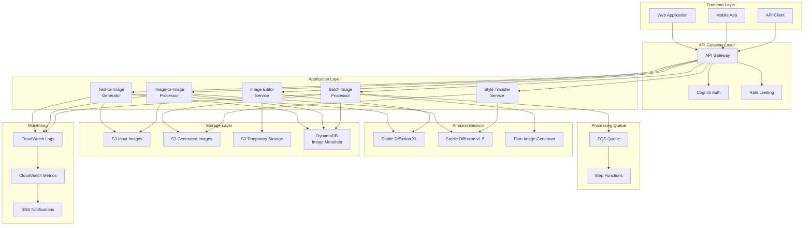

# 5.2.3 画像生成機能

## 学習目標

このセクションでは、Amazon Bedrock Stable Diffusionモデルを使用した高度な画像生成機能の実装について学習します。テキストから画像を生成する基本的な機能から、高度な画像編集、スタイル転送、バッチ処理まで包括的にカバーします。

### 習得できるスキル
- Amazon Bedrock Stable Diffusionモデルの活用
- Text-to-Image（テキストから画像）生成の実装
- Image-to-Image（画像から画像）変換機能
- 画像編集・インペインティング機能
- バッチ画像処理とワークフロー自動化
- 画像品質向上とスタイル転送
- API最適化とコスト効率的な実装

## 前提知識

### 必須の知識
- Amazon Bedrockの基本操作（5.1.1セクション完了）
- Lambda関数開発（1.2.3セクション完了）
- S3バケット操作の理解
- REST APIの基本概念

### あると望ましい知識
- 画像処理の基本概念
-機械学習モデルの理解
- プロンプトエンジニアリングの経験
- Base64エンコーディングの知識

## アーキテクチャ概要

### 画像生成システム全体図



### 主要コンポーネント
- **Text-to-Image Generator**: テキストプロンプトから画像生成
- **Image-to-Image Processor**: 既存画像の変換・編集
- **Batch Processor**: 大量画像の一括処理
- **Style Transfer Service**: 画像スタイル転送
- **S3 Storage**: 画像ファイルの保存・管理
- **DynamoDB**: 画像メタデータと生成履歴

## ハンズオン手順

### ステップ1: インフラストラクチャの構築

#### 1.1 CloudFormationテンプレート

```yaml
# cloudformation/image-generation-infrastructure.yaml
AWSTemplateFormatVersion: '2010-09-09'
Description: 'Image Generation Infrastructure using Amazon Bedrock Stable Diffusion'

Parameters:
  ProjectName:
    Type: String
    Default: 'AI-ImageGen'
    Description: プロジェクト名（リソース命名に使用）
  
  Environment:
    Type: String
    Default: 'dev'
    AllowedValues: ['dev', 'staging', 'prod']
    Description: |
      環境名
      - dev: 開発環境（小規模設定）
      - staging: ステージング環境（中規模設定）
      - prod: 本番環境（高可用性設定）

  # Bedrock設定
  PrimaryImageModel:
    Type: String
    Default: 'stability.stable-diffusion-xl-v1'
    AllowedValues:
      - 'stability.stable-diffusion-xl-v1'
      - 'stability.stable-diffusion-v1-5'
      - 'amazon.titan-image-generator-v1'
    Description: |
      メイン画像生成モデル
      - SDXL: 高品質、大きいサイズ対応
      - SD v1.5: 高速、コスト効率
      - Titan: Amazon純正、日本語対応

  # ストレージ設定
  ImageRetentionDays:
    Type: Number
    Default: 90
    MinValue: 1
    MaxValue: 3650
    Description: |
      生成画像の保持期間（日数）
      開発環境: 30日、本番環境: 90-365日推奨

  MaxImageSizeMB:
    Type: Number
    Default: 10
    MinValue: 1
    MaxValue: 100
    Description: |
      入力画像の最大サイズ（MB）
      大きすぎるとLambda制限に引っかかる可能性

Conditions:
  # 本番環境かどうか
  IsProduction: !Equals [!Ref Environment, 'prod']
  
  # 高可用性設定が必要かどうか
  RequiresHighAvailability: !Or 
    - !Equals [!Ref Environment, 'prod']
    - !Equals [!Ref Environment, 'staging']

Resources:
  # ========================================
  # S3バケット（画像ストレージ）
  # ========================================
  # 入力画像バケット
  InputImagesBucket:
    Type: AWS::S3::Bucket
    Properties:
      BucketName: !Sub '${ProjectName}-${Environment}-input-images-${AWS::AccountId}'
      PublicAccessBlockConfiguration:
        BlockPublicAcls: true
        BlockPublicPolicy: true
        IgnorePublicAcls: true
        RestrictPublicBuckets: true
      BucketEncryption:
        ServerSideEncryptionConfiguration:
          - ServerSideEncryptionByDefault:
              SSEAlgorithm: AES256
            BucketKeyEnabled: true
      VersioningConfiguration:
        Status: !If [IsProduction, Enabled, Suspended]
      LifecycleConfiguration:
        Rules:
          - Id: DeleteOldInputs
            Status: Enabled
            ExpirationInDays: !Ref ImageRetentionDays
      NotificationConfiguration:
        LambdaConfigurations:
          - Event: s3:ObjectCreated:*
            Function: !GetAtt ImageProcessorFunction.Arn
            Filter:
              S3Key:
                Rules:
                  - Name: suffix
                    Value: .jpg
                  - Name: suffix
                    Value: .png
                  - Name: suffix
                    Value: .jpeg
      Tags:
        - Key: Environment
          Value: !Ref Environment
        - Key: Project
          Value: !Ref ProjectName

  # 生成画像バケット
  GeneratedImagesBucket:
    Type: AWS::S3::Bucket
    Properties:
      BucketName: !Sub '${ProjectName}-${Environment}-generated-images-${AWS::AccountId}'
      PublicAccessBlockConfiguration:
        BlockPublicAcls: true
        BlockPublicPolicy: true
        IgnorePublicAcls: true
        RestrictPublicBuckets: true
      BucketEncryption:
        ServerSideEncryptionConfiguration:
          - ServerSideEncryptionByDefault:
              SSEAlgorithm: AES256
            BucketKeyEnabled: true
      VersioningConfiguration:
        Status: !If [IsProduction, Enabled, Suspended]
      LifecycleConfiguration:
        Rules:
          - Id: TransitionToIA
            Status: Enabled
            Transition:
              StorageClass: STANDARD_IA
              TransitionInDays: 30
          - Id: TransitionToGlacier
            Status: Enabled
            Transition:
              StorageClass: GLACIER
              TransitionInDays: 90
          - Id: DeleteOldGenerations
            Status: Enabled
            ExpirationInDays: !Ref ImageRetentionDays
      CorsConfiguration:
        CorsRules:
          - AllowedOrigins: ['*']
            AllowedMethods: [GET, PUT, POST, DELETE, HEAD]
            AllowedHeaders: ['*']
            MaxAge: 3000
      Tags:
        - Key: Environment
          Value: !Ref Environment
        - Key: Project
          Value: !Ref ProjectName

  # テンプレート・一時ファイルバケット
  TemplateBucket:
    Type: AWS::S3::Bucket
    Properties:
      BucketName: !Sub '${ProjectName}-${Environment}-templates-${AWS::AccountId}'
      PublicAccessBlockConfiguration:
        BlockPublicAcls: true
        BlockPublicPolicy: true
        IgnorePublicAcls: true
        RestrictPublicBuckets: true
      BucketEncryption:
        ServerSideEncryptionConfiguration:
          - ServerSideEncryptionByDefault:
              SSEAlgorithm: AES256
      LifecycleConfiguration:
        Rules:
          - Id: DeleteTempFiles
            Status: Enabled
            ExpirationInDays: 7
      Tags:
        - Key: Environment
          Value: !Ref Environment
        - Key: Project
          Value: !Ref ProjectName

  # ========================================
  # DynamoDB テーブル（メタデータ管理）
  # ========================================
  # 画像生成履歴テーブル
  ImageGenerationHistoryTable:
    Type: AWS::DynamoDB::Table
    Properties:
      TableName: !Sub '${ProjectName}-${Environment}-image-generation-history'
      BillingMode: PAY_PER_REQUEST
      AttributeDefinitions:
        - AttributeName: generationId
          AttributeType: S
        - AttributeName: userId
          AttributeType: S
        - AttributeName: createdAt
          AttributeType: S
        - AttributeName: status
          AttributeType: S
        - AttributeName: modelId
          AttributeType: S
      KeySchema:
        - AttributeName: generationId
          KeyType: HASH
      GlobalSecondaryIndexes:
        - IndexName: UserGenerationsIndex
          KeySchema:
            - AttributeName: userId
              KeyType: HASH
            - AttributeName: createdAt
              KeyType: RANGE
          Projection:
            ProjectionType: ALL
        - IndexName: StatusIndex
          KeySchema:
            - AttributeName: status
              KeyType: HASH
            - AttributeName: createdAt
              KeyType: RANGE
          Projection:
            ProjectionType: ALL
        - IndexName: ModelUsageIndex
          KeySchema:
            - AttributeName: modelId
              KeyType: HASH
            - AttributeName: createdAt
              KeyType: RANGE
          Projection:
            ProjectionType: ALL
      TimeToLiveSpecification:
        AttributeName: ttl
        Enabled: true
      StreamSpecification:
        StreamViewType: NEW_AND_OLD_IMAGES
      Tags:
        - Key: Environment
          Value: !Ref Environment
        - Key: Project
          Value: !Ref ProjectName

  # 画像メタデータテーブル
  ImageMetadataTable:
    Type: AWS::DynamoDB::Table
    Properties:
      TableName: !Sub '${ProjectName}-${Environment}-image-metadata'
      BillingMode: PAY_PER_REQUEST
      AttributeDefinitions:
        - AttributeName: imageId
          AttributeType: S
        - AttributeName: generationId
          AttributeType: S
        - AttributeName: createdAt
          AttributeType: S
        - AttributeName: imageType
          AttributeType: S
      KeySchema:
        - AttributeName: imageId
          KeyType: HASH
      GlobalSecondaryIndexes:
        - IndexName: GenerationImagesIndex
          KeySchema:
            - AttributeName: generationId
              KeyType: HASH
            - AttributeName: createdAt
              KeyType: RANGE
          Projection:
            ProjectionType: ALL
        - IndexName: ImageTypeIndex
          KeySchema:
            - AttributeName: imageType
              KeyType: HASH
            - AttributeName: createdAt
              KeyType: RANGE
          Projection:
            ProjectionType: ALL
      TimeToLiveSpecification:
        AttributeName: ttl
        Enabled: true
      Tags:
        - Key: Environment
          Value: !Ref Environment
        - Key: Project
          Value: !Ref ProjectName

  # ========================================
  # SQS キュー（非同期処理）
  # ========================================
  # 画像生成キュー
  ImageGenerationQueue:
    Type: AWS::SQS::Queue
    Properties:
      QueueName: !Sub '${ProjectName}-${Environment}-image-generation.fifo'
      FifoQueue: true
      ContentBasedDeduplication: true
      VisibilityTimeoutSeconds: 900  # 15分
      MessageRetentionPeriod: 1209600  # 14日
      DeadLetterTargetArn: !GetAtt ImageGenerationDLQ.Arn
      RedrivePolicy:
        deadLetterTargetArn: !GetAtt ImageGenerationDLQ.Arn
        maxReceiveCount: 3
      KmsMasterKeyId: alias/aws/sqs
      Tags:
        - Key: Environment
          Value: !Ref Environment
        - Key: Project
          Value: !Ref ProjectName

  # デッドレターキュー
  ImageGenerationDLQ:
    Type: AWS::SQS::Queue
    Properties:
      QueueName: !Sub '${ProjectName}-${Environment}-image-generation-dlq.fifo'
      FifoQueue: true
      MessageRetentionPeriod: 1209600  # 14日
      KmsMasterKeyId: alias/aws/sqs

  # ========================================
  # Lambda関数
  # ========================================
  # Text-to-Image生成関数
  TextToImageFunction:
    Type: AWS::Lambda::Function
    Properties:
      FunctionName: !Sub '${ProjectName}-${Environment}-text-to-image'
      Runtime: python3.9
      Handler: index.lambda_handler
      Role: !GetAtt ImageGenerationLambdaRole.Arn
      Timeout: 900  # 15分
      MemorySize: 3008
      Environment:
        Variables:
          INPUT_BUCKET: !Ref InputImagesBucket
          OUTPUT_BUCKET: !Ref GeneratedImagesBucket
          TEMPLATE_BUCKET: !Ref TemplateBucket
          HISTORY_TABLE: !Ref ImageGenerationHistoryTable
          METADATA_TABLE: !Ref ImageMetadataTable
          GENERATION_QUEUE: !Ref ImageGenerationQueue
          PRIMARY_MODEL: !Ref PrimaryImageModel
          MAX_IMAGE_SIZE_MB: !Ref MaxImageSizeMB
          ENVIRONMENT: !Ref Environment
          PROJECT_NAME: !Ref ProjectName
      Code:
        ZipFile: |
          import json
          import boto3
          import os
          import uuid
          import base64
          from datetime import datetime, timedelta
          from botocore.exceptions import ClientError
          import logging
          
          logger = logging.getLogger()
          logger.setLevel(logging.INFO)
          
          bedrock_runtime = boto3.client('bedrock-runtime')
          s3 = boto3.client('s3')
          dynamodb = boto3.resource('dynamodb')
          
          def lambda_handler(event, context):
              """
              Text-to-Image生成のメインハンドラー
              """
              try:
                  # リクエストの解析
                  if 'body' in event:
                      body = json.loads(event['body']) if isinstance(event['body'], str) else event['body']
                  else:
                      body = event
                  
                  prompt = body.get('prompt', '')
                  negative_prompt = body.get('negative_prompt', '')
                  model_id = body.get('model_id', os.environ['PRIMARY_MODEL'])
                  width = body.get('width', 1024)
                  height = body.get('height', 1024)
                  cfg_scale = body.get('cfg_scale', 7.0)
                  steps = body.get('steps', 30)
                  seed = body.get('seed', None)
                  user_id = body.get('user_id', 'anonymous')
                  
                  if not prompt.strip():
                      raise ValueError("Prompt is required")
                  
                  logger.info(f"Generating image with prompt: {prompt[:100]}...")
                  
                  # 画像生成の実行
                  result = generate_text_to_image(
                      prompt=prompt,
                      negative_prompt=negative_prompt,
                      model_id=model_id,
                      width=width,
                      height=height,
                      cfg_scale=cfg_scale,
                      steps=steps,
                      seed=seed,
                      user_id=user_id
                  )
                  
                  return {
                      'statusCode': 200,
                      'headers': {
                          'Content-Type': 'application/json',
                          'Access-Control-Allow-Origin': '*'
                      },
                      'body': json.dumps({
                          'success': True,
                          'result': result
                      }, ensure_ascii=False)
                  }
                  
              except Exception as e:
                  logger.error(f"Error in text-to-image generation: {str(e)}")
                  return {
                      'statusCode': 500,
                      'headers': {
                          'Content-Type': 'application/json',
                          'Access-Control-Allow-Origin': '*'
                      },
                      'body': json.dumps({
                          'success': False,
                          'error': str(e)
                      }, ensure_ascii=False)
                  }
          
          def generate_text_to_image(prompt, negative_prompt, model_id, width, height, 
                                   cfg_scale, steps, seed, user_id):
              """
              Stable Diffusionでテキストから画像を生成
              """
              generation_id = str(uuid.uuid4())
              
              # 生成履歴をDynamoDBに記録
              save_generation_history(
                  generation_id=generation_id,
                  user_id=user_id,
                  prompt=prompt,
                  negative_prompt=negative_prompt,
                  model_id=model_id,
                  parameters={
                      'width': width,
                      'height': height,
                      'cfg_scale': cfg_scale,
                      'steps': steps,
                      'seed': seed
                  },
                  status='processing'
              )
              
              try:
                  # Bedrock APIリクエストの構築
                  request_body = build_bedrock_request(
                      prompt=prompt,
                      negative_prompt=negative_prompt,
                      width=width,
                      height=height,
                      cfg_scale=cfg_scale,
                      steps=steps,
                      seed=seed,
                      model_id=model_id
                  )
                  
                  # Bedrock API呼び出し
                  response = bedrock_runtime.invoke_model(
                      modelId=model_id,
                      body=json.dumps(request_body)
                  )
                  
                  # レスポンスの解析
                  response_body = json.loads(response['body'].read())
                  
                  # 生成画像の処理
                  image_data = response_body['artifacts'][0]['base64']
                  image_id = str(uuid.uuid4())
                  
                  # S3に画像を保存
                  image_url = save_image_to_s3(
                      image_data=image_data,
                      image_id=image_id,
                      generation_id=generation_id
                  )
                  
                  # 画像メタデータを保存
                  save_image_metadata(
                      image_id=image_id,
                      generation_id=generation_id,
                      image_url=image_url,
                      prompt=prompt,
                      model_id=model_id,
                      user_id=user_id
                  )
                  
                  # 生成履歴を完了状態に更新
                  update_generation_status(generation_id, 'completed', image_url)
                  
                  return {
                      'generation_id': generation_id,
                      'image_id': image_id,
                      'image_url': image_url,
                      'prompt': prompt,
                      'model_id': model_id,
                      'parameters': request_body,
                      'created_at': datetime.utcnow().isoformat()
                  }
                  
              except Exception as e:
                  # エラー時の履歴更新
                  update_generation_status(generation_id, 'failed', str(e))
                  raise e
          
          def build_bedrock_request(prompt, negative_prompt, width, height, 
                                  cfg_scale, steps, seed, model_id):
              """
              モデル別のリクエストボディを構築
              """
              if model_id.startswith('stability.stable-diffusion'):
                  request_body = {
                      "text_prompts": [
                          {"text": prompt, "weight": 1.0}
                      ],
                      "cfg_scale": cfg_scale,
                      "steps": steps,
                      "width": width,
                      "height": height
                  }
                  
                  if negative_prompt:
                      request_body["text_prompts"].append({
                          "text": negative_prompt,
                          "weight": -1.0
                      })
                  
                  if seed is not None:
                      request_body["seed"] = seed
                      
              elif model_id.startswith('amazon.titan-image'):
                  request_body = {
                      "taskType": "TEXT_IMAGE",
                      "textToImageParams": {
                          "text": prompt,
                          "negativeText": negative_prompt or ""
                      },
                      "imageGenerationConfig": {
                          "numberOfImages": 1,
                          "height": height,
                          "width": width,
                          "cfgScale": cfg_scale,
                          "seed": seed or 0
                      }
                  }
              else:
                  raise ValueError(f"Unsupported model: {model_id}")
              
              return request_body
          
          def save_image_to_s3(image_data, image_id, generation_id):
              """
              生成画像をS3に保存
              """
              bucket = os.environ['OUTPUT_BUCKET']
              key = f"generated/{generation_id}/{image_id}.png"
              
              # Base64デコード
              image_bytes = base64.b64decode(image_data)
              
              # S3にアップロード
              s3.put_object(
                  Bucket=bucket,
                  Key=key,
                  Body=image_bytes,
                  ContentType='image/png',
                  ServerSideEncryption='AES256'
              )
              
              return f"s3://{bucket}/{key}"
          
          def save_generation_history(generation_id, user_id, prompt, negative_prompt, 
                                    model_id, parameters, status):
              """
              生成履歴をDynamoDBに保存
              """
              table = dynamodb.Table(os.environ['HISTORY_TABLE'])
              
              # TTL設定（1年後）
              ttl = int((datetime.utcnow() + timedelta(days=365)).timestamp())
              
              table.put_item(
                  Item={
                      'generationId': generation_id,
                      'userId': user_id,
                      'prompt': prompt,
                      'negativePrompt': negative_prompt or '',
                      'modelId': model_id,
                      'parameters': parameters,
                      'status': status,
                      'createdAt': datetime.utcnow().isoformat(),
                      'ttl': ttl
                  }
              )
          
          def save_image_metadata(image_id, generation_id, image_url, prompt, model_id, user_id):
              """
              画像メタデータをDynamoDBに保存
              """
              table = dynamodb.Table(os.environ['METADATA_TABLE'])
              
              # TTL設定（1年後）
              ttl = int((datetime.utcnow() + timedelta(days=365)).timestamp())
              
              table.put_item(
                  Item={
                      'imageId': image_id,
                      'generationId': generation_id,
                      'imageUrl': image_url,
                      'prompt': prompt,
                      'modelId': model_id,
                      'userId': user_id,
                      'imageType': 'generated',
                      'createdAt': datetime.utcnow().isoformat(),
                      'ttl': ttl
                  }
              )
          
          def update_generation_status(generation_id, status, result_data=''):
              """
              生成ステータスを更新
              """
              table = dynamodb.Table(os.environ['HISTORY_TABLE'])
              
              table.update_item(
                  Key={'generationId': generation_id},
                  UpdateExpression='SET #status = :status, updatedAt = :timestamp, resultData = :result',
                  ExpressionAttributeNames={'#status': 'status'},
                  ExpressionAttributeValues={
                      ':status': status,
                      ':timestamp': datetime.utcnow().isoformat(),
                      ':result': result_data
                  }
              )
      Tags:
        - Key: Environment
          Value: !Ref Environment
        - Key: Project
          Value: !Ref ProjectName

  # Image-to-Image変換関数
  ImageToImageFunction:
    Type: AWS::Lambda::Function
    Properties:
      FunctionName: !Sub '${ProjectName}-${Environment}-image-to-image'
      Runtime: python3.9
      Handler: index.lambda_handler
      Role: !GetAtt ImageGenerationLambdaRole.Arn
      Timeout: 900  # 15分
      MemorySize: 3008
      Environment:
        Variables:
          INPUT_BUCKET: !Ref InputImagesBucket
          OUTPUT_BUCKET: !Ref GeneratedImagesBucket
          TEMPLATE_BUCKET: !Ref TemplateBucket
          HISTORY_TABLE: !Ref ImageGenerationHistoryTable
          METADATA_TABLE: !Ref ImageMetadataTable
          PRIMARY_MODEL: !Ref PrimaryImageModel
          MAX_IMAGE_SIZE_MB: !Ref MaxImageSizeMB
          ENVIRONMENT: !Ref Environment
          PROJECT_NAME: !Ref ProjectName
      Code:
        ZipFile: |
          import json
          import boto3
          import os
          import uuid
          import base64
          from datetime import datetime, timedelta
          from botocore.exceptions import ClientError
          import logging
          from PIL import Image
          import io
          
          logger = logging.getLogger()
          logger.setLevel(logging.INFO)
          
          bedrock_runtime = boto3.client('bedrock-runtime')
          s3 = boto3.client('s3')
          dynamodb = boto3.resource('dynamodb')
          
          def lambda_handler(event, context):
              """
              Image-to-Image変換のメインハンドラー
              """
              try:
                  # リクエストの解析
                  if 'body' in event:
                      body = json.loads(event['body']) if isinstance(event['body'], str) else event['body']
                  else:
                      body = event
                  
                  input_image_url = body.get('input_image_url', '')
                  input_image_base64 = body.get('input_image_base64', '')
                  prompt = body.get('prompt', '')
                  negative_prompt = body.get('negative_prompt', '')
                  model_id = body.get('model_id', os.environ['PRIMARY_MODEL'])
                  image_strength = body.get('image_strength', 0.5)
                  cfg_scale = body.get('cfg_scale', 7.0)
                  steps = body.get('steps', 30)
                  seed = body.get('seed', None)
                  user_id = body.get('user_id', 'anonymous')
                  
                  if not prompt.strip():
                      raise ValueError("Prompt is required")
                  
                  if not input_image_url and not input_image_base64:
                      raise ValueError("Input image is required")
                  
                  logger.info(f"Processing image-to-image with prompt: {prompt[:100]}...")
                  
                  # 入力画像の処理
                  if input_image_url:
                      input_image_data = load_image_from_s3(input_image_url)
                  else:
                      input_image_data = input_image_base64
                  
                  # 画像変換の実行
                  result = generate_image_to_image(
                      input_image_data=input_image_data,
                      prompt=prompt,
                      negative_prompt=negative_prompt,
                      model_id=model_id,
                      image_strength=image_strength,
                      cfg_scale=cfg_scale,
                      steps=steps,
                      seed=seed,
                      user_id=user_id
                  )
                  
                  return {
                      'statusCode': 200,
                      'headers': {
                          'Content-Type': 'application/json',
                          'Access-Control-Allow-Origin': '*'
                      },
                      'body': json.dumps({
                          'success': True,
                          'result': result
                      }, ensure_ascii=False)
                  }
                  
              except Exception as e:
                  logger.error(f"Error in image-to-image generation: {str(e)}")
                  return {
                      'statusCode': 500,
                      'headers': {
                          'Content-Type': 'application/json',
                          'Access-Control-Allow-Origin': '*'
                      },
                      'body': json.dumps({
                          'success': False,
                          'error': str(e)
                      }, ensure_ascii=False)
                  }
          
          def generate_image_to_image(input_image_data, prompt, negative_prompt, model_id,
                                    image_strength, cfg_scale, steps, seed, user_id):
              """
              既存画像から新しい画像を生成
              """
              generation_id = str(uuid.uuid4())
              
              # 入力画像の前処理
              processed_image_data = preprocess_image(input_image_data)
              
              # 生成履歴をDynamoDBに記録
              save_generation_history(
                  generation_id=generation_id,
                  user_id=user_id,
                  prompt=prompt,
                  negative_prompt=negative_prompt,
                  model_id=model_id,
                  parameters={
                      'image_strength': image_strength,
                      'cfg_scale': cfg_scale,
                      'steps': steps,
                      'seed': seed,
                      'type': 'image_to_image'
                  },
                  status='processing'
              )
              
              try:
                  # Bedrock APIリクエストの構築
                  request_body = {
                      "text_prompts": [
                          {"text": prompt, "weight": 1.0}
                      ],
                      "init_image": processed_image_data,
                      "image_strength": image_strength,
                      "cfg_scale": cfg_scale,
                      "steps": steps
                  }
                  
                  if negative_prompt:
                      request_body["text_prompts"].append({
                          "text": negative_prompt,
                          "weight": -1.0
                      })
                  
                  if seed is not None:
                      request_body["seed"] = seed
                  
                  # Bedrock API呼び出し
                  response = bedrock_runtime.invoke_model(
                      modelId=model_id,
                      body=json.dumps(request_body)
                  )
                  
                  # レスポンスの解析
                  response_body = json.loads(response['body'].read())
                  
                  # 生成画像の処理
                  image_data = response_body['artifacts'][0]['base64']
                  image_id = str(uuid.uuid4())
                  
                  # S3に画像を保存
                  image_url = save_image_to_s3(
                      image_data=image_data,
                      image_id=image_id,
                      generation_id=generation_id,
                      image_type='image_to_image'
                  )
                  
                  # 画像メタデータを保存
                  save_image_metadata(
                      image_id=image_id,
                      generation_id=generation_id,
                      image_url=image_url,
                      prompt=prompt,
                      model_id=model_id,
                      user_id=user_id,
                      image_type='image_to_image'
                  )
                  
                  # 生成履歴を完了状態に更新
                  update_generation_status(generation_id, 'completed', image_url)
                  
                  return {
                      'generation_id': generation_id,
                      'image_id': image_id,
                      'image_url': image_url,
                      'prompt': prompt,
                      'model_id': model_id,
                      'image_strength': image_strength,
                      'created_at': datetime.utcnow().isoformat()
                  }
                  
              except Exception as e:
                  # エラー時の履歴更新
                  update_generation_status(generation_id, 'failed', str(e))
                  raise e
          
          def preprocess_image(image_data):
              """
              画像の前処理（リサイズ、フォーマット変換等）
              """
              try:
                  # Base64からPIL Imageに変換
                  if isinstance(image_data, str):
                      image_bytes = base64.b64decode(image_data)
                  else:
                      image_bytes = image_data
                  
                  img = Image.open(io.BytesIO(image_bytes))
                  
                  # RGBに変換（透明度チャンネルを削除）
                  if img.mode in ('RGBA', 'LA'):
                      img = img.convert('RGB')
                  
                  # サイズ制限（最大1024x1024）
                  max_size = 1024
                  if img.width > max_size or img.height > max_size:
                      img.thumbnail((max_size, max_size), Image.Resampling.LANCZOS)
                  
                  # 8の倍数に調整（Stable Diffusionの要件）
                  new_width = (img.width // 8) * 8
                  new_height = (img.height // 8) * 8
                  img = img.resize((new_width, new_height), Image.Resampling.LANCZOS)
                  
                  # Base64エンコード
                  buffer = io.BytesIO()
                  img.save(buffer, format='PNG')
                  processed_data = base64.b64encode(buffer.getvalue()).decode()
                  
                  return processed_data
                  
              except Exception as e:
                  logger.error(f"Error preprocessing image: {str(e)}")
                  raise ValueError(f"Invalid image data: {str(e)}")
          
          def load_image_from_s3(s3_url):
              """
              S3から画像を読み込み
              """
              # S3 URLを解析
              parts = s3_url.replace('s3://', '').split('/')
              bucket = parts[0]
              key = '/'.join(parts[1:])
              
              # S3オブジェクトを取得
              response = s3.get_object(Bucket=bucket, Key=key)
              image_bytes = response['Body'].read()
              
              # Base64エンコード
              return base64.b64encode(image_bytes).decode()
          
          def save_image_to_s3(image_data, image_id, generation_id, image_type='generated'):
              """
              生成画像をS3に保存
              """
              bucket = os.environ['OUTPUT_BUCKET']
              key = f"{image_type}/{generation_id}/{image_id}.png"
              
              # Base64デコード
              image_bytes = base64.b64decode(image_data)
              
              # S3にアップロード
              s3.put_object(
                  Bucket=bucket,
                  Key=key,
                  Body=image_bytes,
                  ContentType='image/png',
                  ServerSideEncryption='AES256'
              )
              
              return f"s3://{bucket}/{key}"
          
          def save_generation_history(generation_id, user_id, prompt, negative_prompt, 
                                    model_id, parameters, status):
              """
              生成履歴をDynamoDBに保存
              """
              table = dynamodb.Table(os.environ['HISTORY_TABLE'])
              
              # TTL設定（1年後）
              ttl = int((datetime.utcnow() + timedelta(days=365)).timestamp())
              
              table.put_item(
                  Item={
                      'generationId': generation_id,
                      'userId': user_id,
                      'prompt': prompt,
                      'negativePrompt': negative_prompt or '',
                      'modelId': model_id,
                      'parameters': parameters,
                      'status': status,
                      'createdAt': datetime.utcnow().isoformat(),
                      'ttl': ttl
                  }
              )
          
          def save_image_metadata(image_id, generation_id, image_url, prompt, model_id, 
                                user_id, image_type='generated'):
              """
              画像メタデータをDynamoDBに保存
              """
              table = dynamodb.Table(os.environ['METADATA_TABLE'])
              
              # TTL設定（1年後）
              ttl = int((datetime.utcnow() + timedelta(days=365)).timestamp())
              
              table.put_item(
                  Item={
                      'imageId': image_id,
                      'generationId': generation_id,
                      'imageUrl': image_url,
                      'prompt': prompt,
                      'modelId': model_id,
                      'userId': user_id,
                      'imageType': image_type,
                      'createdAt': datetime.utcnow().isoformat(),
                      'ttl': ttl
                  }
              )
          
          def update_generation_status(generation_id, status, result_data=''):
              """
              生成ステータスを更新
              """
              table = dynamodb.Table(os.environ['HISTORY_TABLE'])
              
              table.update_item(
                  Key={'generationId': generation_id},
                  UpdateExpression='SET #status = :status, updatedAt = :timestamp, resultData = :result',
                  ExpressionAttributeNames={'#status': 'status'},
                  ExpressionAttributeValues={
                      ':status': status,
                      ':timestamp': datetime.utcnow().isoformat(),
                      ':result': result_data
                  }
              )
      Tags:
        - Key: Environment
          Value: !Ref Environment
        - Key: Project
          Value: !Ref ProjectName

  # 画像処理トリガー関数（S3イベント処理）
  ImageProcessorFunction:
    Type: AWS::Lambda::Function
    Properties:
      FunctionName: !Sub '${ProjectName}-${Environment}-image-processor'
      Runtime: python3.9
      Handler: index.lambda_handler
      Role: !GetAtt ImageGenerationLambdaRole.Arn
      Timeout: 300
      MemorySize: 1024
      Environment:
        Variables:
          INPUT_BUCKET: !Ref InputImagesBucket
          OUTPUT_BUCKET: !Ref GeneratedImagesBucket
          METADATA_TABLE: !Ref ImageMetadataTable
          GENERATION_QUEUE: !Ref ImageGenerationQueue
          MAX_IMAGE_SIZE_MB: !Ref MaxImageSizeMB
      Code:
        ZipFile: |
          import json
          import boto3
          import os
          import uuid
          from datetime import datetime, timedelta
          from urllib.parse import unquote_plus
          import logging
          
          logger = logging.getLogger()
          logger.setLevel(logging.INFO)
          
          s3 = boto3.client('s3')
          dynamodb = boto3.resource('dynamodb')
          sqs = boto3.client('sqs')
          
          def lambda_handler(event, context):
              """
              S3アップロードイベントの処理
              """
              try:
                  for record in event['Records']:
                      bucket = record['s3']['bucket']['name']
                      key = unquote_plus(record['s3']['object']['key'])
                      
                      logger.info(f"Processing uploaded image: s3://{bucket}/{key}")
                      
                      # 画像メタデータの保存
                      image_id = str(uuid.uuid4())
                      save_uploaded_image_metadata(
                          image_id=image_id,
                          bucket=bucket,
                          key=key
                      )
                      
                      # 画像のバリデーション
                      validation_result = validate_uploaded_image(bucket, key)
                      if not validation_result['valid']:
                          logger.warning(f"Invalid image: {validation_result['reason']}")
                          continue
                      
                      # 自動処理キューへの送信（オプション）
                      # auto_process = check_auto_process_rules(bucket, key)
                      # if auto_process:
                      #     queue_auto_processing(image_id, bucket, key)
                      
                      logger.info(f"Successfully processed image upload: {image_id}")
                  
                  return {'statusCode': 200, 'body': 'Images processed successfully'}
                  
              except Exception as e:
                  logger.error(f"Error processing image upload: {str(e)}")
                  raise e
          
          def save_uploaded_image_metadata(image_id, bucket, key):
              """
              アップロード画像のメタデータを保存
              """
              table = dynamodb.Table(os.environ['METADATA_TABLE'])
              
              # ファイル情報の取得
              try:
                  response = s3.head_object(Bucket=bucket, Key=key)
                  file_size = response['ContentLength']
                  content_type = response.get('ContentType', 'application/octet-stream')
                  last_modified = response['LastModified'].isoformat()
              except Exception as e:
                  logger.error(f"Error getting file info: {str(e)}")
                  file_size = 0
                  content_type = 'unknown'
                  last_modified = datetime.utcnow().isoformat()
              
              # TTL設定（1年後）
              ttl = int((datetime.utcnow() + timedelta(days=365)).timestamp())
              
              table.put_item(
                  Item={
                      'imageId': image_id,
                      'imageUrl': f"s3://{bucket}/{key}",
                      'fileName': key.split('/')[-1],
                      'fileSize': file_size,
                      'contentType': content_type,
                      'imageType': 'uploaded',
                      'createdAt': datetime.utcnow().isoformat(),
                      'lastModified': last_modified,
                      'ttl': ttl
                  }
              )
          
          def validate_uploaded_image(bucket, key):
              """
              アップロード画像のバリデーション
              """
              try:
                  # ファイルサイズチェック
                  response = s3.head_object(Bucket=bucket, Key=key)
                  file_size_mb = response['ContentLength'] / (1024 * 1024)
                  max_size_mb = float(os.environ['MAX_IMAGE_SIZE_MB'])
                  
                  if file_size_mb > max_size_mb:
                      return {
                          'valid': False,
                          'reason': f'File size ({file_size_mb:.2f}MB) exceeds limit ({max_size_mb}MB)'
                      }
                  
                  # ファイル形式チェック
                  content_type = response.get('ContentType', '')
                  valid_types = ['image/jpeg', 'image/png', 'image/jpg']
                  
                  if content_type not in valid_types:
                      return {
                          'valid': False,
                          'reason': f'Invalid content type: {content_type}'
                      }
                  
                  return {'valid': True, 'reason': 'Valid image'}
                  
              except Exception as e:
                  return {
                      'valid': False,
                      'reason': f'Validation error: {str(e)}'
                  }
      Tags:
        - Key: Environment
          Value: !Ref Environment
        - Key: Project
          Value: !Ref ProjectName

  # S3トリガー権限
  ImageProcessorPermission:
    Type: AWS::Lambda::Permission
    Properties:
      Action: lambda:InvokeFunction
      FunctionName: !Ref ImageProcessorFunction
      Principal: s3.amazonaws.com
      SourceArn: !Sub 'arn:aws:s3:::${InputImagesBucket}'

  # ========================================
  # IAMロール
  # ========================================
  ImageGenerationLambdaRole:
    Type: AWS::IAM::Role
    Properties:
      AssumeRolePolicyDocument:
        Version: '2012-10-17'
        Statement:
          - Effect: Allow
            Principal:
              Service: lambda.amazonaws.com
            Action: sts:AssumeRole
      ManagedPolicyArns:
        - arn:aws:iam::aws:policy/service-role/AWSLambdaBasicExecutionRole
      Policies:
        - PolicyName: BedrockImageGenerationAccess
          PolicyDocument:
            Version: '2012-10-17'
            Statement:
              - Effect: Allow
                Action:
                  - bedrock:InvokeModel
                  - bedrock:InvokeModelWithResponseStream
                Resource:
                  - !Sub 'arn:aws:bedrock:${AWS::Region}::foundation-model/stability.stable-diffusion-*'
                  - !Sub 'arn:aws:bedrock:${AWS::Region}::foundation-model/amazon.titan-image-*'
        - PolicyName: S3ImageAccess
          PolicyDocument:
            Version: '2012-10-17'
            Statement:
              - Effect: Allow
                Action:
                  - s3:GetObject
                  - s3:PutObject
                  - s3:DeleteObject
                  - s3:ListBucket
                Resource:
                  - !Sub '${InputImagesBucket}/*'
                  - !Sub '${GeneratedImagesBucket}/*'
                  - !Sub '${TemplateBucket}/*'
                  - !GetAtt InputImagesBucket.Arn
                  - !GetAtt GeneratedImagesBucket.Arn
                  - !GetAtt TemplateBucket.Arn
        - PolicyName: DynamoDBImageAccess
          PolicyDocument:
            Version: '2012-10-17'
            Statement:
              - Effect: Allow
                Action:
                  - dynamodb:PutItem
                  - dynamodb:GetItem
                  - dynamodb:UpdateItem
                  - dynamodb:DeleteItem
                  - dynamodb:Query
                  - dynamodb:Scan
                Resource:
                  - !GetAtt ImageGenerationHistoryTable.Arn
                  - !Sub '${ImageGenerationHistoryTable.Arn}/index/*'
                  - !GetAtt ImageMetadataTable.Arn
                  - !Sub '${ImageMetadataTable.Arn}/index/*'
        - PolicyName: SQSImageProcessingAccess
          PolicyDocument:
            Version: '2012-10-17'
            Statement:
              - Effect: Allow
                Action:
                  - sqs:SendMessage
                  - sqs:ReceiveMessage
                  - sqs:DeleteMessage
                Resource:
                  - !GetAtt ImageGenerationQueue.Arn

  # ========================================
  # CloudWatch 監視
  # ========================================
  # ログ設定
  TextToImageLogGroup:
    Type: AWS::Logs::LogGroup
    Properties:
      LogGroupName: !Sub '/aws/lambda/${ProjectName}-${Environment}-text-to-image'
      RetentionInDays: !If [IsProduction, 30, 7]

  ImageToImageLogGroup:
    Type: AWS::Logs::LogGroup
    Properties:
      LogGroupName: !Sub '/aws/lambda/${ProjectName}-${Environment}-image-to-image'
      RetentionInDays: !If [IsProduction, 30, 7]

  ImageProcessorLogGroup:
    Type: AWS::Logs::LogGroup
    Properties:
      LogGroupName: !Sub '/aws/lambda/${ProjectName}-${Environment}-image-processor'
      RetentionInDays: !If [IsProduction, 30, 7]

  # CloudWatch ダッシュボード
  ImageGenerationDashboard:
    Type: AWS::CloudWatch::Dashboard
    Properties:
      DashboardName: !Sub '${ProjectName}-${Environment}-image-generation'
      DashboardBody: !Sub |
        {
          "widgets": [
            {
              "type": "metric",
              "width": 12,
              "height": 6,
              "properties": {
                "metrics": [
                  ["AWS/Lambda", "Invocations", "FunctionName", "${TextToImageFunction}"],
                  [".", "Duration", ".", "."],
                  [".", "Errors", ".", "."],
                  ["AWS/Lambda", "Invocations", "FunctionName", "${ImageToImageFunction}"],
                  [".", "Duration", ".", "."],
                  [".", "Errors", ".", "."]
                ],
                "period": 300,
                "stat": "Sum",
                "region": "${AWS::Region}",
                "title": "Lambda Function Metrics"
              }
            },
            {
              "type": "metric",
              "width": 12,
              "height": 6,
              "properties": {
                "metrics": [
                  ["AWS/S3", "BucketSizeBytes", "BucketName", "${GeneratedImagesBucket}", "StorageType", "StandardStorage"],
                  [".", "NumberOfObjects", ".", ".", ".", "."]
                ],
                "period": 86400,
                "stat": "Average",
                "region": "${AWS::Region}",
                "title": "S3 Storage Metrics"
              }
            }
          ]
        }

# ========================================
# 出力値（他のスタックから参照可能）
# ========================================
Outputs:
  # S3バケット情報
  InputImagesBucketName:
    Description: 入力画像S3バケット名
    Value: !Ref InputImagesBucket
    Export:
      Name: !Sub '${AWS::StackName}-InputImagesBucket'

  GeneratedImagesBucketName:
    Description: 生成画像S3バケット名
    Value: !Ref GeneratedImagesBucket
    Export:
      Name: !Sub '${AWS::StackName}-GeneratedImagesBucket'

  TemplateBucketName:
    Description: テンプレートS3バケット名
    Value: !Ref TemplateBucket
    Export:
      Name: !Sub '${AWS::StackName}-TemplateBucket'

  # Lambda関数ARN
  TextToImageFunctionArn:
    Description: Text-to-Image生成Lambda関数ARN
    Value: !GetAtt TextToImageFunction.Arn
    Export:
      Name: !Sub '${AWS::StackName}-TextToImageFunction'

  ImageToImageFunctionArn:
    Description: Image-to-Image変換Lambda関数ARN
    Value: !GetAtt ImageToImageFunction.Arn
    Export:
      Name: !Sub '${AWS::StackName}-ImageToImageFunction'

  ImageProcessorFunctionArn:
    Description: 画像処理Lambda関数ARN
    Value: !GetAtt ImageProcessorFunction.Arn
    Export:
      Name: !Sub '${AWS::StackName}-ImageProcessorFunction'

  # DynamoDB テーブル名
  ImageGenerationHistoryTableName:
    Description: 画像生成履歴テーブル名
    Value: !Ref ImageGenerationHistoryTable
    Export:
      Name: !Sub '${AWS::StackName}-ImageGenerationHistoryTable'

  ImageMetadataTableName:
    Description: 画像メタデータテーブル名
    Value: !Ref ImageMetadataTable
    Export:
      Name: !Sub '${AWS::StackName}-ImageMetadataTable'

  # SQS キュー
  ImageGenerationQueueUrl:
    Description: 画像生成SQSキューURL
    Value: !Ref ImageGenerationQueue
    Export:
      Name: !Sub '${AWS::StackName}-ImageGenerationQueue'

  # 使用例
  ImageGenerationUsageExample:
    Description: 画像生成システム使用例
    Value: !Sub |
      画像生成システム使用例:
      
      1. Text-to-Image:
      aws lambda invoke --function-name ${TextToImageFunction} \
        --payload '{"prompt":"beautiful landscape","width":1024,"height":1024}' response.json
      
      2. Image-to-Image:
      aws lambda invoke --function-name ${ImageToImageFunction} \
        --payload '{"input_image_url":"s3://${InputImagesBucket}/input.jpg","prompt":"make it artistic"}' response.json
      
      3. 画像アップロード:
      aws s3 cp input.jpg s3://${InputImagesBucket}/uploads/
      
      4. 生成画像ダウンロード:
      aws s3 cp s3://${GeneratedImagesBucket}/generated/[generation-id]/[image-id].png ./

  # 設定概要
  ImageGenerationConfiguration:
    Description: 画像生成システム設定概要
    Value: !Sub |
      Image Generation System Configuration:
      - Input Bucket: s3://${InputImagesBucket}/
      - Output Bucket: s3://${GeneratedImagesBucket}/
      - Primary Model: ${PrimaryImageModel}
      - Max Image Size: ${MaxImageSizeMB}MB
      - Retention Period: ${ImageRetentionDays} days
      - Environment: ${Environment}
```

### ステップ2: API Gateway統合とクライアント実装

#### 2.1 API Gateway設定

```yaml
# cloudformation/image-api-gateway.yaml
AWSTemplateFormatVersion: '2010-09-09'
Description: 'API Gateway for Image Generation Service'

Parameters:
  ProjectName:
    Type: String
    Default: 'AI-ImageGen'
  
  Environment:
    Type: String
    Default: 'dev'
  
  TextToImageFunctionArn:
    Type: String
    Description: 'Text-to-Image Lambda Function ARN'
  
  ImageToImageFunctionArn:
    Type: String
    Description: 'Image-to-Image Lambda Function ARN'

Resources:
  # REST API
  ImageGenerationAPI:
    Type: AWS::ApiGateway::RestApi
    Properties:
      Name: !Sub '${ProjectName}-${Environment}-ImageAPI'
      Description: 'Image Generation API using Amazon Bedrock'
      EndpointConfiguration:
        Types:
          - REGIONAL
      BinaryMediaTypes:
        - 'image/jpeg'
        - 'image/png'
        - 'image/jpg'
        - 'multipart/form-data'

  # リソース定義
  GenerateResource:
    Type: AWS::ApiGateway::Resource
    Properties:
      RestApiId: !Ref ImageGenerationAPI
      ParentId: !GetAtt ImageGenerationAPI.RootResourceId
      PathPart: 'generate'

  ConvertResource:
    Type: AWS::ApiGateway::Resource
    Properties:
      RestApiId: !Ref ImageGenerationAPI
      ParentId: !GetAtt ImageGenerationAPI.RootResourceId
      PathPart: 'convert'

  # Text-to-Image エンドポイント
  TextToImageMethod:
    Type: AWS::ApiGateway::Method
    Properties:
      RestApiId: !Ref ImageGenerationAPI
      ResourceId: !Ref GenerateResource
      HttpMethod: POST
      AuthorizationType: NONE
      Integration:
        Type: AWS_PROXY
        IntegrationHttpMethod: POST
        Uri: !Sub 'arn:aws:apigateway:${AWS::Region}:lambda:path/2015-03-31/functions/${TextToImageFunctionArn}/invocations'
      MethodResponses:
        - StatusCode: 200
          ResponseHeaders:
            Access-Control-Allow-Origin: true
        - StatusCode: 400
        - StatusCode: 500

  # Image-to-Image エンドポイント
  ImageToImageMethod:
    Type: AWS::ApiGateway::Method
    Properties:
      RestApiId: !Ref ImageGenerationAPI
      ResourceId: !Ref ConvertResource
      HttpMethod: POST
      AuthorizationType: NONE
      Integration:
        Type: AWS_PROXY
        IntegrationHttpMethod: POST
        Uri: !Sub 'arn:aws:apigateway:${AWS::Region}:lambda:path/2015-03-31/functions/${ImageToImageFunctionArn}/invocations'
      MethodResponses:
        - StatusCode: 200
          ResponseHeaders:
            Access-Control-Allow-Origin: true
        - StatusCode: 400
        - StatusCode: 500

  # CORS設定
  GenerateOptionsMethod:
    Type: AWS::ApiGateway::Method
    Properties:
      RestApiId: !Ref ImageGenerationAPI
      ResourceId: !Ref GenerateResource
      HttpMethod: OPTIONS
      AuthorizationType: NONE
      Integration:
        Type: MOCK
        IntegrationResponses:
          - StatusCode: 200
            ResponseParameters:
              method.response.header.Access-Control-Allow-Headers: "'Content-Type,X-Amz-Date,Authorization,X-Api-Key,X-Amz-Security-Token'"
              method.response.header.Access-Control-Allow-Methods: "'POST,OPTIONS'"
              method.response.header.Access-Control-Allow-Origin: "'*'"
        RequestTemplates:
          application/json: '{"statusCode": 200}'
      MethodResponses:
        - StatusCode: 200
          ResponseParameters:
            method.response.header.Access-Control-Allow-Headers: true
            method.response.header.Access-Control-Allow-Methods: true
            method.response.header.Access-Control-Allow-Origin: true

  ConvertOptionsMethod:
    Type: AWS::ApiGateway::Method
    Properties:
      RestApiId: !Ref ImageGenerationAPI
      ResourceId: !Ref ConvertResource
      HttpMethod: OPTIONS
      AuthorizationType: NONE
      Integration:
        Type: MOCK
        IntegrationResponses:
          - StatusCode: 200
            ResponseParameters:
              method.response.header.Access-Control-Allow-Headers: "'Content-Type,X-Amz-Date,Authorization,X-Api-Key,X-Amz-Security-Token'"
              method.response.header.Access-Control-Allow-Methods: "'POST,OPTIONS'"
              method.response.header.Access-Control-Allow-Origin: "'*'"
        RequestTemplates:
          application/json: '{"statusCode": 200}'
      MethodResponses:
        - StatusCode: 200
          ResponseParameters:
            method.response.header.Access-Control-Allow-Headers: true
            method.response.header.Access-Control-Allow-Methods: true
            method.response.header.Access-Control-Allow-Origin: true

  # API デプロイ
  APIDeployment:
    Type: AWS::ApiGateway::Deployment
    DependsOn:
      - TextToImageMethod
      - ImageToImageMethod
      - GenerateOptionsMethod
      - ConvertOptionsMethod
    Properties:
      RestApiId: !Ref ImageGenerationAPI
      StageName: !Ref Environment

  # Lambda権限
  TextToImagePermission:
    Type: AWS::Lambda::Permission
    Properties:
      FunctionName: !Ref TextToImageFunctionArn
      Action: lambda:InvokeFunction
      Principal: apigateway.amazonaws.com
      SourceArn: !Sub 'arn:aws:execute-api:${AWS::Region}:${AWS::AccountId}:${ImageGenerationAPI}/*/*/*'

  ImageToImagePermission:
    Type: AWS::Lambda::Permission
    Properties:
      FunctionName: !Ref ImageToImageFunctionArn
      Action: lambda:InvokeFunction
      Principal: apigateway.amazonaws.com
      SourceArn: !Sub 'arn:aws:execute-api:${AWS::Region}:${AWS::AccountId}:${ImageGenerationAPI}/*/*/*'

Outputs:
  APIGatewayURL:
    Description: 'API Gateway URL'
    Value: !Sub 'https://${ImageGenerationAPI}.execute-api.${AWS::Region}.amazonaws.com/${Environment}'
    Export:
      Name: !Sub '${AWS::StackName}-APIURL'

  APIGatewayId:
    Description: 'API Gateway ID'
    Value: !Ref ImageGenerationAPI
    Export:
      Name: !Sub '${AWS::StackName}-APIId'
```

#### 2.2 Webクライアント実装

```html
<!-- client/image-generator.html -->
<!DOCTYPE html>
<html lang="ja">
<head>
    <meta charset="UTF-8">
    <meta name="viewport" content="width=device-width, initial-scale=1.0">
    <title>AI Image Generator</title>
    <style>
        body {
            font-family: -apple-system, BlinkMacSystemFont, 'Segoe UI', Roboto, sans-serif;
            max-width: 1200px;
            margin: 0 auto;
            padding: 20px;
            background: linear-gradient(135deg, #667eea 0%, #764ba2 100%);
            min-height: 100vh;
        }
        
        .container {
            background: white;
            border-radius: 15px;
            padding: 30px;
            box-shadow: 0 10px 30px rgba(0,0,0,0.2);
            margin-bottom: 20px;
        }
        
        .header {
            text-align: center;
            margin-bottom: 30px;
            color: #333;
        }
        
        .header h1 {
            margin: 0;
            color: #667eea;
            font-size: 2.5em;
        }
        
        .tab-container {
            display: flex;
            margin-bottom: 20px;
            border-bottom: 2px solid #f0f0f0;
        }
        
        .tab {
            flex: 1;
            padding: 15px;
            text-align: center;
            cursor: pointer;
            background: none;
            border: none;
            font-size: 16px;
            font-weight: 600;
            color: #666;
            transition: all 0.3s;
        }
        
        .tab.active {
            color: #667eea;
            border-bottom: 3px solid #667eea;
        }
        
        .tab-content {
            display: none;
        }
        
        .tab-content.active {
            display: block;
        }
        
        .form-group {
            margin-bottom: 20px;
        }
        
        label {
            display: block;
            margin-bottom: 8px;
            font-weight: 600;
            color: #555;
        }
        
        input, textarea, select {
            width: 100%;
            padding: 12px;
            border: 2px solid #ddd;
            border-radius: 8px;
            font-size: 14px;
            transition: border-color 0.3s;
            font-family: inherit;
        }
        
        input:focus, textarea:focus, select:focus {
            outline: none;
            border-color: #667eea;
        }
        
        .prompt-textarea {
            min-height: 100px;
            resize: vertical;
        }
        
        .parameters-grid {
            display: grid;
            grid-template-columns: repeat(auto-fit, minmax(200px, 1fr));
            gap: 15px;
        }
        
        .image-upload-area {
            border: 2px dashed #ddd;
            border-radius: 8px;
            padding: 40px;
            text-align: center;
            cursor: pointer;
            transition: all 0.3s;
            background: #fafafa;
        }
        
        .image-upload-area:hover {
            border-color: #667eea;
            background: #f0f4ff;
        }
        
        .image-upload-area.dragover {
            border-color: #667eea;
            background: #e3f2fd;
        }
        
        .uploaded-image {
            max-width: 300px;
            max-height: 300px;
            border-radius: 8px;
            margin: 10px auto;
            display: block;
        }
        
        button {
            padding: 15px 30px;
            border: none;
            border-radius: 8px;
            font-size: 16px;
            font-weight: 600;
            cursor: pointer;
            transition: all 0.3s;
            margin: 10px 5px;
        }
        
        .btn-primary {
            background: linear-gradient(135deg, #667eea 0%, #764ba2 100%);
            color: white;
        }
        
        .btn-primary:hover {
            transform: translateY(-2px);
            box-shadow: 0 5px 15px rgba(102, 126, 234, 0.4);
        }
        
        .btn-secondary {
            background: #6c757d;
            color: white;
        }
        
        .btn-secondary:hover {
            background: #5a6268;
        }
        
        button:disabled {
            background: #cccccc;
            cursor: not-allowed;
            transform: none;
        }
        
        .loading {
            display: none;
            text-align: center;
            padding: 40px;
        }
        
        .spinner {
            border: 4px solid #f3f3f3;
            border-top: 4px solid #667eea;
            border-radius: 50%;
            width: 50px;
            height: 50px;
            animation: spin 1s linear infinite;
            margin: 0 auto 20px;
        }
        
        @keyframes spin {
            0% { transform: rotate(0deg); }
            100% { transform: rotate(360deg); }
        }
        
        .result-container {
            text-align: center;
            margin-top: 20px;
        }
        
        .generated-image {
            max-width: 100%;
            border-radius: 15px;
            box-shadow: 0 10px 30px rgba(0,0,0,0.2);
            margin: 20px 0;
        }
        
        .status {
            padding: 15px;
            margin: 15px 0;
            border-radius: 8px;
            font-weight: 500;
        }
        
        .status.success {
            background: linear-gradient(135deg, #4caf50, #45a049);
            color: white;
        }
        
        .status.error {
            background: linear-gradient(135deg, #f44336, #d32f2f);
            color: white;
        }
        
        .status.info {
            background: linear-gradient(135deg, #2196f3, #1976d2);
            color: white;
        }
        
        .metadata {
            background: #f8f9fa;
            padding: 20px;
            border-radius: 8px;
            margin-top: 20px;
            text-align: left;
        }
        
        .metadata h3 {
            margin-top: 0;
            color: #667eea;
        }
        
        .metadata-item {
            margin: 10px 0;
            padding: 8px 0;
            border-bottom: 1px solid #e0e0e0;
        }
        
        .metadata-item:last-child {
            border-bottom: none;
        }
        
        .download-btn {
            background: linear-gradient(135deg, #4caf50, #45a049);
            color: white;
            text-decoration: none;
            display: inline-block;
            margin: 10px;
        }
        
        .gallery {
            display: grid;
            grid-template-columns: repeat(auto-fill, minmax(250px, 1fr));
            gap: 20px;
            margin-top: 30px;
        }
        
        .gallery-item {
            background: white;
            border-radius: 10px;
            overflow: hidden;
            box-shadow: 0 5px 15px rgba(0,0,0,0.1);
            transition: transform 0.3s;
        }
        
        .gallery-item:hover {
            transform: translateY(-5px);
        }
        
        .gallery-image {
            width: 100%;
            height: 200px;
            object-fit: cover;
        }
        
        .gallery-info {
            padding: 15px;
        }
        
        .gallery-prompt {
            font-size: 14px;
            color: #666;
            margin: 5px 0;
            display: -webkit-box;
            -webkit-line-clamp: 3;
            -webkit-box-orient: vertical;
            overflow: hidden;
        }
    </style>
</head>
<body>
    <div class="container">
        <div class="header">
            <h1>🎨 AI Image Generator</h1>
            <p>Amazon Bedrockを使用した高品質画像生成</p>
        </div>
        
        <div class="tab-container">
            <button class="tab active" onclick="switchTab('text-to-image')">Text to Image</button>
            <button class="tab" onclick="switchTab('image-to-image')">Image to Image</button>
            <button class="tab" onclick="switchTab('gallery')">Gallery</button>
        </div>
        
        <!-- Text-to-Image Tab -->
        <div id="text-to-image" class="tab-content active">
            <form id="textToImageForm">
                <div class="form-group">
                    <label for="apiUrl">API URL:</label>
                    <input type="url" id="apiUrl" placeholder="https://your-api-gateway-url.amazonaws.com/dev" required>
                </div>
                
                <div class="form-group">
                    <label for="textPrompt">プロンプト（生成したい画像の説明）:</label>
                    <textarea id="textPrompt" class="prompt-textarea" 
                        placeholder="例: beautiful landscape with mountains and lake, digital art, highly detailed, 4k"
                        required></textarea>
                </div>
                
                <div class="form-group">
                    <label for="textNegativePrompt">ネガティブプロンプト（避けたい要素）:</label>
                    <textarea id="textNegativePrompt" class="prompt-textarea" 
                        placeholder="例: blurry, low quality, artifacts, distorted"></textarea>
                </div>
                
                <div class="form-group">
                    <label for="textModel">モデル:</label>
                    <select id="textModel">
                        <option value="stability.stable-diffusion-xl-v1">Stable Diffusion XL (高品質)</option>
                        <option value="stability.stable-diffusion-v1-5">Stable Diffusion v1.5 (高速)</option>
                        <option value="amazon.titan-image-generator-v1">Amazon Titan (日本語対応)</option>
                    </select>
                </div>
                
                <div class="parameters-grid">
                    <div class="form-group">
                        <label for="textWidth">幅:</label>
                        <select id="textWidth">
                            <option value="512">512px</option>
                            <option value="768">768px</option>
                            <option value="1024" selected>1024px</option>
                            <option value="1280">1280px</option>
                        </select>
                    </div>
                    
                    <div class="form-group">
                        <label for="textHeight">高さ:</label>
                        <select id="textHeight">
                            <option value="512">512px</option>
                            <option value="768">768px</option>
                            <option value="1024" selected>1024px</option>
                            <option value="1280">1280px</option>
                        </select>
                    </div>
                    
                    <div class="form-group">
                        <label for="textCfgScale">CFG Scale (プロンプト従順度):</label>
                        <input type="range" id="textCfgScale" min="1" max="20" value="7" step="0.5">
                        <span id="textCfgScaleValue">7.0</span>
                    </div>
                    
                    <div class="form-group">
                        <label for="textSteps">Steps (品質):</label>
                        <input type="range" id="textSteps" min="10" max="100" value="30" step="5">
                        <span id="textStepsValue">30</span>
                    </div>
                    
                    <div class="form-group">
                        <label for="textSeed">Seed (ランダム性制御):</label>
                        <input type="number" id="textSeed" placeholder="空白でランダム">
                    </div>
                </div>
                
                <div style="text-align: center;">
                    <button type="submit" class="btn-primary" id="generateTextBtn">
                        🎨 画像生成
                    </button>
                    <button type="button" class="btn-secondary" onclick="clearTextForm()">
                        🗑️ クリア
                    </button>
                </div>
            </form>
        </div>
        
        <!-- Image-to-Image Tab -->
        <div id="image-to-image" class="tab-content">
            <form id="imageToImageForm">
                <div class="form-group">
                    <label>入力画像をアップロード:</label>
                    <div class="image-upload-area" id="imageUploadArea">
                        <div id="uploadText">
                            <p>📷 画像をドラッグ&ドロップ または クリックして選択</p>
                            <p style="font-size: 14px; color: #666;">サポート形式: JPG, PNG (最大10MB)</p>
                        </div>
                        
                        <input type="file" id="imageInput" accept="image/*" style="display: none;">
                    </div>
                </div>
                
                <div class="form-group">
                    <label for="imagePrompt">変換プロンプト:</label>
                    <textarea id="imagePrompt" class="prompt-textarea" 
                        placeholder="例: transform this image into a painting style, add flowers"
                        required></textarea>
                </div>
                
                <div class="form-group">
                    <label for="imageNegativePrompt">ネガティブプロンプト:</label>
                    <textarea id="imageNegativePrompt" class="prompt-textarea" 
                        placeholder="例: blurry, low quality, artifacts"></textarea>
                </div>
                
                <div class="parameters-grid">
                    <div class="form-group">
                        <label for="imageStrength">Image Strength (元画像の影響度):</label>
                        <input type="range" id="imageStrength" min="0.1" max="1.0" value="0.5" step="0.1">
                        <span id="imageStrengthValue">0.5</span>
                    </div>
                    
                    <div class="form-group">
                        <label for="imageCfgScale">CFG Scale:</label>
                        <input type="range" id="imageCfgScale" min="1" max="20" value="7" step="0.5">
                        <span id="imageCfgScaleValue">7.0</span>
                    </div>
                    
                    <div class="form-group">
                        <label for="imageSteps">Steps:</label>
                        <input type="range" id="imageSteps" min="10" max="100" value="30" step="5">
                        <span id="imageStepsValue">30</span>
                    </div>
                    
                    <div class="form-group">
                        <label for="imageSeed">Seed:</label>
                        <input type="number" id="imageSeed" placeholder="空白でランダム">
                    </div>
                </div>
                
                <div style="text-align: center;">
                    <button type="submit" class="btn-primary" id="convertImageBtn">
                        🔄 画像変換
                    </button>
                    <button type="button" class="btn-secondary" onclick="clearImageForm()">
                        🗑️ クリア
                    </button>
                </div>
            </form>
        </div>
        
        <!-- Gallery Tab -->
        <div id="gallery" class="tab-content">
            <div style="text-align: center; margin-bottom: 20px;">
                <button class="btn-primary" onclick="loadGallery()">
                    🖼️ ギャラリーを更新
                </button>
            </div>
            <div id="galleryContent" class="gallery">
                <!-- ギャラリー内容がここに表示される -->
            </div>
        </div>
    </div>
    
    <!-- Loading Indicator -->
    <div class="loading" id="loading">
        <div class="spinner"></div>
        <p>画像生成中... しばらくお待ちください</p>
    </div>
    
    <!-- Status Messages -->
    <div id="status"></div>
    
    <!-- Result Container -->
    <div class="container" id="resultContainer" style="display: none;">
        <div class="result-container">
            <h3>🎉 生成完了!</h3>
            
            <div>
                <a id="downloadBtn" class="download-btn" download>📥 ダウンロード</a>
                <button class="btn-secondary" onclick="saveToGallery()">💾 ギャラリーに保存</button>
            </div>
            <div id="imageMetadata" class="metadata" style="display: none;"></div>
        </div>
    </div>

    <script>
        class ImageGeneratorClient {
            constructor() {
                this.currentImageData = null;
                this.galleryData = [];
                this.initEventListeners();
                this.initFileUpload();
                this.initSliders();
            }
            
            initEventListeners() {
                document.getElementById('textToImageForm').addEventListener('submit', (e) => {
                    e.preventDefault();
                    this.generateTextToImage();
                });
                
                document.getElementById('imageToImageForm').addEventListener('submit', (e) => {
                    e.preventDefault();
                    this.generateImageToImage();
                });
            }
            
            initFileUpload() {
                const uploadArea = document.getElementById('imageUploadArea');
                const fileInput = document.getElementById('imageInput');
                const uploadedImage = document.getElementById('uploadedImage');
                const uploadText = document.getElementById('uploadText');
                
                uploadArea.addEventListener('click', () => fileInput.click());
                
                uploadArea.addEventListener('dragover', (e) => {
                    e.preventDefault();
                    uploadArea.classList.add('dragover');
                });
                
                uploadArea.addEventListener('dragleave', () => {
                    uploadArea.classList.remove('dragover');
                });
                
                uploadArea.addEventListener('drop', (e) => {
                    e.preventDefault();
                    uploadArea.classList.remove('dragover');
                    const files = e.dataTransfer.files;
                    if (files.length > 0) {
                        this.handleFileSelect(files[0]);
                    }
                });
                
                fileInput.addEventListener('change', (e) => {
                    if (e.target.files.length > 0) {
                        this.handleFileSelect(e.target.files[0]);
                    }
                });
            }
            
            initSliders() {
                // スライダーの値を表示更新
                const sliders = [
                    'textCfgScale', 'textSteps', 'imageCfgScale', 
                    'imageSteps', 'imageStrength'
                ];
                
                sliders.forEach(sliderId => {
                    const slider = document.getElementById(sliderId);
                    const valueDisplay = document.getElementById(sliderId + 'Value');
                    
                    if (slider && valueDisplay) {
                        slider.addEventListener('input', (e) => {
                            valueDisplay.textContent = e.target.value;
                        });
                    }
                });
            }
            
            handleFileSelect(file) {
                if (!file.type.startsWith('image/')) {
                    this.showStatus('画像ファイルを選択してください。', 'error');
                    return;
                }
                
                if (file.size > 10 * 1024 * 1024) { // 10MB
                    this.showStatus('ファイルサイズが大きすぎます（最大10MB）。', 'error');
                    return;
                }
                
                const reader = new FileReader();
                reader.onload = (e) => {
                    const uploadedImage = document.getElementById('uploadedImage');
                    const uploadText = document.getElementById('uploadText');
                    
                    uploadedImage.src = e.target.result;
                    uploadedImage.style.display = 'block';
                    uploadText.style.display = 'none';
                    
                    // Base64データを保存（data:image/jpeg;base64, の部分を除去）
                    this.currentImageData = e.target.result.split(',')[1];
                };
                reader.readAsDataURL(file);
            }
            
            async generateTextToImage() {
                const apiUrl = document.getElementById('apiUrl').value.trim();
                const prompt = document.getElementById('textPrompt').value.trim();
                const negativePrompt = document.getElementById('textNegativePrompt').value.trim();
                const model = document.getElementById('textModel').value;
                const width = parseInt(document.getElementById('textWidth').value);
                const height = parseInt(document.getElementById('textHeight').value);
                const cfgScale = parseFloat(document.getElementById('textCfgScale').value);
                const steps = parseInt(document.getElementById('textSteps').value);
                const seed = document.getElementById('textSeed').value ? 
                    parseInt(document.getElementById('textSeed').value) : null;
                
                if (!apiUrl || !prompt) {
                    this.showStatus('API URLとプロンプトを入力してください。', 'error');
                    return;
                }
                
                this.setLoading(true);
                this.hideResult();
                
                const payload = {
                    prompt: prompt,
                    negative_prompt: negativePrompt,
                    model_id: model,
                    width: width,
                    height: height,
                    cfg_scale: cfgScale,
                    steps: steps,
                    seed: seed,
                    user_id: 'web-client'
                };
                
                try {
                    const startTime = Date.now();
                    
                    const response = await fetch(apiUrl + '/generate', {
                        method: 'POST',
                        headers: {
                            'Content-Type': 'application/json',
                        },
                        body: JSON.stringify(payload)
                    });
                    
                    if (!response.ok) {
                        throw new Error(`HTTP error! status: ${response.status}`);
                    }
                    
                    const result = await response.json();
                    const endTime = Date.now();
                    const duration = (endTime - startTime) / 1000;
                    
                    this.displayResult(result, duration, payload);
                    
                } catch (error) {
                    console.error('Generation error:', error);
                    this.showStatus(`エラーが発生しました: ${error.message}`, 'error');
                } finally {
                    this.setLoading(false);
                }
            }
            
            async generateImageToImage() {
                if (!this.currentImageData) {
                    this.showStatus('画像をアップロードしてください。', 'error');
                    return;
                }
                
                const apiUrl = document.getElementById('apiUrl').value.trim();
                const prompt = document.getElementById('imagePrompt').value.trim();
                const negativePrompt = document.getElementById('imageNegativePrompt').value.trim();
                const imageStrength = parseFloat(document.getElementById('imageStrength').value);
                const cfgScale = parseFloat(document.getElementById('imageCfgScale').value);
                const steps = parseInt(document.getElementById('imageSteps').value);
                const seed = document.getElementById('imageSeed').value ? 
                    parseInt(document.getElementById('imageSeed').value) : null;
                
                if (!apiUrl || !prompt) {
                    this.showStatus('API URLとプロンプトを入力してください。', 'error');
                    return;
                }
                
                this.setLoading(true);
                this.hideResult();
                
                const payload = {
                    input_image_base64: this.currentImageData,
                    prompt: prompt,
                    negative_prompt: negativePrompt,
                    model_id: 'stability.stable-diffusion-xl-v1',
                    image_strength: imageStrength,
                    cfg_scale: cfgScale,
                    steps: steps,
                    seed: seed,
                    user_id: 'web-client'
                };
                
                try {
                    const startTime = Date.now();
                    
                    const response = await fetch(apiUrl + '/convert', {
                        method: 'POST',
                        headers: {
                            'Content-Type': 'application/json',
                        },
                        body: JSON.stringify(payload)
                    });
                    
                    if (!response.ok) {
                        throw new Error(`HTTP error! status: ${response.status}`);
                    }
                    
                    const result = await response.json();
                    const endTime = Date.now();
                    const duration = (endTime - startTime) / 1000;
                    
                    this.displayResult(result, duration, payload);
                    
                } catch (error) {
                    console.error('Conversion error:', error);
                    this.showStatus(`エラーが発生しました: ${error.message}`, 'error');
                } finally {
                    this.setLoading(false);
                }
            }
            
            displayResult(result, duration, payload) {
                if (!result.success) {
                    this.showStatus(`生成エラー: ${result.error}`, 'error');
                    return;
                }
                
                const imageData = result.result;
                const generatedImage = document.getElementById('generatedImage');
                const downloadBtn = document.getElementById('downloadBtn');
                const metadata = document.getElementById('imageMetadata');
                
                // S3 URLから画像を表示（実際の実装では署名付きURLが必要）
                // ここでは仮のURLを使用
                const imageUrl = imageData.image_url || 'data:image/png;base64,' + imageData.image_data;
                
                generatedImage.src = imageUrl;
                downloadBtn.href = imageUrl;
                downloadBtn.download = `generated-${imageData.image_id}.png`;
                
                // メタデータ表示
                const metadataHtml = `
                    <h3>生成情報</h3>
                    <div class="metadata-item"><strong>Generation ID:</strong> ${imageData.generation_id}</div>
                    <div class="metadata-item"><strong>Image ID:</strong> ${imageData.image_id}</div>
                    <div class="metadata-item"><strong>Model:</strong> ${imageData.model_id}</div>
                    <div class="metadata-item"><strong>Prompt:</strong> ${imageData.prompt}</div>
                    <div class="metadata-item"><strong>Generation Time:</strong> ${duration.toFixed(2)}秒</div>
                    <div class="metadata-item"><strong>Created At:</strong> ${imageData.created_at}</div>
                `;
                
                metadata.innerHTML = metadataHtml;
                metadata.style.display = 'block';
                
                this.showResult();
                this.showStatus('画像生成が完了しました！', 'success');
                
                // 結果をローカルストレージに保存
                this.saveToLocalStorage(imageData, payload);
            }
            
            saveToLocalStorage(imageData, payload) {
                const galleryItem = {
                    id: imageData.image_id,
                    generationId: imageData.generation_id,
                    imageUrl: imageData.image_url,
                    prompt: imageData.prompt,
                    modelId: imageData.model_id,
                    createdAt: imageData.created_at,
                    payload: payload
                };
                
                const gallery = JSON.parse(localStorage.getItem('imageGallery') || '[]');
                gallery.unshift(galleryItem); // 最新を先頭に
                
                // 最大50件まで保存
                if (gallery.length > 50) {
                    gallery.splice(50);
                }
                
                localStorage.setItem('imageGallery', JSON.stringify(gallery));
            }
            
            loadGallery() {
                const gallery = JSON.parse(localStorage.getItem('imageGallery') || '[]');
                const galleryContent = document.getElementById('galleryContent');
                
                if (gallery.length === 0) {
                    galleryContent.innerHTML = '<p style="text-align: center; color: #666;">まだ画像が生成されていません。</p>';
                    return;
                }
                
                galleryContent.innerHTML = gallery.map(item => `
                    <div class="gallery-item">
                        
                        <div class="gallery-info">
                            <div class="gallery-prompt">${item.prompt}</div>
                            <div style="font-size: 12px; color: #999; margin-top: 5px;">
                                ${new Date(item.createdAt).toLocaleDateString('ja-JP')}
                            </div>
                        </div>
                    </div>
                `).join('');
            }
            
            saveToGallery() {
                // 現在の結果をギャラリーに保存（既に自動で保存されているためメッセージのみ）
                this.showStatus('ギャラリーに保存されました！', 'success');
            }
            
            showStatus(message, type) {
                const statusDiv = document.getElementById('status');
                statusDiv.innerHTML = `<div class="status ${type}">${message}</div>`;
                
                if (type === 'success') {
                    setTimeout(() => {
                        statusDiv.innerHTML = '';
                    }, 5000);
                }
            }
            
            setLoading(loading) {
                const loadingDiv = document.getElementById('loading');
                const generateBtn = document.getElementById('generateTextBtn');
                const convertBtn = document.getElementById('convertImageBtn');
                
                if (loading) {
                    loadingDiv.style.display = 'block';
                    generateBtn.disabled = true;
                    convertBtn.disabled = true;
                } else {
                    loadingDiv.style.display = 'none';
                    generateBtn.disabled = false;
                    convertBtn.disabled = false;
                }
            }
            
            showResult() {
                document.getElementById('resultContainer').style.display = 'block';
            }
            
            hideResult() {
                document.getElementById('resultContainer').style.display = 'none';
            }
        }
        
        // タブ切り替え
        function switchTab(tabName) {
            // すべてのタブを非アクティブに
            document.querySelectorAll('.tab').forEach(tab => tab.classList.remove('active'));
            document.querySelectorAll('.tab-content').forEach(content => content.classList.remove('active'));
            
            // 選択されたタブをアクティブに
            event.target.classList.add('active');
            document.getElementById(tabName).classList.add('active');
            
            // ギャラリータブの場合は自動読み込み
            if (tabName === 'gallery') {
                setTimeout(() => imageClient.loadGallery(), 100);
            }
        }
        
        // フォームクリア関数
        function clearTextForm() {
            document.getElementById('textToImageForm').reset();
            document.getElementById('textCfgScaleValue').textContent = '7.0';
            document.getElementById('textStepsValue').textContent = '30';
        }
        
        function clearImageForm() {
            document.getElementById('imageToImageForm').reset();
            document.getElementById('uploadedImage').style.display = 'none';
            document.getElementById('uploadText').style.display = 'block';
            document.getElementById('imageCfgScaleValue').textContent = '7.0';
            document.getElementById('imageStepsValue').textContent = '30';
            document.getElementById('imageStrengthValue').textContent = '0.5';
            imageClient.currentImageData = null;
        }
        
        // アプリケーションの初期化
        let imageClient;
        document.addEventListener('DOMContentLoaded', () => {
            imageClient = new ImageGeneratorClient();
        });
    </script>
</body>
</html>
```

#### 2.3 Python CLIクライアント

```python
# client/image_cli.py
import requests
import base64
import json
import argparse
import os
from PIL import Image
import io

class ImageGeneratorCLI:
    """
    画像生成API用コマンドラインクライアント
    """
    
    def __init__(self, api_url):
        self.api_url = api_url.rstrip('/')
        self.session = requests.Session()
        self.session.headers.update({
            'Content-Type': 'application/json',
            'User-Agent': 'ImageGeneratorCLI/1.0'
        })
    
    def text_to_image(self, prompt, negative_prompt=None, model_id='stability.stable-diffusion-xl-v1',
                     width=1024, height=1024, cfg_scale=7.0, steps=30, seed=None, output_path=None):
        """
        テキストから画像を生成
        """
        payload = {
            'prompt': prompt,
            'negative_prompt': negative_prompt or '',
            'model_id': model_id,
            'width': width,
            'height': height,
            'cfg_scale': cfg_scale,
            'steps': steps,
            'seed': seed,
            'user_id': 'cli-client'
        }
        
        print(f"Generating image with prompt: '{prompt[:50]}...'")
        print(f"Model: {model_id}, Size: {width}x{height}")
        
        try:
            response = self.session.post(
                f'{self.api_url}/generate',
                json=payload,
                timeout=600  # 10分
            )
            response.raise_for_status()
            result = response.json()
            
            if not result.get('success', True):
                raise Exception(f"API Error: {result.get('error', 'Unknown error')}")
            
            image_data = result['result']
            
            # 画像の保存
            if output_path:
                self.save_image_from_url(image_data['image_url'], output_path)
                print(f"Image saved to: {output_path}")
            
            return result
            
        except requests.exceptions.RequestException as e:
            raise Exception(f"Request failed: {str(e)}")
    
    def image_to_image(self, input_image_path, prompt, negative_prompt=None, 
                      image_strength=0.5, cfg_scale=7.0, steps=30, seed=None, output_path=None):
        """
        画像から画像への変換
        """
        # 入力画像の読み込み
        with open(input_image_path, 'rb') as f:
            image_data = base64.b64encode(f.read()).decode()
        
        payload = {
            'input_image_base64': image_data,
            'prompt': prompt,
            'negative_prompt': negative_prompt or '',
            'model_id': 'stability.stable-diffusion-xl-v1',
            'image_strength': image_strength,
            'cfg_scale': cfg_scale,
            'steps': steps,
            'seed': seed,
            'user_id': 'cli-client'
        }
        
        print(f"Converting image with prompt: '{prompt[:50]}...'")
        print(f"Input: {input_image_path}, Strength: {image_strength}")
        
        try:
            response = self.session.post(
                f'{self.api_url}/convert',
                json=payload,
                timeout=600  # 10分
            )
            response.raise_for_status()
            result = response.json()
            
            if not result.get('success', True):
                raise Exception(f"API Error: {result.get('error', 'Unknown error')}")
            
            image_data = result['result']
            
            # 画像の保存
            if output_path:
                self.save_image_from_url(image_data['image_url'], output_path)
                print(f"Converted image saved to: {output_path}")
            
            return result
            
        except requests.exceptions.RequestException as e:
            raise Exception(f"Request failed: {str(e)}")
    
    def save_image_from_url(self, image_url, output_path):
        """
        画像URLから画像を保存（実際の実装では署名付きURLを使用）
        """
        # 実際の実装では、S3の署名付きURLから画像をダウンロード
        # ここではプレースホルダー実装
        print(f"Image URL: {image_url}")
        print(f"Note: Actual download implementation would require signed S3 URLs")
    
    def batch_generate(self, prompts_file, output_dir, **kwargs):
        """
        バッチ画像生成
        """
        with open(prompts_file, 'r', encoding='utf-8') as f:
            prompts = [line.strip() for line in f if line.strip()]
        
        os.makedirs(output_dir, exist_ok=True)
        
        results = []
        for i, prompt in enumerate(prompts):
            try:
                print(f"\nProcessing {i+1}/{len(prompts)}: {prompt[:50]}...")
                
                output_path = os.path.join(output_dir, f"generated_{i+1:03d}.png")
                result = self.text_to_image(prompt, output_path=output_path, **kwargs)
                results.append({
                    'prompt': prompt,
                    'result': result,
                    'output_path': output_path
                })
                
            except Exception as e:
                print(f"Error processing prompt {i+1}: {str(e)}")
                results.append({
                    'prompt': prompt,
                    'error': str(e)
                })
        
        # 結果をJSONで保存
        results_file = os.path.join(output_dir, 'batch_results.json')
        with open(results_file, 'w', encoding='utf-8') as f:
            json.dump(results, f, ensure_ascii=False, indent=2)
        
        print(f"\nBatch generation completed. Results saved to: {results_file}")
        return results

def main():
    parser = argparse.ArgumentParser(description='AI Image Generator CLI')
    subparsers = parser.add_subparsers(dest='command', help='Available commands')
    
    # 共通引数
    parser.add_argument('--api-url', required=True, help='API Gateway URL')
    parser.add_argument('--model', default='stability.stable-diffusion-xl-v1', 
                       help='Model ID')
    parser.add_argument('--cfg-scale', type=float, default=7.0, 
                       help='CFG Scale (1-20)')
    parser.add_argument('--steps', type=int, default=30, 
                       help='Number of steps (10-100)')
    parser.add_argument('--seed', type=int, help='Seed for reproducible results')
    
    # text-to-image コマンド
    text_parser = subparsers.add_parser('text', help='Generate image from text')
    text_parser.add_argument('prompt', help='Text prompt for image generation')
    text_parser.add_argument('--negative-prompt', help='Negative prompt')
    text_parser.add_argument('--width', type=int, default=1024, 
                            choices=[512, 768, 1024, 1280], help='Image width')
    text_parser.add_argument('--height', type=int, default=1024, 
                            choices=[512, 768, 1024, 1280], help='Image height')
    text_parser.add_argument('--output', help='Output image path')
    
    # image-to-image コマンド
    image_parser = subparsers.add_parser('convert', help='Convert image to image')
    image_parser.add_argument('input_image', help='Input image path')
    image_parser.add_argument('prompt', help='Conversion prompt')
    image_parser.add_argument('--negative-prompt', help='Negative prompt')
    image_parser.add_argument('--strength', type=float, default=0.5, 
                             help='Image strength (0.1-1.0)')
    image_parser.add_argument('--output', help='Output image path')
    
    # batch コマンド
    batch_parser = subparsers.add_parser('batch', help='Batch generate images')
    batch_parser.add_argument('prompts_file', help='File containing prompts (one per line)')
    batch_parser.add_argument('output_dir', help='Output directory')
    batch_parser.add_argument('--width', type=int, default=1024)
    batch_parser.add_argument('--height', type=int, default=1024)
    
    args = parser.parse_args()
    
    if not args.command:
        parser.print_help()
        return
    
    client = ImageGeneratorCLI(args.api_url)
    
    try:
        if args.command == 'text':
            result = client.text_to_image(
                prompt=args.prompt,
                negative_prompt=args.negative_prompt,
                model_id=args.model,
                width=args.width,
                height=args.height,
                cfg_scale=args.cfg_scale,
                steps=args.steps,
                seed=args.seed,
                output_path=args.output
            )
            print(f"Generation ID: {result['result']['generation_id']}")
            print(f"Image ID: {result['result']['image_id']}")
            
        elif args.command == 'convert':
            result = client.image_to_image(
                input_image_path=args.input_image,
                prompt=args.prompt,
                negative_prompt=args.negative_prompt,
                image_strength=args.strength,
                cfg_scale=args.cfg_scale,
                steps=args.steps,
                seed=args.seed,
                output_path=args.output
            )
            print(f"Generation ID: {result['result']['generation_id']}")
            print(f"Image ID: {result['result']['image_id']}")
            
        elif args.command == 'batch':
            client.batch_generate(
                prompts_file=args.prompts_file,
                output_dir=args.output_dir,
                model_id=args.model,
                width=args.width,
                height=args.height,
                cfg_scale=args.cfg_scale,
                steps=args.steps,
                seed=args.seed
            )
            
    except Exception as e:
        print(f"Error: {e}")
        exit(1)

if __name__ == '__main__':
    main()
```

## 検証方法

### 1. インフラストラクチャの検証

```bash
# CloudFormationスタックの確認
aws cloudformation describe-stacks \
    --stack-name ai-imagegen-dev-infrastructure \
    --query 'Stacks[0].StackStatus'

# Lambda関数の確認
aws lambda list-functions \
    --query 'Functions[?starts_with(FunctionName, `AI-ImageGen-dev`)].FunctionName'

# S3バケットの確認
aws s3 ls | grep ai-imagegen

# DynamoDBテーブルの確認
aws dynamodb list-tables \
    --query 'TableNames[?contains(@, `ai-imagegen`)]'
```

### 2. API機能テスト

```bash
# Text-to-Image生成テスト
curl -X POST https://your-api-url/dev/generate \
  -H "Content-Type: application/json" \
  -d '{
    "prompt": "beautiful mountain landscape, digital art, highly detailed",
    "negative_prompt": "blurry, low quality",
    "model_id": "stability.stable-diffusion-xl-v1",
    "width": 1024,
    "height": 1024,
    "cfg_scale": 7.0,
    "steps": 30,
    "user_id": "test-user"
  }'

# Image-to-Image変換テスト（Base64エンコードした画像が必要）
curl -X POST https://your-api-url/dev/convert \
  -H "Content-Type: application/json" \
  -d '{
    "input_image_base64": "[base64-encoded-image-data]",
    "prompt": "transform into artistic painting style",
    "image_strength": 0.5,
    "cfg_scale": 7.0,
    "steps": 30,
    "user_id": "test-user"
  }'
```

### 3. パフォーマンステスト

```python
# performance_test.py
import asyncio
import aiohttp
import time
import statistics
import base64

async def test_image_generation_performance(api_url, num_requests=5):
    """
    画像生成のパフォーマンステスト
    """
    async def make_request(session, request_id):
        payload = {
            "prompt": f"Test image {request_id}, beautiful landscape",
            "model_id": "stability.stable-diffusion-xl-v1",
            "width": 512,  # 小さいサイズでテスト
            "height": 512,
            "cfg_scale": 7.0,
            "steps": 20,  # 少ないステップでテスト
            "user_id": f"test-{request_id}"
        }
        
        start_time = time.time()
        async with session.post(f"{api_url}/generate", json=payload) as response:
            result = await response.json()
            end_time = time.time()
            return end_time - start_time, result.get('success', False)
    
    async with aiohttp.ClientSession(timeout=aiohttp.ClientTimeout(total=600)) as session:
        tasks = [make_request(session, i) for i in range(num_requests)]
        results = await asyncio.gather(*tasks, return_exceptions=True)
    
    response_times = [r[0] for r in results if isinstance(r, tuple) and r[1]]
    success_count = len(response_times)
    
    if response_times:
        print(f"Successful requests: {success_count}/{num_requests}")
        print(f"Average response time: {statistics.mean(response_times):.2f}s")
        print(f"Min response time: {min(response_times):.2f}s")
        print(f"Max response time: {max(response_times):.2f}s")
        print(f"Median response time: {statistics.median(response_times):.2f}s")
    else:
        print("No successful requests")

if __name__ == "__main__":
    api_url = "https://your-api-url/dev"
    asyncio.run(test_image_generation_performance(api_url, 3))
```

## トラブルシューティング

### よくある問題と解決策

#### 1. Bedrockモデルアクセスエラー
**症状**: `ValidationException: The provided model identifier is invalid`

**解決策**:
```bash
# 利用可能モデルの確認
aws bedrock list-foundation-models \
    --region us-east-1 \
    --query 'modelSummaries[?contains(modelId, `stability`) || contains(modelId, `titan-image`)].[modelId,modelName]'

# Bedrockコンソールでモデルアクセスを申請
# https://console.aws.amazon.com/bedrock/home#/model-access
```

#### 2. Lambda メモリ不足エラー
**症状**: `Runtime.ExitError: RequestId: ... Process exited before completing request`

**解決策**:
```yaml
# メモリサイズの増加
Properties:
  MemorySize: 3008  # 最大値
  Timeout: 900     # 15分
  EphemeralStorage:
    Size: 10240    # 10GB（画像処理用）
```

#### 3. S3アップロードエラー
**症状**: `AccessDenied` または `InvalidBucketName`

**解決策**:
```yaml
# IAMポリシーの確認
- Effect: Allow
  Action:
    - s3:PutObject
    - s3:PutObjectAcl
    - s3:GetObject
  Resource: 
    - !Sub '${GeneratedImagesBucket}/*'
```

#### 4. 画像品質が低い
**症状**: 生成画像がぼやけている、歪んでいる

**解決策**:
```python
# パラメータの調整
improved_params = {
    "cfg_scale": 10.0,      # 7.0 → 10.0（プロンプト従順度向上）
    "steps": 50,            # 30 → 50（品質向上）
    "width": 1024,          # 高解像度
    "height": 1024,
    "negative_prompt": "blurry, low quality, deformed, distorted, disfigured, bad anatomy, wrong anatomy, ugly, duplicate, morbid, mutilated, extra fingers, mutated hands, poorly drawn hands, poorly drawn face, mutation, deformed, bad proportions, cropped, worst quality, low quality, jpeg artifacts"
}
```

### デバッグ手法

#### 1. CloudWatch Logsの活用
```python
# Lambda関数でのログ出力
import logging
logger = logging.getLogger()
logger.setLevel(logging.INFO)

def lambda_handler(event, context):
    logger.info(f"Received request: {json.dumps(event, default=str)}")
    # 処理...
    logger.info(f"Generated image: {image_id}")
    logger.error(f"Error details: {str(e)}")
```

#### 2. 画像処理のデバッグ
```python
# 画像前処理のデバッグ
def debug_image_preprocessing(image_data):
    """画像前処理のデバッグ情報出力"""
    img = Image.open(io.BytesIO(base64.b64decode(image_data)))
    
    print(f"Original size: {img.size}")
    print(f"Original mode: {img.mode}")
    print(f"Original format: {img.format}")
    
    # 前処理後
    processed_img = preprocess_image(image_data)
    processed_bytes = base64.b64decode(processed_img)
    processed_img_obj = Image.open(io.BytesIO(processed_bytes))
    
    print(f"Processed size: {processed_img_obj.size}")
    print(f"Processed mode: {processed_img_obj.mode}")
```

## コスト見積もり

### 月間コスト（開発環境での想定使用量）

| サービス | 使用量 | 単価 | 月間コスト |
|---------|--------|------|-----------|
| Bedrock Stable Diffusion XL | 100画像生成 | $0.04/画像 | $4.00 |
| Lambda (3008MB) | 100実行×15分 | $25.00/100万GB-秒 | $18.75 |
| S3 Standard | 10GB | $0.023/GB | $0.23 |
| DynamoDB | 1000リクエスト | $0.25/100万 | $0.01 |
| API Gateway | 100リクエスト | $3.50/100万 | $0.01 |
| CloudWatch Logs | 1GB | $0.50/GB | $0.50 |

**開発環境月額総計: 約 $23.50**

### 本番環境（中規模利用想定）

| サービス | 使用量 | 単価 | 月間コスト |
|---------|--------|------|-----------|
| Bedrock Stable Diffusion XL | 5000画像生成 | $0.04/画像 | $200.00 |
| Lambda (3008MB) | 5000実行×15分 | $25.00/100万GB-秒 | $937.50 |
| S3 Standard | 500GB | $0.023/GB | $11.50 |
| DynamoDB | 100万リクエスト | $0.25/100万 | $0.25 |
| API Gateway | 5000リクエスト | $3.50/100万 | $0.02 |
| CloudWatch | 50GB | $0.50/GB | $25.00 |

**本番環境月額総計: 約 $1,174.27**

## 次のステップ

### 推奨される学習パス
1. **6.1.1 マルチステージビルド**: CI/CDパイプラインの構築
2. **6.1.2 テスト自動化**: 画像生成品質のテスト自動化
3. **6.2.1 APM実装**: アプリケーション性能監視
4. **6.2.2 コスト最適化**: 画像生成コストの最適化

### 発展的な機能実装
1. **バッチ処理システム**: 大量画像の並列生成
2. **カスタムモデル**: ファインチューニングした専用モデル
3. **リアルタイム画像編集**: インペインティング・アウトペインティング
4. **動画生成**: 連続画像からの動画作成

### 実践プロジェクトのアイデア
1. **アートジェネレーター**: カスタムスタイルの画像生成
2. **プロダクト画像作成**: Eコマース用商品画像の自動生成
3. **SNS画像ボット**: ハッシュタグに応じた画像の自動投稿
4. **ゲームアセット生成**: ゲーム用テクスチャ・背景の生成

## 学習リソース

### AWS公式ドキュメント
- [Amazon Bedrock User Guide](https://docs.aws.amazon.com/bedrock/latest/userguide/)
- [Stable Diffusion on Bedrock](https://docs.aws.amazon.com/bedrock/latest/userguide/model-parameters-diffusion.html)
- [Lambda Best Practices](https://docs.aws.amazon.com/lambda/latest/dg/best-practices.html)

### 画像生成技術
- [Stable Diffusion Paper](https://arxiv.org/abs/2112.10752)
- [Prompt Engineering for Image Generation](https://prompthero.com/stable-diffusion-prompt-guide)
- [ControlNet for Precise Control](https://github.com/lllyasviel/ControlNet)

### 追加学習教材
- [AWS Bedrock Samples](https://github.com/aws-samples/amazon-bedrock-samples)
- [Generative AI Use Cases](https://github.com/aws-samples/generative-ai-use-cases-jp)
- [Image Generation Best Practices](https://huggingface.co/docs/diffusers/main/en/using-diffusers/sdxl)