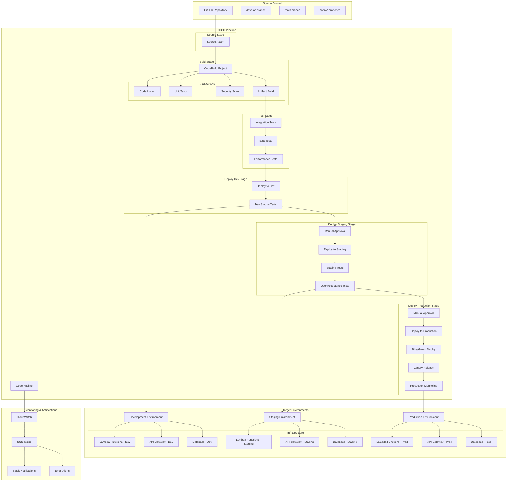

# 6.1.1 マルチステージビルド

## 学習目標

このセクションでは、AWS CodePipeline、CodeBuild、CodeDeployを使用して、複数の環境（開発、ステージング、本番）に対応したマルチステージビルドパイプラインを構築します。継続的インテグレーション（CI）と継続的デプロイメント（CD）のベストプラクティスを学習し、安全で効率的な自動デプロイメントシステムを実装します。

### 習得できるスキル
- AWS CodePipeline を使用した CI/CD パイプラインの設計・構築
- AWS CodeBuild による自動ビルド・テスト実行
- AWS CodeDeploy を使用した段階的デプロイメント
- マルチステージ環境での品質ゲートとApproval Process
- Blue/Green デプロイメントとCanary リリース戦略
- Infrastructure as Code (IaC) との統合
- セキュリティスキャンとコンプライアンス自動化

## 前提知識

### 必須の知識
- AWS CodeCommit または GitHub の基本操作
- AWS Lambda 関数開発（1.2.3セクション完了）
- CloudFormation テンプレート作成（1.1.1セクション完了）
- Docker コンテナの基本概念

### あると望ましい知識
- CI/CD パイプラインの概念
- ソフトウェアテストの手法（Unit/Integration/E2E）
- Git ブランチ戦略（GitFlow、GitHub Flow）
- Infrastructure as Code のベストプラクティス

## アーキテクチャ概要

### マルチステージ CI/CD パイプライン全体図



### 主要コンポーネント
- **Source Control**: GitHub リポジトリとブランチ戦略
- **CodePipeline**: パイプラインのオーケストレーション
- **CodeBuild**: ビルド・テスト・セキュリティスキャンの実行
- **CodeDeploy**: 段階的デプロイメントの実行
- **Multi-Environment**: Dev/Staging/Production の分離
- **Quality Gates**: 各ステージでの品質チェック
- **Approval Process**: 手動承認によるリリース制御

## ハンズオン手順

### ステップ1: パイプライン基盤の構築

#### 1.1 CodePipeline インフラストラクチャ

```yaml
# cloudformation/cicd-pipeline-infrastructure.yaml
AWSTemplateFormatVersion: '2010-09-09'
Description: 'Multi-Stage CI/CD Pipeline Infrastructure'

Parameters:
  ProjectName:
    Type: String
    Default: 'MultiStageApp'
    Description: プロジェクト名（リソース命名に使用）
  
  Environment:
    Type: String
    Default: 'shared'
    Description: |
      共有リソース用環境名
      パイプライン自体は環境間で共有される
  
  # GitHub設定
  GitHubOwner:
    Type: String
    Description: |
      GitHubリポジトリのオーナー名
      例: your-github-username
  
  GitHubRepo:
    Type: String
    Description: |
      GitHubリポジトリ名
      例: multi-stage-app
  
  GitHubBranch:
    Type: String
    Default: 'main'
    AllowedValues: ['main', 'develop', 'release/*']
    Description: |
      監視するブランチ
      - main: 本番リリース用
      - develop: 開発ブランチ
      - release/*: リリースブランチ
  
  # 通知設定
  SlackWebhookUrl:
    Type: String
    NoEcho: true
    Description: |
      Slack通知用WebhookURL
      空の場合はSlack通知を無効化
  
  NotificationEmail:
    Type: String
    Description: |
      パイプライン通知用メールアドレス
      承認通知やエラー通知に使用

Conditions:
  # Slack通知が有効かどうか
  EnableSlackNotifications: !Not [!Equals [!Ref SlackWebhookUrl, '']]

Resources:
  # ========================================
  # S3バケット（アーティファクト保存）
  # ========================================
  # パイプラインアーティファクトバケット
  PipelineArtifactsBucket:
    Type: AWS::S3::Bucket
    Properties:
      BucketName: !Sub '${ProjectName}-pipeline-artifacts-${AWS::AccountId}'
      PublicAccessBlockConfiguration:
        BlockPublicAcls: true
        BlockPublicPolicy: true
        IgnorePublicAcls: true
        RestrictPublicBuckets: true
      BucketEncryption:
        ServerSideEncryptionConfiguration:
          - ServerSideEncryptionByDefault:
              SSEAlgorithm: AES256
            BucketKeyEnabled: true
      VersioningConfiguration:
        Status: Enabled
      LifecycleConfiguration:
        Rules:
          - Id: DeleteOldArtifacts
            Status: Enabled
            ExpirationInDays: 30  # 30日後に削除
          - Id: DeleteOldVersions
            Status: Enabled
            NoncurrentVersionExpirationInDays: 7
      Tags:
        - Key: Environment
          Value: !Ref Environment
        - Key: Project
          Value: !Ref ProjectName

  # ビルドキャッシュバケット
  BuildCacheBucket:
    Type: AWS::S3::Bucket
    Properties:
      BucketName: !Sub '${ProjectName}-build-cache-${AWS::AccountId}'
      PublicAccessBlockConfiguration:
        BlockPublicAcls: true
        BlockPublicPolicy: true
        IgnorePublicAcls: true
        RestrictPublicBuckets: true
      BucketEncryption:
        ServerSideEncryptionConfiguration:
          - ServerSideEncryptionByDefault:
              SSEAlgorithm: AES256
      LifecycleConfiguration:
        Rules:
          - Id: DeleteOldCache
            Status: Enabled
            ExpirationInDays: 7  # キャッシュは7日で削除
      Tags:
        - Key: Environment
          Value: !Ref Environment
        - Key: Project
          Value: !Ref ProjectName

  # ========================================
  # IAMロール（CodePipeline用）
  # ========================================
  # CodePipelineサービスロール
  CodePipelineServiceRole:
    Type: AWS::IAM::Role
    Properties:
      RoleName: !Sub '${ProjectName}-CodePipeline-ServiceRole'
      AssumeRolePolicyDocument:
        Version: '2012-10-17'
        Statement:
          - Effect: Allow
            Principal:
              Service: codepipeline.amazonaws.com
            Action: sts:AssumeRole
      Policies:
        - PolicyName: PipelineServicePolicy
          PolicyDocument:
            Version: '2012-10-17'
            Statement:
              # S3アーティファクトアクセス
              - Effect: Allow
                Action:
                  - s3:GetBucketVersioning
                  - s3:GetObject
                  - s3:GetObjectVersion
                  - s3:PutObject
                Resource:
                  - !Sub '${PipelineArtifactsBucket}'
                  - !Sub '${PipelineArtifactsBucket}/*'
              # CodeBuildプロジェクト実行
              - Effect: Allow
                Action:
                  - codebuild:BatchGetBuilds
                  - codebuild:StartBuild
                Resource:
                  - !GetAtt CodeBuildProject.Arn
                  - !GetAtt IntegrationTestProject.Arn
                  - !GetAtt E2ETestProject.Arn
              # CodeDeployアプリケーション実行
              - Effect: Allow
                Action:
                  - codedeploy:CreateDeployment
                  - codedeploy:GetApplication
                  - codedeploy:GetApplicationRevision
                  - codedeploy:GetDeployment
                  - codedeploy:GetDeploymentConfig
                  - codedeploy:RegisterApplicationRevision
                Resource: '*'
              # CloudFormationスタック管理
              - Effect: Allow
                Action:
                  - cloudformation:CreateStack
                  - cloudformation:DeleteStack
                  - cloudformation:DescribeStacks
                  - cloudformation:UpdateStack
                  - cloudformation:CreateChangeSet
                  - cloudformation:DeleteChangeSet
                  - cloudformation:DescribeChangeSet
                  - cloudformation:ExecuteChangeSet
                  - cloudformation:SetStackPolicy
                  - cloudformation:ValidateTemplate
                Resource: '*'
              # IAMロール操作（CloudFormation用）
              - Effect: Allow
                Action:
                  - iam:PassRole
                Resource:
                  - !GetAtt CloudFormationDeployRole.Arn
              # SNS通知
              - Effect: Allow
                Action:
                  - sns:Publish
                Resource:
                  - !Ref PipelineNotificationTopic
      Tags:
        - Key: Environment
          Value: !Ref Environment
        - Key: Project
          Value: !Ref ProjectName

  # CodeBuildサービスロール
  CodeBuildServiceRole:
    Type: AWS::IAM::Role
    Properties:
      RoleName: !Sub '${ProjectName}-CodeBuild-ServiceRole'
      AssumeRolePolicyDocument:
        Version: '2012-10-17'
        Statement:
          - Effect: Allow
            Principal:
              Service: codebuild.amazonaws.com
            Action: sts:AssumeRole
      Policies:
        - PolicyName: BuildServicePolicy
          PolicyDocument:
            Version: '2012-10-17'
            Statement:
              # CloudWatch Logs
              - Effect: Allow
                Action:
                  - logs:CreateLogGroup
                  - logs:CreateLogStream
                  - logs:PutLogEvents
                Resource:
                  - !Sub 'arn:aws:logs:${AWS::Region}:${AWS::AccountId}:log-group:/aws/codebuild/${ProjectName}*'
              # S3アーティファクトアクセス
              - Effect: Allow
                Action:
                  - s3:GetBucketVersioning
                  - s3:GetObject
                  - s3:GetObjectVersion
                  - s3:PutObject
                Resource:
                  - !Sub '${PipelineArtifactsBucket}'
                  - !Sub '${PipelineArtifactsBucket}/*'
                  - !Sub '${BuildCacheBucket}'
                  - !Sub '${BuildCacheBucket}/*'
              # ECRアクセス（Dockerビルド用）
              - Effect: Allow
                Action:
                  - ecr:BatchCheckLayerAvailability
                  - ecr:GetDownloadUrlForLayer
                  - ecr:BatchGetImage
                  - ecr:GetAuthorizationToken
                Resource: '*'
              # セキュリティスキャン用
              - Effect: Allow
                Action:
                  - inspector:CreateAssessmentTarget
                  - inspector:CreateAssessmentTemplate
                  - inspector:StartAssessmentRun
                  - inspector:DescribeAssessmentRuns
                Resource: '*'
              # パラメータストアアクセス（環境変数用）
              - Effect: Allow
                Action:
                  - ssm:GetParameter
                  - ssm:GetParameters
                Resource:
                  - !Sub 'arn:aws:ssm:${AWS::Region}:${AWS::AccountId}:parameter/${ProjectName}/*'
      Tags:
        - Key: Environment
          Value: !Ref Environment
        - Key: Project
          Value: !Ref ProjectName

  # CloudFormationデプロイロール
  CloudFormationDeployRole:
    Type: AWS::IAM::Role
    Properties:
      RoleName: !Sub '${ProjectName}-CloudFormation-DeployRole'
      AssumeRolePolicyDocument:
        Version: '2012-10-17'
        Statement:
          - Effect: Allow
            Principal:
              Service: cloudformation.amazonaws.com
            Action: sts:AssumeRole
      ManagedPolicyArns:
        # 必要なサービスへのフルアクセス（本番では最小権限に調整）
        - arn:aws:iam::aws:policy/AWSLambda_FullAccess
        - arn:aws:iam::aws:policy/AmazonAPIGatewayAdministrator
        - arn:aws:iam::aws:policy/AmazonDynamoDBFullAccess
        - arn:aws:iam::aws:policy/AmazonS3FullAccess
        - arn:aws:iam::aws:policy/CloudWatchFullAccess
        - arn:aws:iam::aws:policy/IAMFullAccess
      Tags:
        - Key: Environment
          Value: !Ref Environment
        - Key: Project
          Value: !Ref ProjectName

  # ========================================
  # CodeBuildプロジェクト
  # ========================================
  # メインビルドプロジェクト
  CodeBuildProject:
    Type: AWS::CodeBuild::Project
    Properties:
      Name: !Sub '${ProjectName}-build'
      Description: 'Main build project for application'
      ServiceRole: !GetAtt CodeBuildServiceRole.Arn
      Artifacts:
        Type: CODEPIPELINE
      Environment:
        Type: LINUX_CONTAINER
        ComputeType: BUILD_GENERAL1_MEDIUM
        Image: aws/codebuild/amazonlinux2-x86_64-standard:4.0
        PrivilegedMode: true  # Docker使用のため
        EnvironmentVariables:
          - Name: AWS_DEFAULT_REGION
            Value: !Ref AWS::Region
          - Name: AWS_ACCOUNT_ID
            Value: !Ref AWS::AccountId
          - Name: PROJECT_NAME
            Value: !Ref ProjectName
          - Name: BUILD_CACHE_BUCKET
            Value: !Ref BuildCacheBucket
      Source:
        Type: CODEPIPELINE
        BuildSpec: |
          version: 0.2
          
          phases:
            pre_build:
              commands:
                - echo Logging in to Amazon ECR...
                - aws ecr get-login-password --region $AWS_DEFAULT_REGION | docker login --username AWS --password-stdin $AWS_ACCOUNT_ID.dkr.ecr.$AWS_DEFAULT_REGION.amazonaws.com
                - echo Build started on `date`
                - echo Installing dependencies...
                
                # Node.js プロジェクトの場合
                - |
                  if [ -f "package.json" ]; then
                    npm ci --cache .npm --prefer-offline
                  fi
                
                # Python プロジェクトの場合
                - |
                  if [ -f "requirements.txt" ]; then
                    pip install -r requirements.txt
                  fi
                
                # キャッシュから復元
                - |
                  if aws s3 ls s3://$BUILD_CACHE_BUCKET/build-cache.tar.gz; then
                    aws s3 cp s3://$BUILD_CACHE_BUCKET/build-cache.tar.gz .
                    tar -xzf build-cache.tar.gz
                  fi
            
            build:
              commands:
                - echo Build phase started on `date`
                
                # コードリンティング
                - echo "Running code linting..."
                - |
                  if [ -f "package.json" ]; then
                    npm run lint || exit 1
                  fi
                
                # ユニットテスト実行
                - echo "Running unit tests..."
                - |
                  if [ -f "package.json" ]; then
                    npm run test:unit || exit 1
                  elif [ -f "requirements.txt" ]; then
                    python -m pytest tests/unit/ || exit 1
                  fi
                
                # セキュリティスキャン
                - echo "Running security scan..."
                - |
                  if [ -f "package.json" ]; then
                    npm audit --audit-level=high || exit 1
                  fi
                
                # アプリケーションビルド
                - echo "Building application..."
                - |
                  if [ -f "package.json" ]; then
                    npm run build
                  fi
                
                # Lambdaデプロイメントパッケージ作成
                - echo "Creating deployment packages..."
                - |
                  mkdir -p dist
                  for func_dir in functions/*/; do
                    if [ -d "$func_dir" ]; then
                      func_name=$(basename "$func_dir")
                      echo "Packaging function: $func_name"
                      cd "$func_dir"
                      zip -r "../../dist/${func_name}.zip" . -x "*.pyc" "*__pycache__*" "*.git*" "*node_modules*"
                      cd ../..
                    fi
                  done
                
                # CloudFormationテンプレート検証
                - echo "Validating CloudFormation templates..."
                - |
                  for template in cloudformation/*.yaml; do
                    if [ -f "$template" ]; then
                      aws cloudformation validate-template --template-body file://"$template"
                    fi
                  done
                
                # ビルドキャッシュ保存
                - echo "Saving build cache..."
                - |
                  tar -czf build-cache.tar.gz node_modules/ .npm/ || true
                  aws s3 cp build-cache.tar.gz s3://$BUILD_CACHE_BUCKET/ || true
            
            post_build:
              commands:
                - echo Build completed on `date`
                - echo "Generating build report..."
                - |
                  cat > build-report.json << EOF
                  {
                    "buildTime": "$(date -Iseconds)",
                    "gitCommit": "$CODEBUILD_RESOLVED_SOURCE_VERSION",
                    "buildNumber": "$CODEBUILD_BUILD_NUMBER",
                    "projectName": "$PROJECT_NAME"
                  }
                  EOF
          
          artifacts:
            files:
              - '**/*'
            name: BuildArtifact
          
          cache:
            paths:
              - '/root/.npm/**/*'
              - 'node_modules/**/*'
              - '.cache/**/*'
      Cache:
        Type: S3
        Location: !Sub '${BuildCacheBucket}/build-cache'
      TimeoutInMinutes: 30
      Tags:
        - Key: Environment
          Value: !Ref Environment
        - Key: Project
          Value: !Ref ProjectName

  # 統合テストプロジェクト
  IntegrationTestProject:
    Type: AWS::CodeBuild::Project
    Properties:
      Name: !Sub '${ProjectName}-integration-tests'
      Description: 'Integration tests for application'
      ServiceRole: !GetAtt CodeBuildServiceRole.Arn
      Artifacts:
        Type: CODEPIPELINE
      Environment:
        Type: LINUX_CONTAINER
        ComputeType: BUILD_GENERAL1_SMALL
        Image: aws/codebuild/amazonlinux2-x86_64-standard:4.0
        EnvironmentVariables:
          - Name: AWS_DEFAULT_REGION
            Value: !Ref AWS::Region
          - Name: PROJECT_NAME
            Value: !Ref ProjectName
      Source:
        Type: CODEPIPELINE
        BuildSpec: |
          version: 0.2
          
          phases:
            pre_build:
              commands:
                - echo Installing test dependencies...
                - |
                  if [ -f "package.json" ]; then
                    npm ci
                  elif [ -f "requirements.txt" ]; then
                    pip install -r requirements.txt
                  fi
            
            build:
              commands:
                - echo Running integration tests...
                - |
                  if [ -f "package.json" ]; then
                    npm run test:integration || exit 1
                  elif [ -f "requirements.txt" ]; then
                    python -m pytest tests/integration/ || exit 1
                  fi
                
                # API エンドポイントテスト
                - echo Testing API endpoints...
                - |
                  if [ -f "tests/api-tests.sh" ]; then
                    chmod +x tests/api-tests.sh
                    ./tests/api-tests.sh
                  fi
            
            post_build:
              commands:
                - echo Integration tests completed
                - |
                  if [ -f "test-results.xml" ]; then
                    echo "Test results available"
                  fi
          
          reports:
            integration-test-reports:
              files:
                - '**/*'
              base-directory: 'test-results'
              file-format: 'JUNITXML'
      TimeoutInMinutes: 20
      Tags:
        - Key: Environment
          Value: !Ref Environment
        - Key: Project
          Value: !Ref ProjectName

  # E2Eテストプロジェクト
  E2ETestProject:
    Type: AWS::CodeBuild::Project
    Properties:
      Name: !Sub '${ProjectName}-e2e-tests'
      Description: 'End-to-end tests for application'
      ServiceRole: !GetAtt CodeBuildServiceRole.Arn
      Artifacts:
        Type: CODEPIPELINE
      Environment:
        Type: LINUX_CONTAINER
        ComputeType: BUILD_GENERAL1_MEDIUM
        Image: aws/codebuild/amazonlinux2-x86_64-standard:4.0
        EnvironmentVariables:
          - Name: AWS_DEFAULT_REGION
            Value: !Ref AWS::Region
          - Name: PROJECT_NAME
            Value: !Ref ProjectName
      Source:
        Type: CODEPIPELINE
        BuildSpec: |
          version: 0.2
          
          phases:
            pre_build:
              commands:
                - echo Installing E2E test dependencies...
                - |
                  # Playwright または Cypress のセットアップ
                  if [ -f "package.json" ]; then
                    npm ci
                    if grep -q "playwright" package.json; then
                      npx playwright install-deps
                      npx playwright install
                    elif grep -q "cypress" package.json; then
                      npx cypress install
                    fi
                  fi
            
            build:
              commands:
                - echo Running E2E tests...
                - |
                  if [ -f "package.json" ]; then
                    if grep -q "playwright" package.json; then
                      npm run test:e2e:playwright || exit 1
                    elif grep -q "cypress" package.json; then
                      npm run test:e2e:cypress || exit 1
                    else
                      npm run test:e2e || exit 1
                    fi
                  fi
                
                # パフォーマンステスト
                - echo Running performance tests...
                - |
                  if [ -f "tests/performance.js" ]; then
                    node tests/performance.js
                  fi
            
            post_build:
              commands:
                - echo E2E tests completed
                - |
                  # スクリーンショットやビデオの保存
                  if [ -d "test-results" ]; then
                    echo "Test artifacts available"
                  fi
          
          artifacts:
            files:
              - 'test-results/**/*'
            name: E2ETestResults
          
          reports:
            e2e-test-reports:
              files:
                - '**/*'
              base-directory: 'test-results'
              file-format: 'JUNITXML'
      TimeoutInMinutes: 30
      Tags:
        - Key: Environment
          Value: !Ref Environment
        - Key: Project
          Value: !Ref ProjectName

  # ========================================
  # SNS通知設定
  # ========================================
  # パイプライン通知トピック
  PipelineNotificationTopic:
    Type: AWS::SNS::Topic
    Properties:
      TopicName: !Sub '${ProjectName}-pipeline-notifications'
      DisplayName: 'CI/CD Pipeline Notifications'
      Tags:
        - Key: Environment
          Value: !Ref Environment
        - Key: Project
          Value: !Ref ProjectName

  # メール通知サブスクリプション
  EmailNotificationSubscription:
    Type: AWS::SNS::Subscription
    Properties:
      TopicArn: !Ref PipelineNotificationTopic
      Protocol: email
      Endpoint: !Ref NotificationEmail

  # Slack通知用Lambda関数（オプション）
  SlackNotificationFunction:
    Type: AWS::Lambda::Function
    Condition: EnableSlackNotifications
    Properties:
      FunctionName: !Sub '${ProjectName}-slack-notification'
      Runtime: python3.9
      Handler: index.lambda_handler
      Role: !GetAtt SlackNotificationRole.Arn
      Timeout: 30
      Environment:
        Variables:
          SLACK_WEBHOOK_URL: !Ref SlackWebhookUrl
          PROJECT_NAME: !Ref ProjectName
      Code:
        ZipFile: |
          import json
          import urllib3
          import os
          
          def lambda_handler(event, context):
              """
              SNSメッセージをSlackに転送
              """
              try:
                  # SNSメッセージを解析
                  message = json.loads(event['Records'][0]['Sns']['Message'])
                  subject = event['Records'][0]['Sns']['Subject']
                  
                  # Slackメッセージを構築
                  slack_message = {
                      "text": f":construction: {subject}",
                      "blocks": [
                          {
                              "type": "section",
                              "text": {
                                  "type": "mrkdwn",
                                  "text": f"*{subject}*\n{message.get('detail', 'Pipeline status update')}"
                              }
                          }
                      ]
                  }
                  
                  # パイプライン状態に応じたアイコン
                  state = message.get('detail-type', '').lower()
                  if 'success' in state or 'succeed' in state:
                      slack_message["text"] = f":white_check_mark: {subject}"
                  elif 'fail' in state or 'error' in state:
                      slack_message["text"] = f":x: {subject}"
                  elif 'start' in state:
                      slack_message["text"] = f":rocket: {subject}"
                  
                  # SlackにPOST
                  http = urllib3.PoolManager()
                  response = http.request(
                      'POST',
                      os.environ['SLACK_WEBHOOK_URL'],
                      body=json.dumps(slack_message),
                      headers={'Content-Type': 'application/json'}
                  )
                  
                  return {
                      'statusCode': 200,
                      'body': json.dumps('Notification sent to Slack')
                  }
                  
              except Exception as e:
                  print(f"Error sending Slack notification: {str(e)}")
                  return {
                      'statusCode': 500,
                      'body': json.dumps(f'Error: {str(e)}')
                  }
      Tags:
        - Key: Environment
          Value: !Ref Environment
        - Key: Project
          Value: !Ref ProjectName

  # Slack通知用IAMロール
  SlackNotificationRole:
    Type: AWS::IAM::Role
    Condition: EnableSlackNotifications
    Properties:
      AssumeRolePolicyDocument:
        Version: '2012-10-17'
        Statement:
          - Effect: Allow
            Principal:
              Service: lambda.amazonaws.com
            Action: sts:AssumeRole
      ManagedPolicyArns:
        - arn:aws:iam::aws:policy/service-role/AWSLambdaBasicExecutionRole

  # Slack通知サブスクリプション
  SlackNotificationSubscription:
    Type: AWS::SNS::Subscription
    Condition: EnableSlackNotifications
    Properties:
      TopicArn: !Ref PipelineNotificationTopic
      Protocol: lambda
      Endpoint: !GetAtt SlackNotificationFunction.Arn

  # Lambda呼び出し権限
  SlackNotificationPermission:
    Type: AWS::Lambda::Permission
    Condition: EnableSlackNotifications
    Properties:
      FunctionName: !Ref SlackNotificationFunction
      Action: lambda:InvokeFunction
      Principal: sns.amazonaws.com
      SourceArn: !Ref PipelineNotificationTopic

  # ========================================
  # CloudWatch ログ設定
  # ========================================
  # CodeBuildログ用ログループ
  CodeBuildLogGroup:
    Type: AWS::Logs::LogGroup
    Properties:
      LogGroupName: !Sub '/aws/codebuild/${ProjectName}-build'
      RetentionInDays: 30

  IntegrationTestLogGroup:
    Type: AWS::Logs::LogGroup
    Properties:
      LogGroupName: !Sub '/aws/codebuild/${ProjectName}-integration-tests'
      RetentionInDays: 14

  E2ETestLogGroup:
    Type: AWS::Logs::LogGroup
    Properties:
      LogGroupName: !Sub '/aws/codebuild/${ProjectName}-e2e-tests'
      RetentionInDays: 14

# ========================================
# 出力値（パイプライン作成で使用）
# ========================================
Outputs:
  # S3バケット
  PipelineArtifactsBucketName:
    Description: パイプラインアーティファクトS3バケット名
    Value: !Ref PipelineArtifactsBucket
    Export:
      Name: !Sub '${AWS::StackName}-PipelineArtifactsBucket'

  BuildCacheBucketName:
    Description: ビルドキャッシュS3バケット名
    Value: !Ref BuildCacheBucket
    Export:
      Name: !Sub '${AWS::StackName}-BuildCacheBucket'

  # IAMロール
  CodePipelineServiceRoleArn:
    Description: CodePipelineサービスロールARN
    Value: !GetAtt CodePipelineServiceRole.Arn
    Export:
      Name: !Sub '${AWS::StackName}-CodePipelineServiceRole'

  CodeBuildServiceRoleArn:
    Description: CodeBuildサービスロールARN
    Value: !GetAtt CodeBuildServiceRole.Arn
    Export:
      Name: !Sub '${AWS::StackName}-CodeBuildServiceRole'

  CloudFormationDeployRoleArn:
    Description: CloudFormationデプロイロールARN
    Value: !GetAtt CloudFormationDeployRole.Arn
    Export:
      Name: !Sub '${AWS::StackName}-CloudFormationDeployRole'

  # CodeBuildプロジェクト
  CodeBuildProjectName:
    Description: メインビルドプロジェクト名
    Value: !Ref CodeBuildProject
    Export:
      Name: !Sub '${AWS::StackName}-CodeBuildProject'

  IntegrationTestProjectName:
    Description: 統合テストプロジェクト名
    Value: !Ref IntegrationTestProject
    Export:
      Name: !Sub '${AWS::StackName}-IntegrationTestProject'

  E2ETestProjectName:
    Description: E2Eテストプロジェクト名
    Value: !Ref E2ETestProject
    Export:
      Name: !Sub '${AWS::StackName}-E2ETestProject'

  # SNS通知
  PipelineNotificationTopicArn:
    Description: パイプライン通知SNSトピックARN
    Value: !Ref PipelineNotificationTopic
    Export:
      Name: !Sub '${AWS::StackName}-PipelineNotificationTopic'

  # 設定概要
  PipelineInfrastructureInfo:
    Description: パイプラインインフラ設定概要
    Value: !Sub |
      CI/CD Pipeline Infrastructure:
      - Artifacts Bucket: s3://${PipelineArtifactsBucket}/
      - Build Cache: s3://${BuildCacheBucket}/
      - Build Project: ${CodeBuildProject}
      - Integration Tests: ${IntegrationTestProject}
      - E2E Tests: ${E2ETestProject}
      - Notifications: ${PipelineNotificationTopic}
      - GitHub Repository: https://github.com/${GitHubOwner}/${GitHubRepo}
      - Monitored Branch: ${GitHubBranch}
```

### ステップ2: メインパイプラインの構築

#### 2.1 CodePipeline 定義

```yaml
# cloudformation/multi-stage-pipeline.yaml
AWSTemplateFormatVersion: '2010-09-09'
Description: 'Multi-Stage CI/CD Pipeline using CodePipeline'

Parameters:
  ProjectName:
    Type: String
    Default: 'MultiStageApp'
  
  InfrastructureStackName:
    Type: String
    Description: パイプライン基盤スタック名
  
  # GitHub設定
  GitHubOwner:
    Type: String
    Description: GitHubオーナー名
  
  GitHubRepo:
    Type: String
    Description: GitHubリポジトリ名
  
  GitHubBranch:
    Type: String
    Default: 'main'
  
  GitHubToken:
    Type: String
    NoEcho: true
    Description: GitHub Personal Access Token

Resources:
  # ========================================
  # メイン CI/CD パイプライン
  # ========================================
  MultiStagePipeline:
    Type: AWS::CodePipeline::Pipeline
    Properties:
      Name: !Sub '${ProjectName}-multi-stage-pipeline'
      RoleArn:
        Fn::ImportValue: !Sub '${InfrastructureStackName}-CodePipelineServiceRole'
      ArtifactStore:
        Type: S3
        Location:
          Fn::ImportValue: !Sub '${InfrastructureStackName}-PipelineArtifactsBucket'
      Stages:
        # ========================================
        # ソースステージ
        # ========================================
        - Name: Source
          Actions:
            - Name: SourceAction
              ActionTypeId:
                Category: Source
                Owner: ThirdParty
                Provider: GitHub
                Version: '1'
              Configuration:
                Owner: !Ref GitHubOwner
                Repo: !Ref GitHubRepo
                Branch: !Ref GitHubBranch
                OAuthToken: !Ref GitHubToken
                PollForSourceChanges: false  # WebHookを使用
              OutputArtifacts:
                - Name: SourceOutput

        # ========================================
        # ビルド・テストステージ
        # ========================================
        - Name: Build
          Actions:
            - Name: BuildAction
              ActionTypeId:
                Category: Build
                Owner: AWS
                Provider: CodeBuild
                Version: '1'
              Configuration:
                ProjectName:
                  Fn::ImportValue: !Sub '${InfrastructureStackName}-CodeBuildProject'
              InputArtifacts:
                - Name: SourceOutput
              OutputArtifacts:
                - Name: BuildOutput
              RunOrder: 1

        # ========================================
        # 統合テストステージ
        # ========================================
        - Name: IntegrationTest
          Actions:
            - Name: IntegrationTestAction
              ActionTypeId:
                Category: Build
                Owner: AWS
                Provider: CodeBuild
                Version: '1'
              Configuration:
                ProjectName:
                  Fn::ImportValue: !Sub '${InfrastructureStackName}-IntegrationTestProject'
              InputArtifacts:
                - Name: BuildOutput
              RunOrder: 1

        # ========================================
        # 開発環境デプロイステージ
        # ========================================
        - Name: DeployDev
          Actions:
            # インフラストラクチャのデプロイ
            - Name: DeployInfrastructureDev
              ActionTypeId:
                Category: Deploy
                Owner: AWS
                Provider: CloudFormation
                Version: '1'
              Configuration:
                ActionMode: CREATE_UPDATE
                StackName: !Sub '${ProjectName}-dev-infrastructure'
                TemplatePath: BuildOutput::cloudformation/application-infrastructure.yaml
                Capabilities: CAPABILITY_NAMED_IAM
                RoleArn:
                  Fn::ImportValue: !Sub '${InfrastructureStackName}-CloudFormationDeployRole'
                ParameterOverrides: !Sub |
                  {
                    "ProjectName": "${ProjectName}",
                    "Environment": "dev",
                    "LogLevel": "DEBUG",
                    "EnableDetailedMonitoring": "false"
                  }
              InputArtifacts:
                - Name: BuildOutput
              OutputArtifacts:
                - Name: DevInfraOutput
              RunOrder: 1
            
            # アプリケーションのデプロイ
            - Name: DeployApplicationDev
              ActionTypeId:
                Category: Deploy
                Owner: AWS
                Provider: CloudFormation
                Version: '1'
              Configuration:
                ActionMode: CREATE_UPDATE
                StackName: !Sub '${ProjectName}-dev-application'
                TemplatePath: BuildOutput::cloudformation/application-deployment.yaml
                Capabilities: CAPABILITY_IAM
                RoleArn:
                  Fn::ImportValue: !Sub '${InfrastructureStackName}-CloudFormationDeployRole'
                ParameterOverrides: !Sub |
                  {
                    "ProjectName": "${ProjectName}",
                    "Environment": "dev",
                    "InfrastructureStackName": "${ProjectName}-dev-infrastructure"
                  }
              InputArtifacts:
                - Name: BuildOutput
              RunOrder: 2
            
            # 開発環境スモークテスト
            - Name: DevSmokeTest
              ActionTypeId:
                Category: Invoke
                Owner: AWS
                Provider: Lambda
                Version: '1'
              Configuration:
                FunctionName: !Ref SmokeTestFunction
                UserParameters: !Sub |
                  {
                    "environment": "dev",
                    "stackName": "${ProjectName}-dev-application"
                  }
              RunOrder: 3

        # ========================================
        # E2Eテストステージ
        # ========================================
        - Name: E2ETest
          Actions:
            - Name: E2ETestAction
              ActionTypeId:
                Category: Build
                Owner: AWS
                Provider: CodeBuild
                Version: '1'
              Configuration:
                ProjectName:
                  Fn::ImportValue: !Sub '${InfrastructureStackName}-E2ETestProject'
                EnvironmentVariables: !Sub |
                  [
                    {
                      "name": "TARGET_ENVIRONMENT",
                      "value": "dev"
                    },
                    {
                      "name": "APP_STACK_NAME",
                      "value": "${ProjectName}-dev-application"
                    }
                  ]
              InputArtifacts:
                - Name: BuildOutput
              RunOrder: 1

        # ========================================
        # ステージング環境デプロイステージ
        # ========================================
        - Name: DeployStaging
          Actions:
            # 手動承認
            - Name: ManualApprovalForStaging
              ActionTypeId:
                Category: Approval
                Owner: AWS
                Provider: Manual
                Version: '1'
              Configuration:
                CustomData: |
                  開発環境でのテストが完了しました。
                  ステージング環境へのデプロイを承認しますか？
                  
                  変更内容を確認してから承認してください。
                NotificationArn:
                  Fn::ImportValue: !Sub '${InfrastructureStackName}-PipelineNotificationTopic'
              RunOrder: 1
            
            # ステージングインフラデプロイ
            - Name: DeployInfrastructureStaging
              ActionTypeId:
                Category: Deploy
                Owner: AWS
                Provider: CloudFormation
                Version: '1'
              Configuration:
                ActionMode: CREATE_UPDATE
                StackName: !Sub '${ProjectName}-staging-infrastructure'
                TemplatePath: BuildOutput::cloudformation/application-infrastructure.yaml
                Capabilities: CAPABILITY_NAMED_IAM
                RoleArn:
                  Fn::ImportValue: !Sub '${InfrastructureStackName}-CloudFormationDeployRole'
                ParameterOverrides: !Sub |
                  {
                    "ProjectName": "${ProjectName}",
                    "Environment": "staging",
                    "LogLevel": "INFO",
                    "EnableDetailedMonitoring": "true"
                  }
              InputArtifacts:
                - Name: BuildOutput
              RunOrder: 2
            
            # ステージングアプリデプロイ
            - Name: DeployApplicationStaging
              ActionTypeId:
                Category: Deploy
                Owner: AWS
                Provider: CloudFormation
                Version: '1'
              Configuration:
                ActionMode: CREATE_UPDATE
                StackName: !Sub '${ProjectName}-staging-application'
                TemplatePath: BuildOutput::cloudformation/application-deployment.yaml
                Capabilities: CAPABILITY_IAM
                RoleArn:
                  Fn::ImportValue: !Sub '${InfrastructureStackName}-CloudFormationDeployRole'
                ParameterOverrides: !Sub |
                  {
                    "ProjectName": "${ProjectName}",
                    "Environment": "staging",
                    "InfrastructureStackName": "${ProjectName}-staging-infrastructure"
                  }
              InputArtifacts:
                - Name: BuildOutput
              RunOrder: 3
            
            # ステージングテスト
            - Name: StagingTest
              ActionTypeId:
                Category: Invoke
                Owner: AWS
                Provider: Lambda
                Version: '1'
              Configuration:
                FunctionName: !Ref StagingTestFunction
                UserParameters: !Sub |
                  {
                    "environment": "staging",
                    "stackName": "${ProjectName}-staging-application"
                  }
              RunOrder: 4

        # ========================================
        # 本番環境デプロイステージ
        # ========================================
        - Name: DeployProduction
          Actions:
            # 本番承認
            - Name: ManualApprovalForProduction
              ActionTypeId:
                Category: Approval
                Owner: AWS
                Provider: Manual
                Version: '1'
              Configuration:
                CustomData: |
                  ステージング環境でのテストが完了しました。
                  本番環境への**Blue/Green デプロイ**を承認しますか？
                  
                  ⚠️ この操作は本番環境に影響します。
                  十分な確認を行ってから承認してください。
                NotificationArn:
                  Fn::ImportValue: !Sub '${InfrastructureStackName}-PipelineNotificationTopic'
              RunOrder: 1
            
            # 本番インフラ（Blueスタック）
            - Name: DeployInfrastructureProduction
              ActionTypeId:
                Category: Deploy
                Owner: AWS
                Provider: CloudFormation
                Version: '1'
              Configuration:
                ActionMode: CREATE_UPDATE
                StackName: !Sub '${ProjectName}-prod-infrastructure'
                TemplatePath: BuildOutput::cloudformation/application-infrastructure.yaml
                Capabilities: CAPABILITY_NAMED_IAM
                RoleArn:
                  Fn::ImportValue: !Sub '${InfrastructureStackName}-CloudFormationDeployRole'
                ParameterOverrides: !Sub |
                  {
                    "ProjectName": "${ProjectName}",
                    "Environment": "prod",
                    "LogLevel": "WARN",
                    "EnableDetailedMonitoring": "true",
                    "HighAvailability": "true"
                  }
              InputArtifacts:
                - Name: BuildOutput
              RunOrder: 2
            
            # Blue/Green デプロイ
            - Name: BlueGreenDeployProduction
              ActionTypeId:
                Category: Invoke
                Owner: AWS
                Provider: Lambda
                Version: '1'
              Configuration:
                FunctionName: !Ref BlueGreenDeployFunction
                UserParameters: !Sub |
                  {
                    "projectName": "${ProjectName}",
                    "environment": "prod",
                    "deploymentArtifact": "BuildOutput"
                  }
              InputArtifacts:
                - Name: BuildOutput
              RunOrder: 3
            
            # 本番ヘルスチェック
            - Name: ProductionHealthCheck
              ActionTypeId:
                Category: Invoke
                Owner: AWS
                Provider: Lambda
                Version: '1'
              Configuration:
                FunctionName: !Ref ProductionHealthCheckFunction
                UserParameters: !Sub |
                  {
                    "environment": "prod",
                    "stackName": "${ProjectName}-prod-application"
                  }
              RunOrder: 4

      Tags:
        - Key: Project
          Value: !Ref ProjectName

  # ========================================
  # パイプライン補助機能
  # ========================================
  # スモークテスト関数
  SmokeTestFunction:
    Type: AWS::Lambda::Function
    Properties:
      FunctionName: !Sub '${ProjectName}-smoke-test'
      Runtime: python3.9
      Handler: index.lambda_handler
      Role: !GetAtt TestFunctionRole.Arn
      Timeout: 300
      Code:
        ZipFile: |
          import json
          import boto3
          import urllib3
          import time
          
          def lambda_handler(event, context):
              """
              開発環境スモークテスト
              """
              try:
                  codepipeline = boto3.client('codepipeline')
                  cloudformation = boto3.client('cloudformation')
                  
                  # パラメータ取得
                  params = json.loads(event['CodePipeline.job']['data']['actionConfiguration']['configuration']['UserParameters'])
                  environment = params['environment']
                  stack_name = params['stackName']
                  job_id = event['CodePipeline.job']['id']
                  
                  print(f"Starting smoke test for {environment} environment")
                  
                  # CloudFormationスタックからAPIエンドポイントを取得
                  try:
                      response = cloudformation.describe_stacks(StackName=stack_name)
                      outputs = response['Stacks'][0]['Outputs']
                      
                      api_endpoint = None
                      for output in outputs:
                          if output['OutputKey'] == 'APIEndpoint':
                              api_endpoint = output['OutputValue']
                              break
                      
                      if not api_endpoint:
                          raise Exception("API endpoint not found in stack outputs")
                      
                  except Exception as e:
                      print(f"Error getting stack outputs: {str(e)}")
                      codepipeline.put_job_failure_result(
                          jobId=job_id,
                          failureDetails={'message': f'Failed to get API endpoint: {str(e)}', 'type': 'JobFailed'}
                      )
                      return
                  
                  # ヘルスチェックエンドポイントをテスト
                  http = urllib3.PoolManager()
                  
                  health_tests = [
                      f"{api_endpoint}/health",
                      f"{api_endpoint}/api/v1/status"
                  ]
                  
                  for test_url in health_tests:
                      try:
                          print(f"Testing endpoint: {test_url}")
                          response = http.request('GET', test_url, timeout=30)
                          
                          if response.status not in [200, 204]:
                              raise Exception(f"Health check failed: {response.status}")
                          
                          print(f"✅ {test_url} - OK")
                          
                      except Exception as e:
                          print(f"❌ {test_url} - Failed: {str(e)}")
                          codepipeline.put_job_failure_result(
                              jobId=job_id,
                              failureDetails={'message': f'Smoke test failed: {str(e)}', 'type': 'JobFailed'}
                          )
                          return
                  
                  # 基本機能テスト（例：API呼び出し）
                  try:
                      test_response = http.request('GET', f"{api_endpoint}/api/v1/test")
                      if test_response.status == 200:
                          print("✅ Basic API test - OK")
                      else:
                          print(f"⚠️ Basic API test - Status: {test_response.status}")
                  except:
                      print("⚠️ Basic API test - Not available (optional)")
                  
                  # パイプライン成功
                  codepipeline.put_job_success_result(jobId=job_id)
                  print(f"Smoke test completed successfully for {environment}")
                  
              except Exception as e:
                  print(f"Smoke test failed: {str(e)}")
                  codepipeline.put_job_failure_result(
                      jobId=job_id,
                      failureDetails={'message': str(e), 'type': 'JobFailed'}
                  )
      Tags:
        - Key: Project
          Value: !Ref ProjectName

  # ステージングテスト関数
  StagingTestFunction:
    Type: AWS::Lambda::Function
    Properties:
      FunctionName: !Sub '${ProjectName}-staging-test'
      Runtime: python3.9
      Handler: index.lambda_handler
      Role: !GetAtt TestFunctionRole.Arn
      Timeout: 600
      Code:
        ZipFile: |
          import json
          import boto3
          import urllib3
          import time
          
          def lambda_handler(event, context):
              """
              ステージング環境統合テスト
              """
              try:
                  codepipeline = boto3.client('codepipeline')
                  cloudformation = boto3.client('cloudformation')
                  
                  params = json.loads(event['CodePipeline.job']['data']['actionConfiguration']['configuration']['UserParameters'])
                  environment = params['environment']
                  stack_name = params['stackName']
                  job_id = event['CodePipeline.job']['id']
                  
                  print(f"Starting staging tests for {environment} environment")
                  
                  # APIエンドポイント取得
                  response = cloudformation.describe_stacks(StackName=stack_name)
                  outputs = response['Stacks'][0]['Outputs']
                  
                  api_endpoint = None
                  for output in outputs:
                      if output['OutputKey'] == 'APIEndpoint':
                          api_endpoint = output['OutputValue']
                          break
                  
                  if not api_endpoint:
                      raise Exception("API endpoint not found")
                  
                  http = urllib3.PoolManager()
                  
                  # 詳細なテストスイート
                  test_cases = [
                      {
                          'name': 'Health Check',
                          'method': 'GET',
                          'url': f"{api_endpoint}/health",
                          'expected_status': 200
                      },
                      {
                          'name': 'API Version',
                          'method': 'GET', 
                          'url': f"{api_endpoint}/api/v1/version",
                          'expected_status': 200
                      },
                      {
                          'name': 'Authentication Test',
                          'method': 'POST',
                          'url': f"{api_endpoint}/api/v1/auth/test",
                          'expected_status': [200, 401]  # 認証エラーもOK
                      }
                  ]
                  
                  failed_tests = []
                  
                  for test in test_cases:
                      try:
                          print(f"Running test: {test['name']}")
                          
                          response = http.request(
                              test['method'], 
                              test['url'], 
                              timeout=30
                          )
                          
                          expected_status = test['expected_status']
                          if isinstance(expected_status, list):
                              success = response.status in expected_status
                          else:
                              success = response.status == expected_status
                          
                          if success:
                              print(f"✅ {test['name']} - OK")
                          else:
                              print(f"❌ {test['name']} - Failed: {response.status}")
                              failed_tests.append(test['name'])
                              
                      except Exception as e:
                          print(f"❌ {test['name']} - Error: {str(e)}")
                          failed_tests.append(test['name'])
                  
                  # 負荷テスト（軽量版）
                  print("Running light load test...")
                  for i in range(5):
                      try:
                          response = http.request('GET', f"{api_endpoint}/health")
                          if response.status != 200:
                              failed_tests.append(f"Load test iteration {i+1}")
                          time.sleep(1)
                      except:
                          failed_tests.append(f"Load test iteration {i+1}")
                  
                  # 結果判定
                  if failed_tests:
                      error_message = f"Failed tests: {', '.join(failed_tests)}"
                      print(f"Staging tests failed: {error_message}")
                      codepipeline.put_job_failure_result(
                          jobId=job_id,
                          failureDetails={'message': error_message, 'type': 'JobFailed'}
                      )
                  else:
                      print("All staging tests passed")
                      codepipeline.put_job_success_result(jobId=job_id)
                  
              except Exception as e:
                  print(f"Staging test error: {str(e)}")
                  codepipeline.put_job_failure_result(
                      jobId=job_id,
                      failureDetails={'message': str(e), 'type': 'JobFailed'}
                  )
      Tags:
        - Key: Project
          Value: !Ref ProjectName

  # Blue/Greenデプロイ関数
  BlueGreenDeployFunction:
    Type: AWS::Lambda::Function
    Properties:
      FunctionName: !Sub '${ProjectName}-blue-green-deploy'
      Runtime: python3.9
      Handler: index.lambda_handler
      Role: !GetAtt DeployFunctionRole.Arn
      Timeout: 900
      Code:
        ZipFile: |
          import json
          import boto3
          import time
          
          def lambda_handler(event, context):
              """
              Blue/Green デプロイメント実行
              """
              try:
                  codepipeline = boto3.client('codepipeline')
                  cloudformation = boto3.client('cloudformation')
                  s3 = boto3.client('s3')
                  
                  params = json.loads(event['CodePipeline.job']['data']['actionConfiguration']['configuration']['UserParameters'])
                  project_name = params['projectName']
                  environment = params['environment']
                  job_id = event['CodePipeline.job']['id']
                  
                  print(f"Starting Blue/Green deployment for {project_name}-{environment}")
                  
                  # アーティファクトの取得
                  input_artifacts = event['CodePipeline.job']['data']['inputArtifacts']
                  artifact_bucket = input_artifacts[0]['location']['s3Location']['bucketName']
                  artifact_key = input_artifacts[0]['location']['s3Location']['objectKey']
                  
                  print(f"Artifact location: s3://{artifact_bucket}/{artifact_key}")
                  
                  # Blue/Green デプロイ戦略
                  blue_stack_name = f"{project_name}-{environment}-application"
                  green_stack_name = f"{project_name}-{environment}-application-green"
                  
                  # Green環境のデプロイ
                  print("Deploying to Green environment...")
                  
                  # CloudFormationテンプレートの取得とデプロイ
                  # 実際の実装では、S3からテンプレートを取得してGreen環境にデプロイ
                  
                  try:
                      # Green スタックの作成/更新
                      cloudformation.create_stack(
                          StackName=green_stack_name,
                          TemplateURL=f"https://s3.amazonaws.com/{artifact_bucket}/cloudformation/application-deployment.yaml",
                          Parameters=[
                              {'ParameterKey': 'ProjectName', 'ParameterValue': project_name},
                              {'ParameterKey': 'Environment', 'ParameterValue': f"{environment}-green"},
                              {'ParameterKey': 'InfrastructureStackName', 'ParameterValue': f"{project_name}-{environment}-infrastructure"}
                          ],
                          Capabilities=['CAPABILITY_IAM']
                      )
                      
                      # デプロイ完了待機
                      waiter = cloudformation.get_waiter('stack_create_complete')
                      waiter.wait(StackName=green_stack_name, WaiterConfig={'Delay': 30, 'MaxAttempts': 30})
                      
                      print("Green environment deployed successfully")
                      
                  except cloudformation.exceptions.AlreadyExistsException:
                      # スタックが既に存在する場合は更新
                      cloudformation.update_stack(
                          StackName=green_stack_name,
                          TemplateURL=f"https://s3.amazonaws.com/{artifact_bucket}/cloudformation/application-deployment.yaml",
                          Parameters=[
                              {'ParameterKey': 'ProjectName', 'ParameterValue': project_name},
                              {'ParameterKey': 'Environment', 'ParameterValue': f"{environment}-green"}
                          ],
                          Capabilities=['CAPABILITY_IAM']
                      )
                      
                      waiter = cloudformation.get_waiter('stack_update_complete')
                      waiter.wait(StackName=green_stack_name, WaiterConfig={'Delay': 30, 'MaxAttempts': 30})
                      
                      print("Green environment updated successfully")
                  
                  # Green環境のヘルスチェック
                  print("Performing health check on Green environment...")
                  
                  # 実際の実装では、Green環境のエンドポイントをテスト
                  # ここでは簡略化
                  time.sleep(30)  # ヘルスチェック待機
                  
                  # トラフィック切り替え（実際の実装ではAPI GatewayやALBの設定変更）
                  print("Switching traffic to Green environment...")
                  
                  # Blue環境のクリーンアップ（古いバージョン）
                  print("Cleaning up old Blue environment...")
                  
                  codepipeline.put_job_success_result(jobId=job_id)
                  print("Blue/Green deployment completed successfully")
                  
              except Exception as e:
                  print(f"Blue/Green deployment failed: {str(e)}")
                  codepipeline.put_job_failure_result(
                      jobId=job_id,
                      failureDetails={'message': str(e), 'type': 'JobFailed'}
                  )
      Tags:
        - Key: Project
          Value: !Ref ProjectName

  # 本番ヘルスチェック関数
  ProductionHealthCheckFunction:
    Type: AWS::Lambda::Function
    Properties:
      FunctionName: !Sub '${ProjectName}-production-health-check'
      Runtime: python3.9
      Handler: index.lambda_handler
      Role: !GetAtt TestFunctionRole.Arn
      Timeout: 300
      Code:
        ZipFile: |
          import json
          import boto3
          import urllib3
          import time
          
          def lambda_handler(event, context):
              """
              本番環境最終ヘルスチェック
              """
              try:
                  codepipeline = boto3.client('codepipeline')
                  cloudformation = boto3.client('cloudformation')
                  cloudwatch = boto3.client('cloudwatch')
                  
                  params = json.loads(event['CodePipeline.job']['data']['actionConfiguration']['configuration']['UserParameters'])
                  environment = params['environment']
                  stack_name = params['stackName']
                  job_id = event['CodePipeline.job']['id']
                  
                  print(f"Starting production health check for {environment}")
                  
                  # APIエンドポイント取得
                  response = cloudformation.describe_stacks(StackName=stack_name)
                  outputs = response['Stacks'][0]['Outputs']
                  
                  api_endpoint = None
                  for output in outputs:
                      if output['OutputKey'] == 'APIEndpoint':
                          api_endpoint = output['OutputValue']
                          break
                  
                  if not api_endpoint:
                      raise Exception("API endpoint not found")
                  
                  http = urllib3.PoolManager()
                  
                  # 本番環境ヘルスチェック
                  health_checks = [
                      'Health endpoint availability',
                      'Response time check',
                      'Error rate check',
                      'CloudWatch metrics check'
                  ]
                  
                  failed_checks = []
                  
                  # 1. ヘルスエンドポイントの可用性
                  try:
                      start_time = time.time()
                      response = http.request('GET', f"{api_endpoint}/health", timeout=10)
                      response_time = time.time() - start_time
                      
                      if response.status == 200 and response_time < 2.0:
                          print("✅ Health endpoint - OK")
                      else:
                          failed_checks.append("Health endpoint")
                          print(f"❌ Health endpoint - Status: {response.status}, Time: {response_time}s")
                  except Exception as e:
                      failed_checks.append("Health endpoint")
                      print(f"❌ Health endpoint - Error: {str(e)}")
                  
                  # 2. レスポンス時間チェック（複数回）
                  response_times = []
                  for i in range(5):
                      try:
                          start_time = time.time()
                          response = http.request('GET', f"{api_endpoint}/health")
                          response_time = time.time() - start_time
                          response_times.append(response_time)
                          time.sleep(1)
                      except:
                          response_times.append(999)  # エラー時は大きな値
                  
                  avg_response_time = sum(response_times) / len(response_times)
                  if avg_response_time < 2.0:
                      print(f"✅ Response time - OK ({avg_response_time:.2f}s)")
                  else:
                      failed_checks.append("Response time")
                      print(f"❌ Response time - Slow ({avg_response_time:.2f}s)")
                  
                  # 3. CloudWatch メトリクスチェック
                  try:
                      # 過去5分のエラー率をチェック
                      end_time = time.time()
                      start_time = end_time - 300  # 5分前
                      
                      # Lambda エラー率取得（例）
                      metrics_response = cloudwatch.get_metric_statistics(
                          Namespace='AWS/Lambda',
                          MetricName='Errors',
                          Dimensions=[],
                          StartTime=start_time,
                          EndTime=end_time,
                          Period=300,
                          Statistics=['Sum']
                      )
                      
                      error_count = 0
                      if metrics_response['Datapoints']:
                          error_count = metrics_response['Datapoints'][0]['Sum']
                      
                      if error_count < 5:  # 5分間で5エラー未満
                          print(f"✅ Error rate - OK ({error_count} errors)")
                      else:
                          failed_checks.append("Error rate")
                          print(f"❌ Error rate - High ({error_count} errors)")
                          
                  except Exception as e:
                      print(f"⚠️ CloudWatch metrics check failed: {str(e)}")
                  
                  # 最終判定
                  critical_checks = ["Health endpoint", "Response time"]
                  critical_failures = [check for check in failed_checks if check in critical_checks]
                  
                  if critical_failures:
                      error_message = f"Critical health check failures: {', '.join(critical_failures)}"
                      print(f"Production health check failed: {error_message}")
                      codepipeline.put_job_failure_result(
                          jobId=job_id,
                          failureDetails={'message': error_message, 'type': 'JobFailed'}
                      )
                  else:
                      if failed_checks:
                          print(f"Non-critical issues detected: {', '.join(failed_checks)}")
                      print("Production health check passed")
                      codepipeline.put_job_success_result(jobId=job_id)
                  
              except Exception as e:
                  print(f"Production health check error: {str(e)}")
                  codepipeline.put_job_failure_result(
                      jobId=job_id,
                      failureDetails={'message': str(e), 'type': 'JobFailed'}
                  )
      Tags:
        - Key: Project
          Value: !Ref ProjectName

  # ========================================
  # IAMロール（Lambda関数用）
  # ========================================
  # テスト関数用ロール
  TestFunctionRole:
    Type: AWS::IAM::Role
    Properties:
      AssumeRolePolicyDocument:
        Version: '2012-10-17'
        Statement:
          - Effect: Allow
            Principal:
              Service: lambda.amazonaws.com
            Action: sts:AssumeRole
      ManagedPolicyArns:
        - arn:aws:iam::aws:policy/service-role/AWSLambdaBasicExecutionRole
      Policies:
        - PolicyName: PipelineTestPolicy
          PolicyDocument:
            Version: '2012-10-17'
            Statement:
              - Effect: Allow
                Action:
                  - codepipeline:PutJobSuccessResult
                  - codepipeline:PutJobFailureResult
                Resource: '*'
              - Effect: Allow
                Action:
                  - cloudformation:DescribeStacks
                  - cloudformation:DescribeStackEvents
                  - cloudformation:DescribeStackResources
                Resource: '*'
              - Effect: Allow
                Action:
                  - cloudwatch:GetMetricStatistics
                  - cloudwatch:ListMetrics
                Resource: '*'

  # デプロイ関数用ロール
  DeployFunctionRole:
    Type: AWS::IAM::Role
    Properties:
      AssumeRolePolicyDocument:
        Version: '2012-10-17'
        Statement:
          - Effect: Allow
            Principal:
              Service: lambda.amazonaws.com
            Action: sts:AssumeRole
      ManagedPolicyArns:
        - arn:aws:iam::aws:policy/service-role/AWSLambdaBasicExecutionRole
      Policies:
        - PolicyName: PipelineDeployPolicy
          PolicyDocument:
            Version: '2012-10-17'
            Statement:
              - Effect: Allow
                Action:
                  - codepipeline:PutJobSuccessResult
                  - codepipeline:PutJobFailureResult
                Resource: '*'
              - Effect: Allow
                Action:
                  - cloudformation:*
                Resource: '*'
              - Effect: Allow
                Action:
                  - s3:GetObject
                  - s3:ListBucket
                Resource:
                  - Fn::ImportValue: !Sub '${InfrastructureStackName}-PipelineArtifactsBucket'
                  - !Sub 
                    - '${BucketArn}/*'
                    - BucketArn:
                        Fn::ImportValue: !Sub '${InfrastructureStackName}-PipelineArtifactsBucket'
              - Effect: Allow
                Action:
                  - iam:PassRole
                Resource:
                  - Fn::ImportValue: !Sub '${InfrastructureStackName}-CloudFormationDeployRole'

  # ========================================
  # パイプライン WebHook
  # ========================================
  # GitHub WebHook
  GitHubWebhook:
    Type: AWS::CodePipeline::Webhook
    Properties:
      Name: !Sub '${ProjectName}-github-webhook'
      Authentication: GITHUB_HMAC
      AuthenticationConfiguration:
        SecretToken: !Ref GitHubToken
      Filters:
        - JsonPath: "$.ref"
          MatchEquals: !Sub 'refs/heads/${GitHubBranch}'
      TargetPipeline: !Ref MultiStagePipeline
      TargetAction: SourceAction
      TargetPipelineVersion: !GetAtt MultiStagePipeline.Version
      RegisterWithThirdParty: true

  # ========================================
  # CloudWatch ダッシュボード
  # ========================================
  PipelineDashboard:
    Type: AWS::CloudWatch::Dashboard
    Properties:
      DashboardName: !Sub '${ProjectName}-pipeline-dashboard'
      DashboardBody: !Sub |
        {
          "widgets": [
            {
              "type": "metric",
              "width": 12,
              "height": 6,
              "properties": {
                "metrics": [
                  ["AWS/CodePipeline", "PipelineExecutionSuccess", "PipelineName", "${MultiStagePipeline}"],
                  [".", "PipelineExecutionFailure", ".", "."]
                ],
                "period": 300,
                "stat": "Sum",
                "region": "${AWS::Region}",
                "title": "Pipeline Execution Results"
              }
            },
            {
              "type": "metric",
              "width": 12,
              "height": 6,
              "properties": {
                "metrics": [
                  ["AWS/CodeBuild", "Duration", "ProjectName", "${InfrastructureStackName}-CodeBuildProject"],
                  [".", ".", ".", "${InfrastructureStackName}-IntegrationTestProject"],
                  [".", ".", ".", "${InfrastructureStackName}-E2ETestProject"]
                ],
                "period": 300,
                "stat": "Average",
                "region": "${AWS::Region}",
                "title": "Build Duration"
              }
            }
          ]
        }

# ========================================
# 出力値
# ========================================
Outputs:
  PipelineName:
    Description: メインパイプライン名
    Value: !Ref MultiStagePipeline
    Export:
      Name: !Sub '${AWS::StackName}-PipelineName'

  PipelineUrl:
    Description: パイプライン管理コンソールURL
    Value: !Sub 'https://console.aws.amazon.com/codesuite/codepipeline/pipelines/${MultiStagePipeline}/view'

  GitHubWebhookUrl:
    Description: GitHub WebHookのURL
    Value: !GetAtt GitHubWebhook.Url

  DashboardUrl:
    Description: CloudWatch ダッシュボードURL
    Value: !Sub 'https://console.aws.amazon.com/cloudwatch/home?region=${AWS::Region}#dashboards:name=${ProjectName}-pipeline-dashboard'

  PipelineConfiguration:
    Description: パイプライン設定概要
    Value: !Sub |
      Multi-Stage CI/CD Pipeline Configuration:
      - Pipeline: ${MultiStagePipeline}
      - Source: GitHub (${GitHubOwner}/${GitHubRepo}:${GitHubBranch})
      - Stages: Source → Build → IntegrationTest → DeployDev → E2ETest → DeployStaging → DeployProduction
      - Build Project: ${InfrastructureStackName}-CodeBuildProject
      - Integration Tests: ${InfrastructureStackName}-IntegrationTestProject
      - E2E Tests: ${InfrastructureStackName}-E2ETestProject
      - Deployment Strategy: Blue/Green for Production
      - Monitoring: CloudWatch Dashboard available
```

## 検証方法

### 1. パイプライン基盤の検証

```bash
# インフラストラクチャスタックのデプロイ
aws cloudformation create-stack \
  --stack-name multistage-pipeline-infrastructure \
  --template-body file://cloudformation/cicd-pipeline-infrastructure.yaml \
  --parameters ParameterKey=ProjectName,ParameterValue=MyApp \
               ParameterKey=GitHubOwner,ParameterValue=your-username \
               ParameterKey=GitHubRepo,ParameterValue=your-repo \
               ParameterKey=NotificationEmail,ParameterValue=your-email@example.com \
  --capabilities CAPABILITY_NAMED_IAM

# スタック作成完了の確認
aws cloudformation wait stack-create-complete \
  --stack-name multistage-pipeline-infrastructure

# 作成されたリソースの確認
aws cloudformation describe-stacks \
  --stack-name multistage-pipeline-infrastructure \
  --query 'Stacks[0].Outputs'
```

### 2. パイプライン作成と動作確認

```bash
# メインパイプラインのデプロイ
aws cloudformation create-stack \
  --stack-name multistage-pipeline \
  --template-body file://cloudformation/multi-stage-pipeline.yaml \
  --parameters ParameterKey=ProjectName,ParameterValue=MyApp \
               ParameterKey=InfrastructureStackName,ParameterValue=multistage-pipeline-infrastructure \
               ParameterKey=GitHubOwner,ParameterValue=your-username \
               ParameterKey=GitHubRepo,ParameterValue=your-repo \
               ParameterKey=GitHubToken,ParameterValue=your-github-token \
  --capabilities CAPABILITY_IAM

# パイプライン実行状況の確認
aws codepipeline get-pipeline-state \
  --name MyApp-multi-stage-pipeline

# パイプラインの手動実行
aws codepipeline start-pipeline-execution \
  --name MyApp-multi-stage-pipeline
```

### 3. ビルドとテストの確認

```bash
# CodeBuildプロジェクトのログ確認
aws logs describe-log-groups \
  --log-group-name-prefix "/aws/codebuild/MyApp"

# 最新ビルドログの表示
aws logs describe-log-streams \
  --log-group-name "/aws/codebuild/MyApp-build" \
  --order-by LastEventTime \
  --descending

# テスト結果の確認
aws codebuild batch-get-reports \
  --report-arns $(aws codebuild list-reports-for-report-group \
    --report-group-arn arn:aws:codebuild:region:account:report-group/MyApp-test-reports \
    --query 'reports[0]' --output text)
```

### 4. デプロイメント検証

```bash
# 各環境のスタック状態確認
for env in dev staging prod; do
  echo "=== $env environment ==="
  aws cloudformation describe-stacks \
    --stack-name "MyApp-$env-application" \
    --query 'Stacks[0].StackStatus'
done

# 環境別リソース確認
aws cloudformation list-stack-resources \
  --stack-name MyApp-dev-application

# API エンドポイントの動作確認
DEV_ENDPOINT=$(aws cloudformation describe-stacks \
  --stack-name MyApp-dev-application \
  --query 'Stacks[0].Outputs[?OutputKey==`APIEndpoint`].OutputValue' \
  --output text)

curl -f "$DEV_ENDPOINT/health" || echo "Health check failed"
```

## トラブルシューティング

### よくある問題と解決策

#### 1. GitHub WebHook エラー
**症状**: パイプラインが自動実行されない

**解決策**:
```bash
# WebHookの状態確認
aws codepipeline list-webhooks

# WebHookの再作成
aws codepipeline delete-webhook --name MyApp-github-webhook
aws cloudformation update-stack \
  --stack-name multistage-pipeline \
  --use-previous-template \
  --capabilities CAPABILITY_IAM
```

#### 2. ビルドタイムアウトエラー
**症状**: `Build timed out after 30 minutes`

**解決策**:
```yaml
# buildspec.yml の最適化
version: 0.2
phases:
  pre_build:
    commands:
      # 並列実行でインストール時間短縮
      - npm ci --prefer-offline --no-audit &
      - pip install -r requirements.txt &
      - wait
```

#### 3. 手動承認が機能しない
**症状**: 承認通知が届かない

**解決策**:
```bash
# SNSトピックの確認
aws sns list-subscriptions-by-topic \
  --topic-arn arn:aws:sns:region:account:MyApp-pipeline-notifications

# メールアドレスの確認要求再送
aws sns subscribe \
  --topic-arn arn:aws:sns:region:account:MyApp-pipeline-notifications \
  --protocol email \
  --notification-endpoint your-email@example.com
```

#### 4. Blue/Green デプロイ失敗
**症状**: 本番デプロイでトラフィック切り替えエラー

**解決策**:
```python
# Lambda関数でのエラーハンドリング強化
def lambda_handler(event, context):
    try:
        # Green環境のヘルスチェック
        if not verify_green_environment():
            # ロールバック処理
            rollback_to_blue()
            raise Exception("Green environment health check failed")
        
        # 段階的トラフィック切り替え
        switch_traffic_gradually()
        
    except Exception as e:
        # 失敗時の自動ロールバック
        emergency_rollback()
        raise e
```

### デバッグ手法

#### 1. CloudWatch Insights でログ分析
```bash
# パイプライン実行ログの分析
aws logs start-query \
  --log-group-name "/aws/codepipeline/MyApp-multi-stage-pipeline" \
  --start-time $(date -d '1 hour ago' +%s) \
  --end-time $(date +%s) \
  --query-string 'fields @timestamp, @message | filter @message like /ERROR/ | sort @timestamp desc'
```

#### 2. X-Ray トレーシング
```yaml
# buildspec.yml にX-Ray設定追加
version: 0.2
phases:
  build:
    commands:
      - export _X_AMZN_TRACE_ID="Root=1-$(date +%s)-$(openssl rand -hex 12)"
      - aws xray put-trace-segments --trace-segment-documents '[{"id":"$(openssl rand -hex 8)","name":"build","start_time":$(date +%s),"end_time":$(date +%s)}]'
```

## 学習リソース

### AWS公式ドキュメント
- [AWS CodePipeline User Guide](https://docs.aws.amazon.com/codepipeline/latest/userguide/)
- [AWS CodeBuild User Guide](https://docs.aws.amazon.com/codebuild/latest/userguide/)
- [AWS CodeDeploy User Guide](https://docs.aws.amazon.com/codedeploy/latest/userguide/)

### ベストプラクティス
- [CI/CD Best Practices](https://aws.amazon.com/builders-library/automating-safe-hands-off-deployments/)
- [Blue/Green Deployments](https://docs.aws.amazon.com/whitepapers/latest/blue-green-deployments/welcome.html)

## 次のステップ

### 推奨される学習パス
1. **6.1.2 テスト自動化**: より高度なテスト戦略の実装
2. **6.2.1 APM実装**: アプリケーション性能監視の統合
3. **6.2.2 コスト最適化**: パイプライン運用コストの最適化

### 発展的な機能
1. **カナリアリリース**: 段階的なトラフィック移行
2. **マルチリージョンデプロイ**: 災害対策とグローバル展開
3. **コンプライアンス自動化**: セキュリティ・監査要件の自動チェック
4. **パフォーマンステスト統合**: 負荷テストの自動実行

### 実践プロジェクトのアイデア
1. **マイクロサービスパイプライン**: 複数サービスの協調デプロイ
2. **インフラ管理パイプライン**: Terraform/CDKとの統合
3. **モバイルアプリCD**: アプリストア自動デプロイ
4. **データパイプライン**: ETL処理の自動化