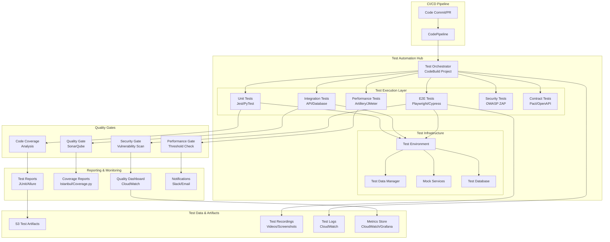

# 6.1.2 テスト自動化

## 学習目標

このセクションでは、AWS環境での包括的なテスト自動化戦略を学習します。ユニットテスト、統合テスト、E2Eテストから、パフォーマンステスト、セキュリティテストまで、DevOpsパイプラインに統合された自動テストシステムを構築し、継続的品質保証を実現します。

### 習得できるスキル
- 多層テスト戦略の設計と実装
- AWS CodeBuild を使用したテスト自動化
- CI/CDパイプラインへのテスト統合
- テスト結果の可視化とレポート生成
- パラレルテスト実行による効率化
- テストデータ管理と環境分離
- 品質ゲートとテスト駆動デプロイメント

## 前提知識

### 必須の知識
- AWS CodePipeline/CodeBuildの基本操作（6.1.1セクション完了）
- Lambda関数開発とテスト（1.2.3セクション完了）
- CloudFormationテンプレート作成（1.1.1セクション完了）
- APIとデータベースの基本概念

### あると望ましい知識
- Jest、Mocha、PyTest等のテストフレームワーク
- Selenium、Playwright、Cypress等のE2Eテストツール
- JMeter、Artillery等の負荷テストツール
- SonarQube、OWASP ZAP等の品質・セキュリティツール

## アーキテクチャ概要

### テスト自動化システム全体図



### 主要コンポーネント
- **Test Orchestrator**: テスト実行の統合管理
- **Multi-Layer Testing**: ユニット〜E2Eまでの多層テスト
- **Quality Gates**: 品質基準による自動判定
- **Test Infrastructure**: テスト専用環境とデータ管理
- **Reporting System**: テスト結果の可視化と通知

## ハンズオン手順

### ステップ1: テスト自動化基盤の構築

#### 1.1 テストインフラストラクチャ

```yaml
# cloudformation/test-automation.yaml
AWSTemplateFormatVersion: '2010-09-09'
Description: 'Comprehensive Test Automation Infrastructure'

Parameters:
  ProjectName:
    Type: String
    Default: 'TestAutomationApp'
    Description: プロジェクト名（リソース命名に使用）
  
  Environment:
    Type: String
    Default: 'test'
    AllowedValues: ['test', 'staging', 'prod']
    Description: |\
      テスト環境の種類
      - test: 開発・ユニットテスト用
      - staging: 統合・E2Eテスト用
      - prod: 本番前最終テスト用
  
  # GitHub設定
  GitHubOwner:
    Type: String
    Description: GitHubオーナー名
  
  GitHubRepo:
    Type: String
    Description: GitHubリポジトリ名
  
  # テスト設定
  TestParallelism:
    Type: Number
    Default: 4
    MinValue: 1
    MaxValue: 10
    Description: |\
      並列テスト実行数
      CodeBuild環境での同時実行テスト数
  
  EnablePerformanceTesting:
    Type: String
    Default: 'true'
    AllowedValues: ['true', 'false']
    Description: |\
      パフォーマンステストの有効化
      大規模負荷テスト実行の可否
  
  EnableSecurityTesting:
    Type: String
    Default: 'true'
    AllowedValues: ['true', 'false']
    Description: |\
      セキュリティテストの有効化
      脆弱性スキャン実行の可否

Conditions:
  IsProduction: !Equals [!Ref Environment, 'prod']
  EnablePerfTests: !Equals [!Ref EnablePerformanceTesting, 'true']
  EnableSecTests: !Equals [!Ref EnableSecurityTesting, 'true']

Resources:
  # ========================================
  # テストアーティファクト用S3バケット
  # ========================================
  TestArtifactsBucket:
    Type: AWS::S3::Bucket
    Properties:
      BucketName: !Sub '${ProjectName}-test-artifacts-${AWS::AccountId}'
      PublicAccessBlockConfiguration:
        BlockPublicAcls: true
        BlockPublicPolicy: true
        IgnorePublicAcls: true
        RestrictPublicBuckets: true
      BucketEncryption:
        ServerSideEncryptionConfiguration:
          - ServerSideEncryptionByDefault:
              SSEAlgorithm: AES256
      LifecycleConfiguration:
        Rules:
          - Id: DeleteOldTestArtifacts
            Status: Enabled
            ExpirationInDays: 30
            NoncurrentVersionExpirationInDays: 7
      VersioningConfiguration:
        Status: Enabled
      NotificationConfiguration:
        CloudWatchConfigurations:
          - Event: s3:ObjectCreated:*
            CloudWatchConfiguration:
              LogGroupName: !Ref TestArtifactsLogGroup
      Tags:
        - Key: Environment
          Value: !Ref Environment
        - Key: Project
          Value: !Ref ProjectName

  # テスト結果・レポート用S3バケット
  TestReportsBucket:
    Type: AWS::S3::Bucket
    Properties:
      BucketName: !Sub '${ProjectName}-test-reports-${AWS::AccountId}'
      PublicAccessBlockConfiguration:
        BlockPublicAcls: true
        BlockPublicPolicy: true
        IgnorePublicAcls: true
        RestrictPublicBuckets: true
      BucketEncryption:
        ServerSideEncryptionConfiguration:
          - ServerSideEncryptionByDefault:
              SSEAlgorithm: AES256
      WebsiteConfiguration:
        IndexDocument: index.html
        ErrorDocument: error.html
      LifecycleConfiguration:
        Rules:
          - Id: DeleteOldReports
            Status: Enabled
            ExpirationInDays: 90
      Tags:
        - Key: Environment
          Value: !Ref Environment
        - Key: Project
          Value: !Ref ProjectName

  # ========================================
  # テスト用DynamoDBテーブル
  # ========================================
  TestDataTable:
    Type: AWS::DynamoDB::Table
    Properties:
      TableName: !Sub '${ProjectName}-test-data-${Environment}'
      BillingMode: PAY_PER_REQUEST
      AttributeDefinitions:
        - AttributeName: testId
          AttributeType: S
        - AttributeName: testSuite
          AttributeType: S
        - AttributeName: createdAt
          AttributeType: S
      KeySchema:
        - AttributeName: testId
          KeyType: HASH
      GlobalSecondaryIndexes:
        - IndexName: TestSuiteIndex
          KeySchema:
            - AttributeName: testSuite
              KeyType: HASH
            - AttributeName: createdAt
              KeyType: RANGE
          Projection:
            ProjectionType: ALL
      TimeToLiveSpecification:
        AttributeName: ttl
        Enabled: true
      PointInTimeRecoverySpecification:
        PointInTimeRecoveryEnabled: !If [IsProduction, true, false]
      Tags:
        - Key: Environment
          Value: !Ref Environment
        - Key: Project
          Value: !Ref ProjectName

  # ========================================
  # CodeBuildプロジェクト（テスト実行）
  # ========================================
  # ユニットテストプロジェクト
  UnitTestProject:
    Type: AWS::CodeBuild::Project
    Properties:
      Name: !Sub '${ProjectName}-unit-tests'
      Description: 'Unit Tests Execution'
      ServiceRole: !GetAtt TestExecutionRole.Arn
      Artifacts:
        Type: CODEPIPELINE
      Environment:
        Type: LINUX_CONTAINER
        ComputeType: BUILD_GENERAL1_MEDIUM
        Image: aws/codebuild/amazonlinux2-x86_64-standard:4.0
        PrivilegedMode: true
        EnvironmentVariables:
          - Name: AWS_DEFAULT_REGION
            Value: !Ref AWS::Region
          - Name: PROJECT_NAME
            Value: !Ref ProjectName
          - Name: ENVIRONMENT
            Value: !Ref Environment
          - Name: TEST_ARTIFACTS_BUCKET
            Value: !Ref TestArtifactsBucket
          - Name: TEST_REPORTS_BUCKET
            Value: !Ref TestReportsBucket
          - Name: TEST_PARALLELISM
            Value: !Ref TestParallelism
      Source:
        Type: CODEPIPELINE
        BuildSpec: !Sub |
          version: 0.2
          
          phases:
            pre_build:
              commands:
                - echo Unit Testing started on `date`
                - echo Installing dependencies...
                
                # Node.js プロジェクトの依存関係
                - |
                  if [ -f "package.json" ]; then
                    echo "Node.js project detected"
                    npm ci --prefer-offline
                    npm install --save-dev jest @jest/reporters jest-junit
                    npm install --save-dev nyc istanbul-reports
                  fi
                
                # Python プロジェクトの依存関係  
                - |
                  if [ -f "requirements.txt" ]; then
                    echo "Python project detected"
                    pip install -r requirements.txt
                    pip install pytest pytest-html pytest-cov pytest-xdist coverage
                  fi
                
                # テスト環境変数の設定
                - export JEST_JUNIT_OUTPUT_DIR=./test-results/unit
                - export JEST_JUNIT_OUTPUT_NAME=unit-test-results.xml
                - mkdir -p test-results/unit
                - mkdir -p coverage-reports
            
            build:
              commands:
                - echo Running unit tests...
                
                # Node.js ユニットテスト実行
                - |
                  if [ -f "package.json" ]; then
                    echo "Running Jest unit tests..."
                    npm run test:unit -- \
                      --ci \
                      --coverage \
                      --watchAll=false \
                      --reporters=default \
                      --reporters=jest-junit \
                      --coverageReporters=lcov \
                      --coverageReporters=text \
                      --coverageReporters=html \
                      --coverageDirectory=./coverage-reports \
                      --maxWorkers=${TEST_PARALLELISM} || exit 1
                  fi
                
                # Python ユニットテスト実行
                - |
                  if [ -f "requirements.txt" ]; then
                    echo "Running PyTest unit tests..."
                    python -m pytest tests/unit/ \
                      --junitxml=test-results/unit/unit-test-results.xml \
                      --html=test-results/unit/unit-test-report.html \
                      --cov=src \
                      --cov-report=html:coverage-reports/html \
                      --cov-report=xml:coverage-reports/coverage.xml \
                      --cov-report=term \
                      -n ${TEST_PARALLELISM} || exit 1
                  fi
                
                # カバレッジレポートの生成
                - echo "Generating coverage reports..."
                - |
                  if [ -f "package.json" ]; then
                    npx nyc report --reporter=lcov --reporter=text-summary
                  fi
                
                # コードカバレッジ閾値チェック
                - echo "Checking coverage thresholds..."
                - |
                  COVERAGE_THRESHOLD=80
                  if [ -f "coverage-reports/coverage.xml" ]; then
                    COVERAGE=$(python -c "
                    import xml.etree.ElementTree as ET
                    tree = ET.parse('coverage-reports/coverage.xml')
                    root = tree.getroot()
                    print(root.attrib.get('line-rate', '0'))
                    " | awk '{print int($1*100)}')
                    
                    echo "Code coverage: ${COVERAGE}%"
                    if [ $COVERAGE -lt $COVERAGE_THRESHOLD ]; then
                      echo "Coverage ${COVERAGE}% is below threshold ${COVERAGE_THRESHOLD}%"
                      exit 1
                    fi
                  fi
            
            post_build:
              commands:
                - echo Unit testing completed on `date`
                
                # テスト結果をS3にアップロード
                - |
                  if [ -d "test-results" ]; then
                    aws s3 cp test-results/ s3://${TEST_REPORTS_BUCKET}/unit-tests/$(date +%Y%m%d-%H%M%S)/ --recursive
                  fi
                
                # カバレッジレポートをS3にアップロード
                - |
                  if [ -d "coverage-reports" ]; then
                    aws s3 cp coverage-reports/ s3://${TEST_REPORTS_BUCKET}/coverage/$(date +%Y%m%d-%H%M%S)/ --recursive
                  fi
                
                # テスト結果サマリー
                - |
                  cat > test-summary.json << EOF
                  {
                    "testType": "unit",
                    "timestamp": "$(date -Iseconds)",
                    "environment": "${ENVIRONMENT}",
                    "project": "${PROJECT_NAME}",
                    "branch": "${CODEBUILD_RESOLVED_SOURCE_VERSION}",
                    "buildNumber": "${CODEBUILD_BUILD_NUMBER}"
                  }
                  EOF
          
          reports:
            unit-test-reports:
              files:
                - 'test-results/unit/*.xml'
              file-format: 'JUNITXML'
            
            coverage-reports:
              files:
                - 'coverage-reports/**/*'
              file-format: 'CLOVER'
          
          artifacts:
            files:
              - test-results/**/*
              - coverage-reports/**/*
              - test-summary.json
            name: UnitTestResults

      TimeoutInMinutes: 30
      Tags:
        - Key: Environment
          Value: !Ref Environment
        - Key: Project
          Value: !Ref ProjectName

  # 統合テストプロジェクト
  IntegrationTestProject:
    Type: AWS::CodeBuild::Project
    Properties:
      Name: !Sub '${ProjectName}-integration-tests'
      Description: 'Integration Tests Execution'
      ServiceRole: !GetAtt TestExecutionRole.Arn
      Artifacts:
        Type: CODEPIPELINE
      Environment:
        Type: LINUX_CONTAINER
        ComputeType: BUILD_GENERAL1_LARGE
        Image: aws/codebuild/amazonlinux2-x86_64-standard:4.0
        EnvironmentVariables:
          - Name: AWS_DEFAULT_REGION
            Value: !Ref AWS::Region
          - Name: PROJECT_NAME
            Value: !Ref ProjectName
          - Name: ENVIRONMENT
            Value: !Ref Environment
          - Name: TEST_DATA_TABLE
            Value: !Ref TestDataTable
          - Name: TEST_REPORTS_BUCKET
            Value: !Ref TestReportsBucket
      Source:
        Type: CODEPIPELINE
        BuildSpec: |
          version: 0.2
          
          phases:
            pre_build:
              commands:
                - echo Integration testing started on `date`
                - echo Setting up test environment...
                
                # 依存関係のインストール
                - |
                  if [ -f "package.json" ]; then
                    npm ci
                    npm install --save-dev supertest newman
                  elif [ -f "requirements.txt" ]; then
                    pip install -r requirements.txt
                    pip install requests boto3 pytest-asyncio
                  fi
                
                # テストデータの準備
                - echo "Setting up test data..."
                - |
                  aws dynamodb put-item \
                    --table-name $TEST_DATA_TABLE \
                    --item '{
                      "testId": {"S": "integration-test-'$(date +%s)'"},
                      "testSuite": {"S": "integration"},
                      "createdAt": {"S": "'$(date -Iseconds)'"},
                      "ttl": {"N": "'$(( $(date +%s) + 86400 ))'"},
                      "testData": {"S": "sample integration test data"}
                    }' || echo "Test data setup failed"
                
                # テスト環境の準備
                - mkdir -p test-results/integration
                - export TEST_ENDPOINT=${TARGET_API_ENDPOINT:-"http://localhost:3000"}
            
            build:
              commands:
                - echo Running integration tests...
                
                # API統合テスト
                - |
                  if [ -f "tests/integration/api-tests.js" ]; then
                    echo "Running API integration tests..."
                    npm run test:integration:api -- \
                      --reporter json \
                      --reporter-options output=test-results/integration/api-results.json || exit 1
                  fi
                
                # データベース統合テスト
                - |
                  if [ -f "tests/integration/database-tests.py" ]; then
                    echo "Running database integration tests..."
                    python -m pytest tests/integration/database-tests.py \
                      --junitxml=test-results/integration/db-test-results.xml \
                      --html=test-results/integration/db-test-report.html || exit 1
                  fi
                
                # サービス間統合テスト
                - |
                  if [ -f "tests/integration/service-integration.js" ]; then
                    echo "Running service integration tests..."
                    node tests/integration/service-integration.js > test-results/integration/service-results.log 2>&1 || exit 1
                  fi
                
                # Postman/Newman テスト実行
                - |
                  if [ -f "tests/postman/collection.json" ]; then
                    echo "Running Postman collection tests..."
                    newman run tests/postman/collection.json \
                      --environment tests/postman/environment.json \
                      --reporters junit,html \
                      --reporter-junit-export test-results/integration/postman-results.xml \
                      --reporter-html-export test-results/integration/postman-report.html || exit 1
                  fi
            
            post_build:
              commands:
                - echo Integration testing completed on `date`
                
                # テストデータのクリーンアップ
                - echo "Cleaning up test data..."
                - |
                  aws dynamodb scan \
                    --table-name $TEST_DATA_TABLE \
                    --filter-expression "testSuite = :suite" \
                    --expression-attribute-values '{":suite":{"S":"integration"}}' \
                    --projection-expression "testId" \
                    --query "Items[].testId.S" \
                    --output text | while read testId; do
                      aws dynamodb delete-item \
                        --table-name $TEST_DATA_TABLE \
                        --key '{"testId":{"S":"'$testId'"}}' || echo "Failed to delete $testId"
                    done
                
                # テスト結果のアップロード
                - |
                  if [ -d "test-results" ]; then
                    aws s3 cp test-results/ s3://${TEST_REPORTS_BUCKET}/integration-tests/$(date +%Y%m%d-%H%M%S)/ --recursive
                  fi
          
          reports:
            integration-test-reports:
              files:
                - 'test-results/integration/*.xml'
              file-format: 'JUNITXML'
          
          artifacts:
            files:
              - test-results/**/*
            name: IntegrationTestResults

      TimeoutInMinutes: 45
      Tags:
        - Key: Environment
          Value: !Ref Environment
        - Key: Project
          Value: !Ref ProjectName

  # E2Eテストプロジェクト
  E2ETestProject:
    Type: AWS::CodeBuild::Project
    Properties:
      Name: !Sub '${ProjectName}-e2e-tests'
      Description: 'End-to-End Tests Execution'
      ServiceRole: !GetAtt TestExecutionRole.Arn
      Artifacts:
        Type: CODEPIPELINE
      Environment:
        Type: LINUX_CONTAINER
        ComputeType: BUILD_GENERAL1_XLARGE
        Image: aws/codebuild/amazonlinux2-x86_64-standard:4.0
        PrivilegedMode: true
        EnvironmentVariables:
          - Name: AWS_DEFAULT_REGION
            Value: !Ref AWS::Region
          - Name: PROJECT_NAME
            Value: !Ref ProjectName
          - Name: ENVIRONMENT
            Value: !Ref Environment
          - Name: TEST_REPORTS_BUCKET
            Value: !Ref TestReportsBucket
          - Name: TEST_PARALLELISM
            Value: !Ref TestParallelism
      Source:
        Type: CODEPIPELINE
        BuildSpec: |
          version: 0.2
          
          phases:
            pre_build:
              commands:
                - echo E2E testing started on `date`
                - echo Setting up browser environment...
                
                # ブラウザとドライバーのインストール
                - |
                  # Chrome/Chromium のインストール
                  curl -sS -o - https://dl-ssl.google.com/linux/linux_signing_key.pub | apt-key add -
                  echo "deb [arch=amd64] http://dl.google.com/linux/chrome/deb/ stable main" >> /etc/apt/sources.list.d/google-chrome.list
                  apt-get update
                  apt-get install -y google-chrome-stable
                
                # Node.js E2Eテスト環境
                - |
                  if [ -f "package.json" ]; then
                    npm ci
                    
                    # Playwright の場合
                    if grep -q "playwright" package.json; then
                      echo "Installing Playwright..."
                      npx playwright install-deps
                      npx playwright install
                    fi
                    
                    # Cypress の場合
                    if grep -q "cypress" package.json; then
                      echo "Installing Cypress..."
                      npx cypress install
                      apt-get install -y xvfb
                    fi
                    
                    # Puppeteer の場合
                    if grep -q "puppeteer" package.json; then
                      echo "Installing Puppeteer..."
                      npm install puppeteer
                    fi
                  fi
                
                # Python E2Eテスト環境
                - |
                  if [ -f "requirements.txt" ]; then
                    pip install -r requirements.txt
                    pip install selenium pytest-html pytest-xdist
                    
                    # WebDriverのセットアップ
                    wget -O /tmp/chromedriver.zip "https://chromedriver.storage.googleapis.com/LATEST_RELEASE/chromedriver_linux64.zip"
                    unzip /tmp/chromedriver.zip -d /usr/local/bin/
                    chmod +x /usr/local/bin/chromedriver
                  fi
                
                # テスト環境の準備
                - mkdir -p test-results/e2e
                - mkdir -p test-artifacts/screenshots
                - mkdir -p test-artifacts/videos
                - export DISPLAY=:99
                - Xvfb :99 -screen 0 1280x720x24 > /dev/null 2>&1 &
            
            build:
              commands:
                - echo Running E2E tests...
                
                # Playwright E2Eテスト
                - |
                  if [ -f "tests/e2e/playwright.config.js" ]; then
                    echo "Running Playwright E2E tests..."
                    npx playwright test \
                      --config=tests/e2e/playwright.config.js \
                      --workers=${TEST_PARALLELISM} \
                      --reporter=junit \
                      --output-dir=test-results/e2e || exit 1
                  fi
                
                # Cypress E2Eテスト
                - |
                  if [ -f "cypress.config.js" ]; then
                    echo "Running Cypress E2E tests..."
                    npx cypress run \
                      --config-file cypress.config.js \
                      --reporter junit \
                      --reporter-options "mochaFile=test-results/e2e/cypress-results.xml" \
                      --video \
                      --screenshot || exit 1
                    
                    # Cypress結果の移動
                    if [ -d "cypress/videos" ]; then
                      cp -r cypress/videos/* test-artifacts/videos/
                    fi
                    if [ -d "cypress/screenshots" ]; then
                      cp -r cypress/screenshots/* test-artifacts/screenshots/
                    fi
                  fi
                
                # Selenium E2Eテスト（Python）
                - |
                  if [ -f "tests/e2e/selenium_tests.py" ]; then
                    echo "Running Selenium E2E tests..."
                    python -m pytest tests/e2e/ \
                      --junitxml=test-results/e2e/selenium-results.xml \
                      --html=test-results/e2e/selenium-report.html \
                      -n ${TEST_PARALLELISM} || exit 1
                  fi
                
                # カスタムE2Eテストスイート
                - |
                  if [ -f "tests/e2e/custom-suite.js" ]; then
                    echo "Running custom E2E test suite..."
                    node tests/e2e/custom-suite.js > test-results/e2e/custom-results.log 2>&1 || exit 1
                  fi
                
                # E2Eテスト結果の検証
                - echo "Validating E2E test results..."
                - |
                  FAILED_TESTS=$(find test-results/e2e -name "*.xml" -exec grep -l "failures=\"[1-9]" {} \; | wc -l)
                  if [ $FAILED_TESTS -gt 0 ]; then
                    echo "E2E tests failed. Number of failed test files: $FAILED_TESTS"
                    exit 1
                  fi
            
            post_build:
              commands:
                - echo E2E testing completed on `date`
                
                # テスト成果物のアップロード
                - |
                  if [ -d "test-results" ]; then
                    aws s3 cp test-results/ s3://${TEST_REPORTS_BUCKET}/e2e-tests/$(date +%Y%m%d-%H%M%S)/ --recursive
                  fi
                
                # スクリーンショット・動画のアップロード
                - |
                  if [ -d "test-artifacts" ]; then
                    aws s3 cp test-artifacts/ s3://${TEST_REPORTS_BUCKET}/e2e-artifacts/$(date +%Y%m%d-%H%M%S)/ --recursive
                  fi
                
                # テスト環境のクリーンアップ
                - pkill Xvfb || true
                - pkill chrome || true
          
          reports:
            e2e-test-reports:
              files:
                - 'test-results/e2e/*.xml'
              file-format: 'JUNITXML'
          
          artifacts:
            files:
              - test-results/**/*
              - test-artifacts/**/*
            name: E2ETestResults

      TimeoutInMinutes: 60
      Tags:
        - Key: Environment
          Value: !Ref Environment
        - Key: Project
          Value: !Ref ProjectName

  # パフォーマンステストプロジェクト
  PerformanceTestProject:
    Type: AWS::CodeBuild::Project
    Condition: EnablePerfTests
    Properties:
      Name: !Sub '${ProjectName}-performance-tests'
      Description: 'Performance Tests Execution'
      ServiceRole: !GetAtt TestExecutionRole.Arn
      Artifacts:
        Type: CODEPIPELINE
      Environment:
        Type: LINUX_CONTAINER
        ComputeType: BUILD_GENERAL1_XLARGE
        Image: aws/codebuild/amazonlinux2-x86_64-standard:4.0
        EnvironmentVariables:
          - Name: AWS_DEFAULT_REGION
            Value: !Ref AWS::Region
          - Name: PROJECT_NAME
            Value: !Ref ProjectName
          - Name: ENVIRONMENT
            Value: !Ref Environment
          - Name: TEST_REPORTS_BUCKET
            Value: !Ref TestReportsBucket
      Source:
        Type: CODEPIPELINE
        BuildSpec: |
          version: 0.2
          
          phases:
            pre_build:
              commands:
                - echo Performance testing started on `date`
                - echo Installing performance testing tools...
                
                # Artillery のインストール
                - npm install -g artillery
                
                # JMeter のインストール
                - |
                  cd /tmp
                  wget https://archive.apache.org/dist/jmeter/binaries/apache-jmeter-5.4.1.tgz
                  tar -xzf apache-jmeter-5.4.1.tgz
                  export JMETER_HOME=/tmp/apache-jmeter-5.4.1
                  export PATH=$JMETER_HOME/bin:$PATH
                  cd $CODEBUILD_SRC_DIR
                
                # K6 のインストール
                - |
                  curl -s https://github.com/grafana/k6/releases/download/v0.38.3/k6-v0.38.3-linux-amd64.tar.gz | tar -xz
                  sudo cp k6-v0.38.3-linux-amd64/k6 /usr/local/bin/
                
                - mkdir -p test-results/performance
            
            build:
              commands:
                - echo Running performance tests...
                
                # Artillery 負荷テスト
                - |
                  if [ -f "tests/performance/artillery-config.yml" ]; then
                    echo "Running Artillery load tests..."
                    artillery run tests/performance/artillery-config.yml \
                      --output test-results/performance/artillery-results.json || exit 1
                    
                    # HTML レポート生成
                    artillery report test-results/performance/artillery-results.json \
                      --output test-results/performance/artillery-report.html
                  fi
                
                # JMeter 負荷テスト
                - |
                  if [ -f "tests/performance/jmeter-test-plan.jmx" ]; then
                    echo "Running JMeter load tests..."
                    jmeter -n \
                      -t tests/performance/jmeter-test-plan.jmx \
                      -l test-results/performance/jmeter-results.jtl \
                      -e -o test-results/performance/jmeter-report || exit 1
                  fi
                
                # K6 負荷テスト
                - |
                  if [ -f "tests/performance/k6-script.js" ]; then
                    echo "Running K6 load tests..."
                    k6 run tests/performance/k6-script.js \
                      --out json=test-results/performance/k6-results.json || exit 1
                  fi
                
                # パフォーマンス閾値チェック
                - echo "Checking performance thresholds..."
                - |
                  if [ -f "test-results/performance/artillery-results.json" ]; then
                    # Artillery結果の解析
                    node -e "
                    const fs = require('fs');
                    const results = JSON.parse(fs.readFileSync('test-results/performance/artillery-results.json'));
                    const summary = results.aggregate;
                    
                    console.log('Performance Test Results:');
                    console.log('- Response Time P95:', summary.latency.p95);
                    console.log('- Response Time P99:', summary.latency.p99);
                    console.log('- Error Rate:', (summary.errors / summary.scenariosCompleted * 100).toFixed(2) + '%');
                    
                    // 閾値チェック
                    if (summary.latency.p95 > 2000) {
                      console.error('P95 response time exceeds threshold (2000ms)');
                      process.exit(1);
                    }
                    
                    if (summary.errors / summary.scenariosCompleted > 0.01) {
                      console.error('Error rate exceeds threshold (1%)');
                      process.exit(1);
                    }
                    "
                  fi
            
            post_build:
              commands:
                - echo Performance testing completed on `date`
                
                # パフォーマンステスト結果のアップロード
                - |
                  if [ -d "test-results/performance" ]; then
                    aws s3 cp test-results/performance/ s3://${TEST_REPORTS_BUCKET}/performance-tests/$(date +%Y%m%d-%H%M%S)/ --recursive
                  fi
          
          artifacts:
            files:
              - test-results/**/*
            name: PerformanceTestResults

      TimeoutInMinutes: 60
      Tags:
        - Key: Environment
          Value: !Ref Environment
        - Key: Project
          Value: !Ref ProjectName

  # セキュリティテストプロジェクト
  SecurityTestProject:
    Type: AWS::CodeBuild::Project
    Condition: EnableSecTests
    Properties:
      Name: !Sub '${ProjectName}-security-tests'
      Description: 'Security Tests Execution'
      ServiceRole: !GetAtt TestExecutionRole.Arn
      Artifacts:
        Type: CODEPIPELINE
      Environment:
        Type: LINUX_CONTAINER
        ComputeType: BUILD_GENERAL1_LARGE
        Image: aws/codebuild/amazonlinux2-x86_64-standard:4.0
        PrivilegedMode: true
        EnvironmentVariables:
          - Name: AWS_DEFAULT_REGION
            Value: !Ref AWS::Region
          - Name: PROJECT_NAME
            Value: !Ref ProjectName
          - Name: ENVIRONMENT
            Value: !Ref Environment
          - Name: TEST_REPORTS_BUCKET
            Value: !Ref TestReportsBucket
      Source:
        Type: CODEPIPELINE
        BuildSpec: |
          version: 0.2
          
          phases:
            pre_build:
              commands:
                - echo Security testing started on `date`
                - echo Installing security testing tools...
                
                # OWASP ZAP のインストール
                - |
                  cd /tmp
                  wget https://github.com/zaproxy/zaproxy/releases/download/v2.11.1/ZAP_2_11_1_Linux.tar.gz
                  tar -xzf ZAP_2_11_1_Linux.tar.gz
                  export ZAP_HOME=/tmp/ZAP_2.11.1
                  export PATH=$ZAP_HOME:$PATH
                  cd $CODEBUILD_SRC_DIR
                
                # Bandit (Python) のインストール
                - pip install bandit[toml]
                
                # ESLint security plugins (Node.js) のインストール
                - |
                  if [ -f "package.json" ]; then
                    npm install --save-dev eslint-plugin-security
                  fi
                
                # Snyk のインストール
                - npm install -g snyk
                
                - mkdir -p test-results/security
            
            build:
              commands:
                - echo Running security tests...
                
                # 静的セキュリティ解析 (Python)
                - |
                  if [ -f "requirements.txt" ]; then
                    echo "Running Bandit security analysis..."
                    bandit -r src/ \
                      -f json \
                      -o test-results/security/bandit-results.json || echo "Bandit completed with warnings"
                    
                    bandit -r src/ \
                      -f txt \
                      -o test-results/security/bandit-report.txt || echo "Bandit completed with warnings"
                  fi
                
                # ESLint セキュリティ解析 (Node.js)
                - |
                  if [ -f "package.json" ]; then
                    echo "Running ESLint security analysis..."
                    npx eslint src/ \
                      --ext .js,.ts \
                      --config tests/security/.eslintrc-security.js \
                      --format json \
                      --output-file test-results/security/eslint-security.json || echo "ESLint completed with warnings"
                  fi
                
                # 依存関係の脆弱性スキャン
                - |
                  echo "Running dependency vulnerability scan..."
                  if [ -f "package.json" ]; then
                    # npm audit
                    npm audit --json > test-results/security/npm-audit.json || echo "npm audit completed"
                    
                    # Snyk test
                    snyk test --json > test-results/security/snyk-results.json || echo "Snyk test completed"
                  fi
                  
                  if [ -f "requirements.txt" ]; then
                    # Safety check for Python
                    pip install safety
                    safety check --json --output test-results/security/safety-results.json || echo "Safety check completed"
                  fi
                
                # OWASP ZAP 動的スキャン
                - |
                  if [ ! -z "$TARGET_API_ENDPOINT" ]; then
                    echo "Running OWASP ZAP dynamic scan..."
                    
                    # ZAPをデーモンモードで起動
                    $ZAP_HOME/zap.sh -daemon -port 8080 -host 0.0.0.0 -config api.disablekey=true &
                    ZAP_PID=$!
                    
                    # ZAP起動待機
                    sleep 30
                    
                    # アクティブスキャン実行
                    curl "http://localhost:8080/JSON/ascan/action/scan/?url=$TARGET_API_ENDPOINT&recurse=true"
                    
                    # スキャン完了待機
                    while [ $(curl -s "http://localhost:8080/JSON/ascan/view/status/" | jq '.status') != "100" ]; do
                      echo "Scanning in progress..."
                      sleep 10
                    done
                    
                    # レポート生成
                    curl "http://localhost:8080/OTHER/core/other/jsonreport/" > test-results/security/zap-results.json
                    curl "http://localhost:8080/OTHER/core/other/htmlreport/" > test-results/security/zap-report.html
                    
                    # ZAP終了
                    kill $ZAP_PID
                  fi
                
                # セキュリティテスト結果の解析
                - echo "Analyzing security test results..."
                - |
                  python3 -c "
                  import json
                  import sys
                  
                  # 重大な脆弱性のチェック
                  critical_issues = 0
                  
                  # Bandit結果の確認
                  try:
                      with open('test-results/security/bandit-results.json') as f:
                          bandit_results = json.load(f)
                          for result in bandit_results.get('results', []):
                              if result.get('issue_severity') == 'HIGH':
                                  critical_issues += 1
                  except:
                      pass
                  
                  # npm audit結果の確認
                  try:
                      with open('test-results/security/npm-audit.json') as f:
                          audit_results = json.load(f)
                          critical_issues += audit_results.get('metadata', {}).get('vulnerabilities', {}).get('critical', 0)
                  except:
                      pass
                  
                  print(f'Critical security issues found: {critical_issues}')
                  
                  # 閾値チェック（重大な脆弱性は0であること）
                  if critical_issues > 0:
                      print(f'SECURITY TEST FAILED: {critical_issues} critical issues found')
                      sys.exit(1)
                  else:
                      print('SECURITY TEST PASSED: No critical issues found')
                  "
            
            post_build:
              commands:
                - echo Security testing completed on `date`
                
                # セキュリティテスト結果のアップロード
                - |
                  if [ -d "test-results/security" ]; then
                    aws s3 cp test-results/security/ s3://${TEST_REPORTS_BUCKET}/security-tests/$(date +%Y%m%d-%H%M%S)/ --recursive
                  fi
          
          artifacts:
            files:
              - test-results/**/*
            name: SecurityTestResults

      TimeoutInMinutes: 45
      Tags:
        - Key: Environment
          Value: !Ref Environment
        - Key: Project
          Value: !Ref ProjectName

  # ========================================
  # IAMロール（テスト実行用）
  # ========================================
  TestExecutionRole:
    Type: AWS::IAM::Role
    Properties:
      RoleName: !Sub '${ProjectName}-test-execution-role'
      AssumeRolePolicyDocument:
        Version: '2012-10-17'
        Statement:
          - Effect: Allow
            Principal:
              Service: codebuild.amazonaws.com
            Action: sts:AssumeRole
      ManagedPolicyArns:
        - arn:aws:iam::aws:policy/AWSCodeBuildDeveloperAccess
      Policies:
        - PolicyName: TestExecutionPolicy
          PolicyDocument:
            Version: '2012-10-17'
            Statement:
              # CloudWatch Logs
              - Effect: Allow
                Action:
                  - logs:CreateLogGroup
                  - logs:CreateLogStream
                  - logs:PutLogEvents
                Resource:
                  - !Sub 'arn:aws:logs:${AWS::Region}:${AWS::AccountId}:log-group:/aws/codebuild/${ProjectName}*'
              
              # S3 テストアーティファクト
              - Effect: Allow
                Action:
                  - s3:GetObject
                  - s3:PutObject
                  - s3:DeleteObject
                  - s3:ListBucket
                Resource:
                  - !Sub '${TestArtifactsBucket}'
                  - !Sub '${TestArtifactsBucket}/*'
                  - !Sub '${TestReportsBucket}'
                  - !Sub '${TestReportsBucket}/*'
              
              # DynamoDB テストデータ
              - Effect: Allow
                Action:
                  - dynamodb:PutItem
                  - dynamodb:GetItem
                  - dynamodb:UpdateItem
                  - dynamodb:DeleteItem
                  - dynamodb:Query
                  - dynamodb:Scan
                Resource:
                  - !GetAtt TestDataTable.Arn
                  - !Sub '${TestDataTable.Arn}/index/*'
              
              # CodeBuild レポート
              - Effect: Allow
                Action:
                  - codebuild:CreateReportGroup
                  - codebuild:CreateReport
                  - codebuild:UpdateReport
                  - codebuild:BatchPutTestCases
                Resource:
                  - !Sub 'arn:aws:codebuild:${AWS::Region}:${AWS::AccountId}:report-group/${ProjectName}*'
              
              # CloudFormation（テスト環境確認用）
              - Effect: Allow
                Action:
                  - cloudformation:DescribeStacks
                  - cloudformation:DescribeStackResources
                  - cloudformation:DescribeStackEvents
                Resource: '*'
              
              # CloudWatch メトリクス（パフォーマンステスト用）
              - Effect: Allow
                Action:
                  - cloudwatch:PutMetricData
                  - cloudwatch:GetMetricStatistics
                Resource: '*'
      Tags:
        - Key: Environment
          Value: !Ref Environment
        - Key: Project
          Value: !Ref ProjectName

  # ========================================
  # CloudWatch ログ
  # ========================================
  TestArtifactsLogGroup:
    Type: AWS::Logs::LogGroup
    Properties:
      LogGroupName: !Sub '/aws/s3/${ProjectName}-test-artifacts'
      RetentionInDays: 30

  UnitTestLogGroup:
    Type: AWS::Logs::LogGroup
    Properties:
      LogGroupName: !Sub '/aws/codebuild/${ProjectName}-unit-tests'
      RetentionInDays: 30

  IntegrationTestLogGroup:
    Type: AWS::Logs::LogGroup
    Properties:
      LogGroupName: !Sub '/aws/codebuild/${ProjectName}-integration-tests'
      RetentionInDays: 30

  E2ETestLogGroup:
    Type: AWS::Logs::LogGroup
    Properties:
      LogGroupName: !Sub '/aws/codebuild/${ProjectName}-e2e-tests'
      RetentionInDays: 30

  PerformanceTestLogGroup:
    Type: AWS::Logs::LogGroup
    Condition: EnablePerfTests
    Properties:
      LogGroupName: !Sub '/aws/codebuild/${ProjectName}-performance-tests'
      RetentionInDays: 30

  SecurityTestLogGroup:
    Type: AWS::Logs::LogGroup
    Condition: EnableSecTests
    Properties:
      LogGroupName: !Sub '/aws/codebuild/${ProjectName}-security-tests'
      RetentionInDays: 30

  # ========================================
  # CloudWatch ダッシュボード
  # ========================================
  TestDashboard:
    Type: AWS::CloudWatch::Dashboard
    Properties:
      DashboardName: !Sub '${ProjectName}-test-automation-dashboard'
      DashboardBody: !Sub |
        {
          "widgets": [
            {
              "type": "metric",
              "width": 12,
              "height": 6,
              "properties": {
                "metrics": [
                  ["AWS/CodeBuild", "Duration", "ProjectName", "${UnitTestProject}"],
                  [".", ".", ".", "${IntegrationTestProject}"],
                  [".", ".", ".", "${E2ETestProject}"]
                ],
                "period": 300,
                "stat": "Average",
                "region": "${AWS::Region}",
                "title": "Test Execution Duration"
              }
            },
            {
              "type": "metric",
              "width": 12,
              "height": 6,
              "properties": {
                "metrics": [
                  ["AWS/CodeBuild", "Builds", "ProjectName", "${UnitTestProject}"],
                  [".", ".", ".", "${IntegrationTestProject}"],
                  [".", ".", ".", "${E2ETestProject}"]
                ],
                "period": 300,
                "stat": "Sum",
                "region": "${AWS::Region}",
                "title": "Test Executions"
              }
            },
            {
              "type": "metric",
              "width": 12,
              "height": 6,
              "properties": {
                "metrics": [
                  ["AWS/CodeBuild", "SucceededBuilds", "ProjectName", "${UnitTestProject}"],
                  [".", "FailedBuilds", ".", "."],
                  [".", "SucceededBuilds", ".", "${IntegrationTestProject}"],
                  [".", "FailedBuilds", ".", "."],
                  [".", "SucceededBuilds", ".", "${E2ETestProject}"],
                  [".", "FailedBuilds", ".", "."]
                ],
                "period": 300,
                "stat": "Sum",
                "region": "${AWS::Region}",
                "title": "Test Success/Failure Rate"
              }
            }
          ]
        }

# ========================================
# 出力値
# ========================================
Outputs:
  # S3バケット
  TestArtifactsBucketName:
    Description: テストアーティファクトS3バケット名
    Value: !Ref TestArtifactsBucket
    Export:
      Name: !Sub '${AWS::StackName}-TestArtifactsBucket'

  TestReportsBucketName:
    Description: テストレポートS3バケット名
    Value: !Ref TestReportsBucket
    Export:
      Name: !Sub '${AWS::StackName}-TestReportsBucket'

  TestReportsBucketWebsiteURL:
    Description: テストレポートWebサイトURL
    Value: !Sub 'http://${TestReportsBucket}.s3-website-${AWS::Region}.amazonaws.com'

  # DynamoDB
  TestDataTableName:
    Description: テストデータテーブル名
    Value: !Ref TestDataTable
    Export:
      Name: !Sub '${AWS::StackName}-TestDataTable'

  # CodeBuildプロジェクト
  UnitTestProjectName:
    Description: ユニットテストプロジェクト名
    Value: !Ref UnitTestProject
    Export:
      Name: !Sub '${AWS::StackName}-UnitTestProject'

  IntegrationTestProjectName:
    Description: 統合テストプロジェクト名
    Value: !Ref IntegrationTestProject
    Export:
      Name: !Sub '${AWS::StackName}-IntegrationTestProject'

  E2ETestProjectName:
    Description: E2Eテストプロジェクト名
    Value: !Ref E2ETestProject
    Export:
      Name: !Sub '${AWS::StackName}-E2ETestProject'

  PerformanceTestProjectName:
    Condition: EnablePerfTests
    Description: パフォーマンステストプロジェクト名
    Value: !Ref PerformanceTestProject
    Export:
      Name: !Sub '${AWS::StackName}-PerformanceTestProject'

  SecurityTestProjectName:
    Condition: EnableSecTests
    Description: セキュリティテストプロジェクト名
    Value: !Ref SecurityTestProject
    Export:
      Name: !Sub '${AWS::StackName}-SecurityTestProject'

  # ダッシュボード
  TestDashboardURL:
    Description: テスト自動化ダッシュボードURL
    Value: !Sub 'https://console.aws.amazon.com/cloudwatch/home?region=${AWS::Region}#dashboards:name=${ProjectName}-test-automation-dashboard'

  # IAMロール
  TestExecutionRoleArn:
    Description: テスト実行IAMロールARN
    Value: !GetAtt TestExecutionRole.Arn
    Export:
      Name: !Sub '${AWS::StackName}-TestExecutionRole'

  # 設定概要
  TestAutomationConfiguration:
    Description: テスト自動化設定概要
    Value: !Sub |
      Test Automation Configuration:
      - Unit Tests: ${UnitTestProject}
      - Integration Tests: ${IntegrationTestProject}
      - E2E Tests: ${E2ETestProject}
      - Performance Tests: ${PerformanceTestProject}
      - Security Tests: ${SecurityTestProject}
      - Test Artifacts: s3://${TestArtifactsBucket}/
      - Test Reports: s3://${TestReportsBucket}/
      - Test Data: ${TestDataTable}
      - Dashboard: ${TestDashboard}
      - Test Parallelism: ${TestParallelism}
```

### ステップ2: テストコードの実装例

#### 2.1 ユニットテストの例

```javascript
// tests/unit/lambda-function.test.js
const { handler } = require('../../src/lambda-function');

describe('Lambda Function Unit Tests', () => {
  beforeEach(() => {
    // テストごとの初期化
    process.env.NODE_ENV = 'test';
  });

  afterEach(() => {
    // モックのクリア
    jest.clearAllMocks();
  });

  describe('handler function', () => {
    it('should return 200 for valid input', async () => {
      const event = {
        httpMethod: 'GET',
        path: '/health',
        headers: {},
        queryStringParameters: null
      };

      const result = await handler(event);

      expect(result.statusCode).toBe(200);
      expect(JSON.parse(result.body)).toEqual({
        status: 'healthy',
        timestamp: expect.any(String)
      });
    });

    it('should handle missing parameters gracefully', async () => {
      const event = {
        httpMethod: 'POST',
        path: '/api/users',
        body: JSON.stringify({})
      };

      const result = await handler(event);

      expect(result.statusCode).toBe(400);
      expect(JSON.parse(result.body)).toHaveProperty('error');
    });

    it('should validate input data correctly', async () => {
      const event = {
        httpMethod: 'POST',
        path: '/api/users',
        body: JSON.stringify({
          email: 'invalid-email',
          name: ''
        })
      };

      const result = await handler(event);

      expect(result.statusCode).toBe(422);
      const body = JSON.parse(result.body);
      expect(body.errors).toContain('Invalid email format');
      expect(body.errors).toContain('Name is required');
    });
  });

  describe('error handling', () => {
    it('should handle database connection errors', async () => {
      // データベース接続エラーをモック
      const mockError = new Error('Database connection failed');
      jest.spyOn(require('../../src/database'), 'connect')
        .mockRejectedValue(mockError);

      const event = {
        httpMethod: 'GET',
        path: '/api/users'
      };

      const result = await handler(event);

      expect(result.statusCode).toBe(500);
      expect(JSON.parse(result.body).error).toBe('Internal server error');
    });
  });
});
```

#### 2.2 統合テストの例

```javascript
// tests/integration/api-integration.test.js
const request = require('supertest');
const AWS = require('aws-sdk');

// テスト用DynamoDB設定
const dynamodb = new AWS.DynamoDB.DocumentClient({
  endpoint: process.env.DYNAMODB_ENDPOINT || 'http://localhost:8000',
  region: 'local'
});

const API_ENDPOINT = process.env.API_ENDPOINT || 'http://localhost:3000';

describe('API Integration Tests', () => {
  let testUserId;

  beforeAll(async () => {
    // テストデータの準備
    await setupTestData();
  });

  afterAll(async () => {
    // テストデータのクリーンアップ
    await cleanupTestData();
  });

  describe('User Management API', () => {
    it('should create a new user', async () => {
      const userData = {
        email: 'test@example.com',
        name: 'Test User',
        role: 'user'
      };

      const response = await request(API_ENDPOINT)
        .post('/api/users')
        .send(userData)
        .expect(201);

      expect(response.body).toHaveProperty('id');
      expect(response.body.email).toBe(userData.email);
      expect(response.body.name).toBe(userData.name);

      testUserId = response.body.id;

      // データベースに実際に保存されているか確認
      const dbUser = await dynamodb.get({
        TableName: process.env.USERS_TABLE,
        Key: { id: testUserId }
      }).promise();

      expect(dbUser.Item).toBeDefined();
      expect(dbUser.Item.email).toBe(userData.email);
    });

    it('should retrieve user by ID', async () => {
      const response = await request(API_ENDPOINT)
        .get(`/api/users/${testUserId}`)
        .expect(200);

      expect(response.body.id).toBe(testUserId);
      expect(response.body.email).toBe('test@example.com');
    });

    it('should update user information', async () => {
      const updateData = {
        name: 'Updated Test User',
        role: 'admin'
      };

      const response = await request(API_ENDPOINT)
        .put(`/api/users/${testUserId}`)
        .send(updateData)
        .expect(200);

      expect(response.body.name).toBe(updateData.name);
      expect(response.body.role).toBe(updateData.role);

      // データベースでも更新されているか確認
      const dbUser = await dynamodb.get({
        TableName: process.env.USERS_TABLE,
        Key: { id: testUserId }
      }).promise();

      expect(dbUser.Item.name).toBe(updateData.name);
      expect(dbUser.Item.role).toBe(updateData.role);
    });

    it('should delete user', async () => {
      await request(API_ENDPOINT)
        .delete(`/api/users/${testUserId}`)
        .expect(204);

      // データベースから削除されているか確認
      const dbUser = await dynamodb.get({
        TableName: process.env.USERS_TABLE,
        Key: { id: testUserId }
      }).promise();

      expect(dbUser.Item).toBeUndefined();
    });
  });

  describe('Authentication API', () => {
    it('should authenticate valid credentials', async () => {
      const credentials = {
        email: 'admin@example.com',
        password: 'password123'
      };

      const response = await request(API_ENDPOINT)
        .post('/api/auth/login')
        .send(credentials)
        .expect(200);

      expect(response.body).toHaveProperty('token');
      expect(response.body).toHaveProperty('user');
      expect(response.body.user.email).toBe(credentials.email);
    });

    it('should reject invalid credentials', async () => {
      const credentials = {
        email: 'admin@example.com',
        password: 'wrongpassword'
      };

      const response = await request(API_ENDPOINT)
        .post('/api/auth/login')
        .send(credentials)
        .expect(401);

      expect(response.body.error).toBe('Invalid credentials');
    });
  });

  async function setupTestData() {
    // テスト用のユーザーデータ作成
    await dynamodb.put({
      TableName: process.env.USERS_TABLE,
      Item: {
        id: 'admin-user-id',
        email: 'admin@example.com',
        name: 'Admin User',
        role: 'admin',
        passwordHash: '$2b$10$...' // bcryptハッシュ
      }
    }).promise();
  }

  async function cleanupTestData() {
    // テストデータの削除
    try {
      await dynamodb.delete({
        TableName: process.env.USERS_TABLE,
        Key: { id: 'admin-user-id' }
      }).promise();

      if (testUserId) {
        await dynamodb.delete({
          TableName: process.env.USERS_TABLE,
          Key: { id: testUserId }
        }).promise();
      }
    } catch (error) {
      console.warn('Cleanup failed:', error.message);
    }
  }
});
```

#### 2.3 E2Eテストの例

```javascript
// tests/e2e/user-workflow.spec.js
const { test, expect } = require('@playwright/test');

test.describe('User Management Workflow', () => {
  let page;

  test.beforeAll(async ({ browser }) => {
    page = await browser.newPage();
  });

  test.afterAll(async () => {
    await page.close();
  });

  test('complete user registration and login flow', async () => {
    // 1. ホームページにアクセス
    await page.goto(process.env.APP_URL || 'http://localhost:3000');
    await expect(page).toHaveTitle(/User Management App/);

    // 2. 登録ページに移動
    await page.click('text=Sign Up');
    await expect(page.locator('h1')).toContainText('Create Account');

    // 3. ユーザー登録
    await page.fill('[data-testid="email-input"]', 'newuser@example.com');
    await page.fill('[data-testid="name-input"]', 'New User');
    await page.fill('[data-testid="password-input"]', 'password123');
    await page.fill('[data-testid="confirm-password-input"]', 'password123');

    await page.click('[data-testid="submit-button"]');

    // 4. 登録成功メッセージの確認
    await expect(page.locator('[data-testid="success-message"]'))
      .toContainText('Account created successfully');

    // 5. ログインページに自動リダイレクト
    await expect(page.locator('h1')).toContainText('Login');

    // 6. ログイン実行
    await page.fill('[data-testid="email-input"]', 'newuser@example.com');
    await page.fill('[data-testid="password-input"]', 'password123');
    await page.click('[data-testid="login-button"]');

    // 7. ダッシュボードにリダイレクト
    await expect(page.locator('h1')).toContainText('Dashboard');
    await expect(page.locator('[data-testid="user-name"]'))
      .toContainText('New User');

    // 8. ユーザープロフィール更新
    await page.click('[data-testid="profile-menu"]');
    await page.click('text=Edit Profile');

    await page.fill('[data-testid="name-input"]', 'Updated User Name');
    await page.click('[data-testid="save-button"]');

    // 9. 更新の確認
    await expect(page.locator('[data-testid="user-name"]'))
      .toContainText('Updated User Name');

    // 10. ログアウト
    await page.click('[data-testid="profile-menu"]');
    await page.click('text=Logout');

    await expect(page.locator('h1')).toContainText('Login');
  });

  test('admin user management workflow', async () => {
    // 管理者としてログイン
    await page.goto(process.env.APP_URL || 'http://localhost:3000');
    
    await page.fill('[data-testid="email-input"]', 'admin@example.com');
    await page.fill('[data-testid="password-input"]', 'admin123');
    await page.click('[data-testid="login-button"]');

    // 管理者ダッシュボードの確認
    await expect(page.locator('[data-testid="admin-menu"]')).toBeVisible();

    // ユーザー管理ページに移動
    await page.click('[data-testid="admin-menu"]');
    await page.click('text=Manage Users');

    // ユーザーリストの確認
    await expect(page.locator('[data-testid="users-table"]')).toBeVisible();
    await expect(page.locator('tbody tr')).toHaveCountGreaterThan(0);

    // 新しいユーザーの作成
    await page.click('[data-testid="add-user-button"]');
    await page.fill('[data-testid="email-input"]', 'staff@example.com');
    await page.fill('[data-testid="name-input"]', 'Staff User');
    await page.selectOption('[data-testid="role-select"]', 'staff');
    await page.click('[data-testid="create-user-button"]');

    // 作成されたユーザーの確認
    await expect(page.locator('text=staff@example.com')).toBeVisible();

    // ユーザーの編集
    await page.click('[data-testid="edit-user-staff@example.com"]');
    await page.fill('[data-testid="name-input"]', 'Senior Staff User');
    await page.click('[data-testid="update-user-button"]');

    // 更新の確認
    await expect(page.locator('text=Senior Staff User')).toBeVisible();

    // ユーザーの削除
    await page.click('[data-testid="delete-user-staff@example.com"]');
    await page.click('[data-testid="confirm-delete-button"]');

    // 削除の確認
    await expect(page.locator('text=staff@example.com')).not.toBeVisible();
  });

  test('responsive design verification', async () => {
    // モバイルビューポートのテスト
    await page.setViewportSize({ width: 375, height: 667 });
    await page.goto(process.env.APP_URL || 'http://localhost:3000');

    // モバイルナビゲーションの確認
    await expect(page.locator('[data-testid="mobile-menu-button"]')).toBeVisible();
    await page.click('[data-testid="mobile-menu-button"]');
    await expect(page.locator('[data-testid="mobile-menu"]')).toBeVisible();

    // タブレットビューポートのテスト
    await page.setViewportSize({ width: 768, height: 1024 });
    await page.reload();

    // タブレットレイアウトの確認
    await expect(page.locator('[data-testid="tablet-layout"]')).toBeVisible();

    // デスクトップビューポートのテスト
    await page.setViewportSize({ width: 1920, height: 1080 });
    await page.reload();

    // デスクトップレイアウトの確認
    await expect(page.locator('[data-testid="desktop-layout"]')).toBeVisible();
  });

  test('accessibility verification', async () => {
    await page.goto(process.env.APP_URL || 'http://localhost:3000');

    // キーボードナビゲーションのテスト
    await page.keyboard.press('Tab');
    await expect(page.locator(':focus')).toHaveAttribute('data-testid', 'email-input');

    await page.keyboard.press('Tab');
    await expect(page.locator(':focus')).toHaveAttribute('data-testid', 'password-input');

    // ARIAラベルの確認
    await expect(page.locator('[data-testid="email-input"]')).toHaveAttribute('aria-label');
    await expect(page.locator('[data-testid="password-input"]')).toHaveAttribute('aria-label');

    // コントラスト比の確認（axe-coreを使用）
    const { injectAxe, checkA11y } = require('axe-playwright');
    
    await injectAxe(page);
    await checkA11y(page, null, {
      tags: ['wcag2a', 'wcag2aa']
    });
  });
});
```

### ステップ3: パフォーマンステストの実装

#### 3.1 Artillery設定

```yaml
# tests/performance/artillery-config.yml
config:
  target: 'https://api.example.com'
  phases:
    - duration: 60
      arrivalRate: 10
      name: "Warm up"
    - duration: 120  
      arrivalRate: 20
      name: "Ramp up load"
    - duration: 300
      arrivalRate: 50
      name: "Sustained load"
    - duration: 60
      arrivalRate: 5
      name: "Cool down"
  defaults:
    headers:
      Content-Type: 'application/json'
      Authorization: 'Bearer {{$randomString()}}'

scenarios:
  - name: "User Authentication Flow"
    weight: 30
    flow:
      - post:
          url: "/api/auth/login"
          json:
            email: "user{{$randomInt(1, 1000)}}@example.com"
            password: "password123"
          capture:
            - json: "$.token"
              as: "authToken"
      - think: 2
      - get:
          url: "/api/users/profile"
          headers:
            Authorization: "Bearer {{ authToken }}"

  - name: "User Management Operations"
    weight: 40
    flow:
      - post:
          url: "/api/users"
          json:
            email: "test{{$randomInt(1, 10000)}}@example.com"
            name: "Test User {{$randomInt(1, 10000)}}"
            role: "user"
          capture:
            - json: "$.id"
              as: "userId"
      - think: 1
      - get:
          url: "/api/users/{{userId}}"
      - think: 1  
      - put:
          url: "/api/users/{{userId}}"
          json:
            name: "Updated User {{$randomInt(1, 10000)}}"
            role: "staff"
      - think: 1
      - delete:
          url: "/api/users/{{userId}}"

  - name: "Data Query Operations"
    weight: 30
    flow:
      - get:
          url: "/api/users"
          qs:
            page: "{{$randomInt(1, 10)}}"
            limit: "{{$randomInt(10, 50)}}"
            sort: "createdAt"
            order: "desc"
      - think: 1
      - get:
          url: "/api/users/search"
          qs:
            q: "{{$randomString()}}"
            filters: "role:user,status:active"

# パフォーマンス閾値設定
expect:
  - statusCode: 200
  - hasProperty: "id"
  - contentType: json

# メトリクス設定
metrics:
  - name: "response_time_p95"
    threshold: 2000  # 95パーセンタイルが2秒以下
  - name: "response_time_p99"  
    threshold: 5000  # 99パーセンタイルが5秒以下
  - name: "error_rate"
    threshold: 0.01  # エラー率1%以下
```

### ステップ4: セキュリティテストの実装

#### 4.1 セキュリティテスト設定

```javascript
// tests/security/security-tests.js
const axios = require('axios');
const { expect } = require('chai');

describe('Security Tests', () => {
  const baseURL = process.env.API_ENDPOINT || 'http://localhost:3000';

  describe('Authentication Security', () => {
    it('should reject requests without authentication', async () => {
      try {
        await axios.get(`${baseURL}/api/users/profile`);
        expect.fail('Request should have been rejected');
      } catch (error) {
        expect(error.response.status).to.equal(401);
      }
    });

    it('should reject invalid JWT tokens', async () => {
      try {
        await axios.get(`${baseURL}/api/users/profile`, {
          headers: {
            'Authorization': 'Bearer invalid.jwt.token'
          }
        });
        expect.fail('Request should have been rejected');
      } catch (error) {
        expect(error.response.status).to.equal(401);
      }
    });

    it('should implement rate limiting', async () => {
      const requests = [];
      
      // 100回のリクエストを並列実行
      for (let i = 0; i < 100; i++) {
        requests.push(
          axios.post(`${baseURL}/api/auth/login`, {
            email: 'test@example.com',
            password: 'wrongpassword'
          }).catch(error => error.response)
        );
      }

      const responses = await Promise.all(requests);
      const rateLimitedResponses = responses.filter(r => r.status === 429);
      
      expect(rateLimitedResponses.length).to.be.greaterThan(0);
    });
  });

  describe('Input Validation Security', () => {
    it('should prevent SQL injection attacks', async () => {
      const maliciousInputs = [
        "'; DROP TABLE users; --",
        "1' OR '1'='1",
        "admin'/*",
        "' UNION SELECT * FROM users --"
      ];

      for (const input of maliciousInputs) {
        try {
          await axios.post(`${baseURL}/api/auth/login`, {
            email: input,
            password: 'password'
          });
        } catch (error) {
          expect(error.response.status).to.be.oneOf([400, 422]);
        }
      }
    });

    it('should prevent XSS attacks', async () => {
      const xssPayloads = [
        "<script>alert('xss')</script>",
        "javascript:alert('xss')",
        "",
        "'; alert('xss'); '"
      ];

      for (const payload of xssPayloads) {
        try {
          const response = await axios.post(`${baseURL}/api/users`, {
            name: payload,
            email: 'test@example.com',
            role: 'user'
          });
          
          // レスポンスにスクリプトタグが含まれていないことを確認
          expect(response.data.name).to.not.include('<script>');
          expect(response.data.name).to.not.include('javascript:');
        } catch (error) {
          expect(error.response.status).to.be.oneOf([400, 422]);
        }
      }
    });

    it('should validate file upload security', async () => {
      const maliciousFiles = [
        { filename: 'test.php', content: '<?php system($_GET["cmd"]); ?>' },
        { filename: 'test.jsp', content: '<% Runtime.exec(request.getParameter("cmd")); %>' },
        { filename: 'test.exe', content: 'MZ...' }
      ];

      for (const file of maliciousFiles) {
        try {
          const formData = new FormData();
          formData.append('file', new Blob([file.content]), file.filename);

          await axios.post(`${baseURL}/api/upload`, formData, {
            headers: { 'Content-Type': 'multipart/form-data' }
          });
          
          expect.fail(`Malicious file ${file.filename} should have been rejected`);
        } catch (error) {
          expect(error.response.status).to.be.oneOf([400, 415, 422]);
        }
      }
    });
  });

  describe('Authorization Security', () => {
    let userToken, adminToken;

    before(async () => {
      // 通常ユーザーでログイン
      const userResponse = await axios.post(`${baseURL}/api/auth/login`, {
        email: 'user@example.com',
        password: 'password123'
      });
      userToken = userResponse.data.token;

      // 管理者ユーザーでログイン
      const adminResponse = await axios.post(`${baseURL}/api/auth/login`, {
        email: 'admin@example.com', 
        password: 'admin123'
      });
      adminToken = adminResponse.data.token;
    });

    it('should prevent privilege escalation', async () => {
      try {
        await axios.put(`${baseURL}/api/users/admin-user-id/role`, {
          role: 'admin'
        }, {
          headers: { 'Authorization': `Bearer ${userToken}` }
        });
        
        expect.fail('User should not be able to modify admin roles');
      } catch (error) {
        expect(error.response.status).to.equal(403);
      }
    });

    it('should enforce resource ownership', async () => {
      try {
        await axios.get(`${baseURL}/api/users/other-user-id/private-data`, {
          headers: { 'Authorization': `Bearer ${userToken}` }
        });
        
        expect.fail('User should not access other users private data');
      } catch (error) {
        expect(error.response.status).to.be.oneOf([403, 404]);
      }
    });
  });

  describe('Data Protection', () => {
    it('should not expose sensitive data in responses', async () => {
      const response = await axios.get(`${baseURL}/api/users`, {
        headers: { 'Authorization': `Bearer ${adminToken}` }
      });

      response.data.users.forEach(user => {
        expect(user).to.not.have.property('password');
        expect(user).to.not.have.property('passwordHash');
        expect(user).to.not.have.property('salt');
      });
    });

    it('should implement proper CORS headers', async () => {
      const response = await axios.options(`${baseURL}/api/users`);
      
      expect(response.headers['access-control-allow-origin']).to.exist;
      expect(response.headers['access-control-allow-methods']).to.exist;
      expect(response.headers['access-control-allow-headers']).to.exist;
    });

    it('should set secure headers', async () => {
      const response = await axios.get(`${baseURL}/api/health`);
      
      expect(response.headers['x-frame-options']).to.equal('DENY');
      expect(response.headers['x-content-type-options']).to.equal('nosniff');
      expect(response.headers['x-xss-protection']).to.equal('1; mode=block');
      expect(response.headers['strict-transport-security']).to.exist;
    });
  });
});
```

## 検証方法

### 1. テスト自動化基盤の検証

```bash
# CloudFormationスタックのデプロイ
aws cloudformation create-stack \
  --stack-name test-automation-infrastructure \
  --template-body file://cloudformation/test-automation.yaml \
  --parameters ParameterKey=ProjectName,ParameterValue=MyTestApp \
               ParameterKey=GitHubOwner,ParameterValue=your-username \
               ParameterKey=GitHubRepo,ParameterValue=your-repo \
  --capabilities CAPABILITY_NAMED_IAM

# デプロイ完了の確認
aws cloudformation wait stack-create-complete \
  --stack-name test-automation-infrastructure

# 作成されたリソースの確認
aws cloudformation describe-stacks \
  --stack-name test-automation-infrastructure \
  --query 'Stacks[0].Outputs'
```

### 2. テスト実行の確認

```bash
# ユニットテストの実行
aws codebuild start-build \
  --project-name MyTestApp-unit-tests

# 統合テストの実行
aws codebuild start-build \
  --project-name MyTestApp-integration-tests

# E2Eテストの実行
aws codebuild start-build \
  --project-name MyTestApp-e2e-tests

# ビルド状況の確認
aws codebuild batch-get-builds \
  --ids "MyTestApp-unit-tests:latest"
```

### 3. テスト結果の確認

```bash
# テストレポートの確認
aws s3 ls s3://mytestapp-test-reports-123456789012/

# 最新のテスト結果をダウンロード
aws s3 sync s3://mytestapp-test-reports-123456789012/unit-tests/latest/ ./test-results/

# カバレッジレポートの確認
aws s3 sync s3://mytestapp-test-reports-123456789012/coverage/latest/ ./coverage-reports/
```

### 4. パフォーマンステスト結果の分析

```bash
# パフォーマンステスト結果の取得
aws s3 cp s3://mytestapp-test-reports-123456789012/performance-tests/latest/artillery-results.json ./

# 結果の分析
node -e "
const results = require('./artillery-results.json');
const summary = results.aggregate;
console.log('Performance Test Summary:');
console.log('- Total Requests:', summary.scenariosCompleted);
console.log('- Average Response Time:', summary.latency.mean + 'ms');
console.log('- P95 Response Time:', summary.latency.p95 + 'ms');
console.log('- Error Rate:', (summary.errors / summary.scenariosCompleted * 100).toFixed(2) + '%');
"
```

## トラブルシューティング

### よくある問題と解決策

#### 1. テスト実行タイムアウト
**症状**: CodeBuildでテストがタイムアウトする

**解決策**:
```yaml
# テスト並列化の追加
Environment:
  Variables:
    - Name: TEST_PARALLELISM
      Value: 8  # 並列数を増やす
    - Name: NODE_OPTIONS
      Value: '--max-old-space-size=4096'  # メモリ増量
```

#### 2. E2Eテストの不安定性
**症状**: E2Eテストが間欠的に失敗する

**解決策**:
```javascript
// 待機時間とリトライの追加
await page.waitForSelector('[data-testid="element"]', { 
  timeout: 10000 
});

// 明示的な待機
await page.waitForLoadState('networkidle');

// リトライ機構
for (let i = 0; i < 3; i++) {
  try {
    await performAction();
    break;
  } catch (error) {
    if (i === 2) throw error;
    await page.waitForTimeout(1000);
  }
}
```

#### 3. セキュリティテストの誤検知
**症状**: 正当な機能がセキュリティテストで失敗する

**解決策**:
```javascript
// ホワイトリストの設定
const securityConfig = {
  allowedEndpoints: ['/api/health', '/api/version'],
  allowedParameters: ['page', 'limit', 'sort'],
  skipXSSCheck: ['description'] // リッチテキスト用
};
```

## 学習リソース

### AWS公式ドキュメント
- [AWS CodeBuild User Guide](https://docs.aws.amazon.com/codebuild/latest/userguide/)
- [CodeBuild Test Reporting](https://docs.aws.amazon.com/codebuild/latest/userguide/test-reporting.html)
- [CloudWatch Test Insights](https://docs.aws.amazon.com/AmazonCloudWatch/latest/monitoring/ContainerInsights.html)

### テストフレームワーク
- [Jest Testing Framework](https://jestjs.io/docs/getting-started)
- [Playwright Documentation](https://playwright.dev/docs/intro)
- [Artillery Load Testing](https://artillery.io/docs/)
- [OWASP Testing Guide](https://owasp.org/www-project-web-security-testing-guide/)

## 次のステップ

### 推奨される学習パス
1. **6.2.1 APM実装**: アプリケーション性能監視の統合
2. **6.2.2 コスト最適化**: テスト実行コストの最適化
3. **7.1.1 Claude Code基礎**: AI駆動テスト生成

### 発展的な機能
1. **ビジュアルリグレッションテスト**: UI変更の自動検出
2. **API契約テスト**: マイクロサービス間の契約検証
3. **カオスエンジニアリング**: 障害耐性テスト
4. **A/Bテスト自動化**: 機能フラグとテストの統合

### 実践プロジェクトのアイデア
1. **フルスタック自動テスト**: React + Node.js + DynamoDB
2. **マイクロサービステスト**: 複数サービスの協調テスト
3. **モバイルアプリテスト**: React Native/Flutter テスト
4. **データパイプラインテスト**: ETL処理の品質保証